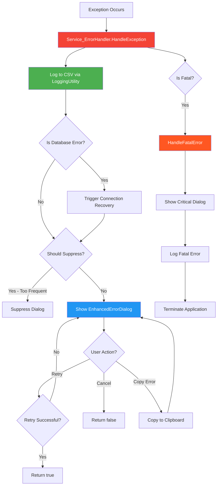
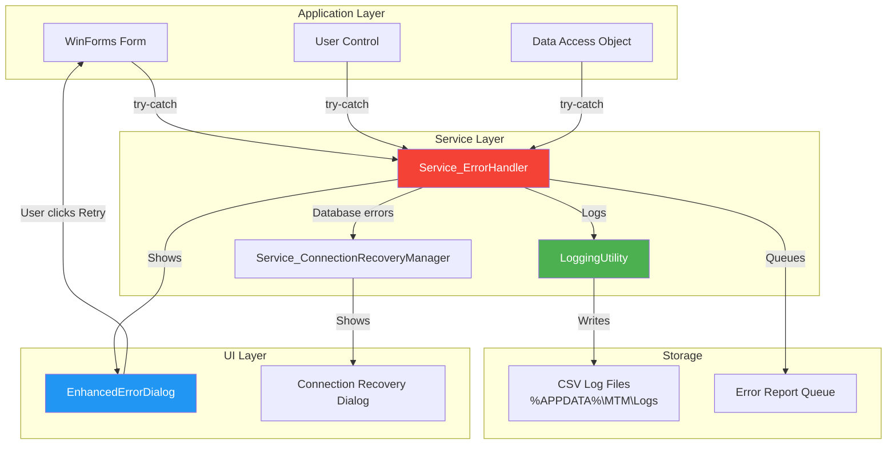
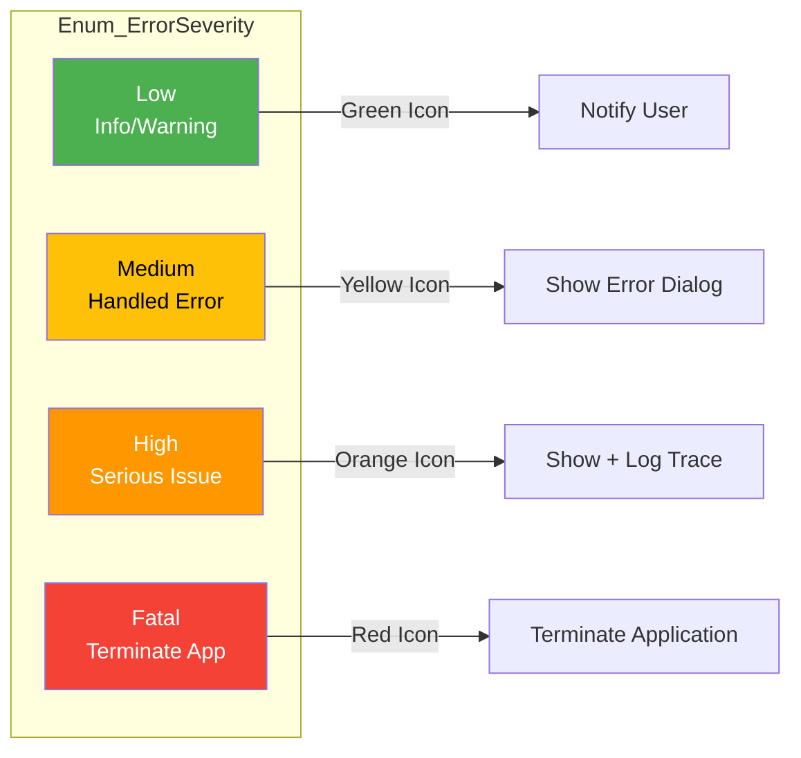

# Service_ErrorHandler Implementation Guide

**CRITICAL**: Service_ErrorHandler is the ONLY approved mechanism for error handling and user notifications. MessageBox.Show is FORBIDDEN.

## System Architecture Overview

Service_ErrorHandler provides centralized error handling with automatic logging, retry logic, error frequency tracking, and enhanced user notifications through WinForms dialogs.

### Core Responsibilities

- ✅ Centralized exception handling across the application
- ✅ Automatic error logging to CSV files
- ✅ User-friendly error dialogs with retry capability
- ✅ Error frequency tracking to prevent spam
- ✅ Connection recovery for database errors
- ✅ Fatal error handling with application termination
- ✅ Context-aware error reporting

## Architecture Diagrams

### Error Handling Flow



### Component Integration



### Error Severity Levels



## File Locations

```
Services/
└── Service_ErrorHandler.cs          # Main error handler (484 lines)

Forms/
└── ErrorDialog/
    └── EnhancedErrorDialog.cs        # Error UI dialog

Models/
└── Enum_ErrorSeverity.cs             # Severity levels enum

Logging/
└── LoggingUtility.cs                 # CSV logging backend

Services/
└── Service_ConnectionRecoveryManager.cs  # DB connection recovery
```

## Core Patterns

### Pattern 1: Basic Exception Handling (MANDATORY)

```csharp
// ✅ CORRECT: Use Service_ErrorHandler
private async void MyButton_Click(object sender, EventArgs e)
{
    try
    {
        await PerformOperationAsync();
    }
    catch (Exception ex)
    {
        Service_ErrorHandler.HandleException(
            ex,
            Enum_ErrorSeverity.Medium,
            contextData: new Dictionary<string, object>
            {
                ["User"] = Model_Application_Variables.User,
                ["Operation"] = "MyOperation"
            },
            callerName: nameof(MyButton_Click),
            controlName: this.Name);
    }
}

// ❌ WRONG: MessageBox.Show
private void MyButton_Click_WRONG(object sender, EventArgs e)
{
    try
    {
        PerformOperation();
    }
    catch (Exception ex)
    {
        MessageBox.Show(ex.Message); // FORBIDDEN!
    }
}
```

### Pattern 2: Retry-Capable Error Handling

```csharp
private async void SaveButton_Click(object sender, EventArgs e)
{
    try
    {
        var result = await SaveDataAsync();
        if (!result.IsSuccess)
        {
            Service_ErrorHandler.ShowUserError(result.ErrorMessage);
            return;
        }
        
        MessageBox.Show("Data saved successfully!", "Success", 
            MessageBoxButtons.OK, MessageBoxIcon.Information);
    }
    catch (Exception ex)
    {
        // With retry capability
        bool retry = Service_ErrorHandler.HandleException(
            ex,
            Enum_ErrorSeverity.Medium,
            retryAction: () => SaveDataRetry(),  // Retry function
            contextData: new Dictionary<string, object>
            {
                ["User"] = Model_Application_Variables.User,
                ["RecordCount"] = GetRecordCount()
            },
            callerName: nameof(SaveButton_Click),
            controlName: this.Name);
            
        if (retry)
        {
            // User chose to retry and it succeeded
            MessageBox.Show("Data saved successfully after retry!", "Success",
                MessageBoxButtons.OK, MessageBoxIcon.Information);
        }
    }
}

private bool SaveDataRetry()
{
    try
    {
        var result = SaveDataAsync().GetAwaiter().GetResult();
        return result.IsSuccess;
    }
    catch
    {
        return false;
    }
}
```

### Pattern 3: Database Error Handling with Auto-Recovery

```csharp
public async Task<Model_Dao_Result<DataTable>> GetInventoryAsync()
{
    try
    {
        var result = await Helper_Database_StoredProcedure
            .ExecuteDataTableWithStatusAsync("md_inventory_GetAll", null);
            
        if (!result.IsSuccess)
        {
            // Database error - will trigger connection recovery
            Service_ErrorHandler.HandleDatabaseError(
                new Exception($"Database error: {result.ErrorMessage}"),
                contextData: new Dictionary<string, object>
                {
                    ["Procedure"] = "md_inventory_GetAll",
                    ["User"] = Model_Application_Variables.User
                },
                callerName: nameof(GetInventoryAsync),
                controlName: "Dao_Inventory");
        }
        
        return result;
    }
    catch (MySqlException ex)
    {
        Service_ErrorHandler.HandleDatabaseError(
            ex,
            contextData: new Dictionary<string, object>
            {
                ["Procedure"] = "md_inventory_GetAll",
                ["ErrorCode"] = ex.Number
            },
            callerName: nameof(GetInventoryAsync),
            controlName: "Dao_Inventory");
            
        return Model_Dao_Result<DataTable>.Failure($"Database connection error: {ex.Message}");
    }
}
```

### Pattern 4: Validation Errors (User-Friendly)

```csharp
private void ValidateAndSave()
{
    // Validate input
    if (string.IsNullOrWhiteSpace(txtPartNumber.Text))
    {
        Service_ErrorHandler.HandleValidationError(
            "Part Number is required.",
            "Part Number",  // Field name
            callerName: nameof(ValidateAndSave),
            controlName: this.Name);
        txtPartNumber.Focus();
        return;
    }
    
    if (numQuantity.Value <= 0)
    {
        Service_ErrorHandler.HandleValidationError(
            "Quantity must be greater than zero.",
            "Quantity",
            callerName: nameof(ValidateAndSave),
            controlName: this.Name);
        numQuantity.Focus();
        return;
    }
    
    // Proceed with save
    SaveData();
}
```

### Pattern 5: Fatal Error Handling

```csharp
// In Program.cs or critical startup code
try
{
    InitializeCriticalResources();
}
catch (Exception ex)
{
    Service_ErrorHandler.HandleException(
        ex,
        Enum_ErrorSeverity.Fatal,  // Application will terminate
        contextData: new Dictionary<string, object>
        {
            ["Stage"] = "Startup",
            ["Component"] = "DatabaseConnection"
        },
        callerName: "Main",
        controlName: "Program");
    
    // Application terminates after showing fatal error dialog
}
```

### Pattern 6: User-Friendly Error Messages

```csharp
// ✅ CORRECT: User-friendly message
try
{
    result = await dao.DeleteRecordAsync(id);
    if (!result.IsSuccess)
    {
        Service_ErrorHandler.ShowUserError(
            "Unable to delete this record because it is referenced by other data. " +
            "Please remove related records first.");
    }
}
catch (Exception ex)
{
    Service_ErrorHandler.HandleException(ex, Enum_ErrorSeverity.Medium);
}

// ❌ WRONG: Technical jargon to user
MessageBox.Show($"Foreign key constraint violation on table inventory_transactions");
```

## Service_ErrorHandler Methods

### Core Methods

#### HandleException (Primary Method)

```csharp
public static bool HandleException(
    Exception ex,
    Enum_ErrorSeverity severity = Enum_ErrorSeverity.Medium,
    Func<bool>? retryAction = null,
    Dictionary<string, object>? contextData = null,
    [CallerMemberName] string callerName = "",
    string controlName = "")
```

**Parameters:**
- `ex`: The exception that occurred
- `severity`: Enum_ErrorSeverity (Low, Medium, High, Fatal)
- `retryAction`: Optional function to retry the failed operation
- `contextData`: Dictionary of context information for logging
- `callerName`: Automatically filled by `[CallerMemberName]`
- `controlName`: Name of form/control where error occurred

**Returns:** `true` if retry succeeded, `false` otherwise

**Behavior:**
1. Logs exception to CSV via LoggingUtility
2. Checks if database error → triggers connection recovery
3. Checks error frequency → suppresses if too frequent
4. Shows EnhancedErrorDialog
5. Handles retry if user chooses
6. Terminates application if Fatal severity

#### HandleDatabaseError

```csharp
public static void HandleDatabaseError(
    Exception ex,
    Dictionary<string, object>? contextData = null,
    [CallerMemberName] string callerName = "",
    string controlName = "")
```

**Specialized for database errors:**
- Automatically sets severity to High
- Triggers Service_ConnectionRecoveryManager
- Includes database-specific context logging

#### HandleValidationError

```csharp
public static void HandleValidationError(
    string message,
    string fieldName,
    [CallerMemberName] string callerName = "",
    string controlName = "")
```

**For user input validation:**
- Shows user-friendly validation message
- Sets severity to Low
- Does NOT trigger retry logic
- Logs validation failure for analytics

#### ShowUserError

```csharp
public static void ShowUserError(string message)
```

**Simple user notification:**
- Shows MessageBox with error icon
- No exception logging (use for expected errors)
- For Model_Dao_Result.ErrorMessage display

#### ShowUserInfo / ShowUserWarning / ShowUserSuccess

```csharp
public static void ShowUserInfo(string message)
public static void ShowUserWarning(string message)
public static void ShowUserSuccess(string message)
```

**User-friendly notifications:**
- ShowUserInfo: Information icon, OK button
- ShowUserWarning: Warning icon, OK button
- ShowUserSuccess: Success icon (custom), OK button

## Error Frequency Tracking

Service_ErrorHandler prevents error dialog spam by tracking:

- **Error Frequency**: Count of same error in time window
- **Cooldown Period**: 5 seconds between same error dialogs
- **Suppression**: Automatic after 3+ occurrences in 5 seconds

```csharp
// Automatic - handled internally
// Same exception in same method within 5 seconds:
// 1st occurrence: Show dialog
// 2nd occurrence: Show dialog
// 3rd+ occurrence: Suppress (log only)
```

## Thread Safety in WinForms

### UI Thread Marshaling

Service_ErrorHandler automatically handles thread marshaling for UI operations:

```csharp
// Internal implementation (already handled)
private static void ShowErrorDialog(EnhancedErrorDialog dialog)
{
    if (Application.OpenForms.Count > 0)
    {
        var mainForm = Application.OpenForms[0];
        if (mainForm.InvokeRequired)
        {
            mainForm.Invoke(() => dialog.ShowDialog(mainForm));
        }
        else
        {
            dialog.ShowDialog(mainForm);
        }
    }
    else
    {
        dialog.ShowDialog();
    }
}
```

**You don't need to check InvokeRequired** - Service_ErrorHandler handles it.

## Context Data Best Practices

### What to Include

```csharp
var contextData = new Dictionary<string, object>
{
    // Always include:
    ["User"] = Model_Application_Variables.User,
    
    // Operation-specific:
    ["Operation"] = "SaveInventory",
    ["RecordCount"] = records.Count,
    ["PartNumber"] = partNumber,
    
    // For database errors:
    ["Procedure"] = "md_inventory_Insert",
    ["Parameters"] = string.Join(", ", parameters.Keys),
    
    // For UI errors:
    ["FormName"] = this.Name,
    ["ControlName"] = txtPartNumber.Name,
    
    // For network errors:
    ["Endpoint"] = apiUrl,
    ["StatusCode"] = response.StatusCode
};
```

### What NOT to Include

```csharp
// ❌ DO NOT include:
- Passwords or sensitive credentials
- Full connection strings
- Personal identifiable information (PII)
- Large data payloads (use counts/summaries)
```

## Integration with LoggingUtility

Service_ErrorHandler automatically logs to CSV via LoggingUtility:

```
%APPDATA%\MTM\Logs\ApplicationErrors_{date}.csv
```

**Log Columns:**
- Timestamp
- Severity
- Exception Type
- Exception Message
- Stack Trace
- Caller Method
- Control/Form Name
- User
- Context Data (JSON)

## WinForms Dialog Integration

### EnhancedErrorDialog Features

- **Error Details Tab**: Full exception information
- **Stack Trace Tab**: Formatted stack trace
- **Context Tab**: Context data display
- **Copy Button**: Copy error to clipboard for reporting
- **Retry Button**: Retry failed operation (if retryAction provided)
- **Cancel Button**: Dismiss dialog

### Dialog Owner Handling

Service_ErrorHandler automatically sets dialog owner:

```csharp
// Prefers active form, falls back to main form
var owner = Form.ActiveForm ?? Application.OpenForms[0];
errorDialog.ShowDialog(owner);
```

## Common Use Cases

### Use Case 1: Form Load with Database

```csharp
private async void MyForm_Load(object sender, EventArgs e)
{
    try
    {
        var dao = new Dao_Inventory();
        var result = await dao.GetAllAsync();
        
        if (!result.IsSuccess)
        {
            Service_ErrorHandler.ShowUserError(
                "Unable to load inventory data. Please try again later.");
            this.Close();
            return;
        }
        
        BindDataToGrid(result.Data);
    }
    catch (Exception ex)
    {
        Service_ErrorHandler.HandleException(
            ex,
            Enum_ErrorSeverity.High,
            contextData: new Dictionary<string, object>
            {
                ["User"] = Model_Application_Variables.User,
                ["Operation"] = "FormLoad"
            },
            callerName: nameof(MyForm_Load),
            controlName: this.Name);
            
        this.Close(); // Close form on critical load error
    }
}
```

### Use Case 2: Button Click with Validation

```csharp
private async void btnSave_Click(object sender, EventArgs e)
{
    // Validate first
    if (string.IsNullOrWhiteSpace(txtName.Text))
    {
        Service_ErrorHandler.HandleValidationError(
            "Name cannot be empty.",
            "Name",
            callerName: nameof(btnSave_Click),
            controlName: this.Name);
        txtName.Focus();
        return;
    }
    
    try
    {
        var dao = new Dao_Entity();
        var result = await dao.InsertAsync(txtName.Text);
        
        if (result.IsSuccess)
        {
            Service_ErrorHandler.ShowUserSuccess("Record saved successfully!");
            this.DialogResult = DialogResult.OK;
            this.Close();
        }
        else
        {
            Service_ErrorHandler.ShowUserError(result.ErrorMessage);
        }
    }
    catch (Exception ex)
    {
        Service_ErrorHandler.HandleException(
            ex,
            Enum_ErrorSeverity.Medium,
            retryAction: () => RetrySave(),
            contextData: new Dictionary<string, object>
            {
                ["User"] = Model_Application_Variables.User,
                ["Name"] = txtName.Text
            },
            callerName: nameof(btnSave_Click),
            controlName: this.Name);
    }
}

private bool RetrySave()
{
    try
    {
        var dao = new Dao_Entity();
        var result = dao.InsertAsync(txtName.Text).GetAwaiter().GetResult();
        return result.IsSuccess;
    }
    catch
    {
        return false;
    }
}
```

### Use Case 3: Background Worker Error

```csharp
private void backgroundWorker_DoWork(object sender, DoWorkEventArgs e)
{
    try
    {
        // Long-running operation
        ProcessLargeDataset();
    }
    catch (Exception ex)
    {
        // Store exception for RunWorkerCompleted
        e.Result = ex;
    }
}

private void backgroundWorker_RunWorkerCompleted(object sender, RunWorkerCompletedEventArgs e)
{
    if (e.Result is Exception ex)
    {
        Service_ErrorHandler.HandleException(
            ex,
            Enum_ErrorSeverity.Medium,
            contextData: new Dictionary<string, object>
            {
                ["User"] = Model_Application_Variables.User,
                ["Operation"] = "BackgroundProcessing"
            },
            callerName: nameof(backgroundWorker_RunWorkerCompleted),
            controlName: this.Name);
    }
    else
    {
        Service_ErrorHandler.ShowUserSuccess("Processing completed!");
    }
}
```

## Constitution Compliance

Service_ErrorHandler enforces the MTM WIP Application Constitution:

### Principle I: Centralized Error Handling

✅ **MANDATORY**: All exceptions MUST go through Service_ErrorHandler  
❌ **FORBIDDEN**: MessageBox.Show for errors  
❌ **FORBIDDEN**: Direct exception logging  
❌ **FORBIDDEN**: Swallowing exceptions without logging

### Verification

```powershell
# Check for MessageBox.Show violations (via MCP tool)
validate_error_handling --source-dir "C:\path\to\Forms"

# Expected result: 0 MessageBox.Show occurrences for errors
```

## Troubleshooting

### Problem: Error dialog not showing

**Cause 1**: Exception swallowed without calling Service_ErrorHandler

**Solution**: Always wrap operations in try-catch with HandleException call

**Cause 2**: Error suppressed due to frequency limit

**Solution**: Check logs for suppressed errors, adjust logic if needed

### Problem: "Cross-thread operation" exception

**Cause**: UI updates from background thread

**Solution**: Service_ErrorHandler handles marshaling automatically - ensure you're calling it, not updating UI directly

### Problem: Error logged but no dialog

**Cause**: ShouldSuppressError returned true (too frequent)

**Solution**: Review error frequency tracking, ensure different errors have different signatures

### Problem: Retry button not working

**Cause**: retryAction parameter is null or returns false

**Solution**: Provide valid retryAction function that returns true on success

## Performance Considerations

- **Error Frequency Tracking**: O(1) dictionary lookups
- **Thread Safety**: Lock-based synchronization (minimal contention)
- **Dialog Display**: <50ms to show dialog
- **Logging**: Async to avoid UI blocking
- **Memory**: Error frequency cleared after 5-minute idle

## Best Practices

### DO

- ✅ Always use Service_ErrorHandler for exception handling
- ✅ Include meaningful context data
- ✅ Use appropriate severity levels
- ✅ Provide retry logic for recoverable operations
- ✅ Log validation errors for analytics
- ✅ Use user-friendly error messages
- ✅ Check Model_Dao_Result.IsSuccess before accessing Data

### DON'T

- ❌ Never use MessageBox.Show for errors
- ❌ Never swallow exceptions without logging
- ❌ Never show technical jargon to users
- ❌ Never include sensitive data in context
- ❌ Never manually call LoggingUtility for exceptions (Service_ErrorHandler does it)
- ❌ Never check InvokeRequired for error dialogs (handled automatically)

## Related Documentation

- **LoggingUtility**: `.github/instructions/service-logging.instructions.md`
- **Connection Recovery**: `.github/instructions/service-connection-recovery.instructions.md`
- **DAO Patterns**: `.github/instructions/dao-patterns.instructions.md`
- **Constitution**: `.specify/memory/constitution.md`

## Summary

Service_ErrorHandler provides:

1. **Centralized error handling** - One place for all exceptions
2. **Automatic logging** - Every error logged to CSV
3. **User-friendly dialogs** - Enhanced error display with retry
4. **Connection recovery** - Automatic for database errors
5. **Thread-safe** - Handles UI marshaling automatically
6. **Error suppression** - Prevents dialog spam
7. **Context tracking** - Rich error context for debugging

**Key Pattern**: Wrap all operations in try-catch calling Service_ErrorHandler.HandleException().
