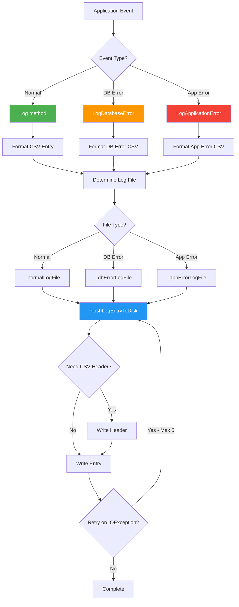
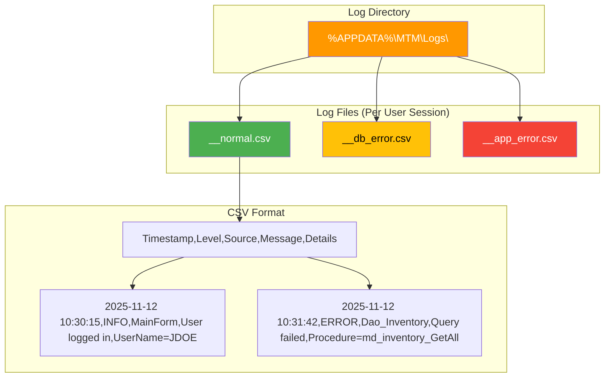
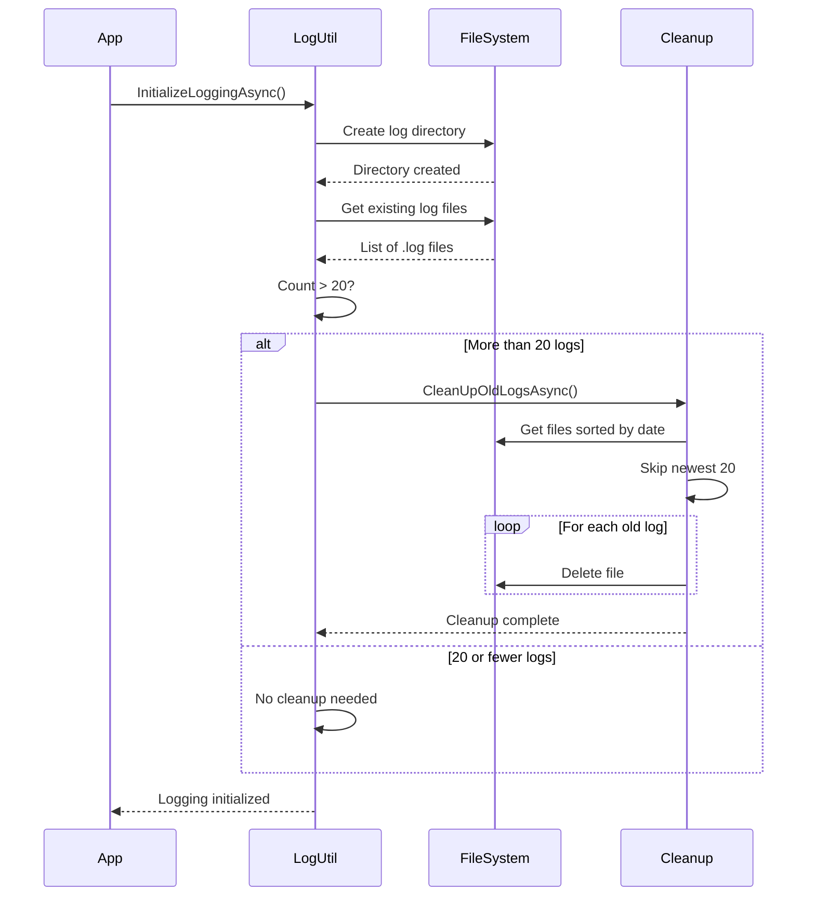

# LoggingUtility Implementation Guide

Centralized CSV-based logging system for the MTM WIP Application with thread-safe file operations and automatic log rotation.

## System Architecture Overview

LoggingUtility provides structured CSV logging with separate log files for different event types (normal operations, database errors, application errors), automatic cleanup, and thread-safe file access.

### Core Responsibilities

- ✅ Structured CSV logging with consistent format
- ✅ Separate log files by type (normal, DB error, app error)
- ✅ Thread-safe concurrent file access
- ✅ Automatic log rotation (keeps last 20 logs)
- ✅ Async file operations (non-blocking)
- ✅ Fallback logging when primary fails
- ✅ CSV header management

## Architecture Diagrams

### Logging Flow



### Log File Structure



### Log Rotation Flow



## File Locations

```
Logging/
└── LoggingUtility.cs              # Main logging utility (403 lines)

Models/
└── Enum_DebugLevel.cs             # Debug level enumeration

Helpers/
├── Helper_LogPath.cs              # Log path management
└── Helper_Database_Variables.cs   # DB connection for log paths

Services/
└── Service_OnStartup_AppDataCleaner.cs  # Directory cleanup
```

## Log File Locations

### Primary Location
```
%APPDATA%\MTM_WIP_Application_Winforms\Logs\<username>\
```

### Fallback Location (if primary fails)
```
%PROGRAMDATA%\MTM_WIP_Application_Winforms\Logs\
```

### Log File Naming Convention
```
<username>_<MM-dd-yyyy @ h-mm tt>_<type>.csv

Examples:
JDOE_11-12-2025 @ 10-30 AM_normal.csv
JDOE_11-12-2025 @ 10-30 AM_db_error.csv
JDOE_11-12-2025 @ 10-30 AM_app_error.csv
```

## Core Methods

### Normal Logging

#### Log (Basic)

```csharp
public static void Log(string message)
```

**Usage:**
```csharp
LoggingUtility.Log("User logged in successfully");
LoggingUtility.Log($"Processing {count} records");
LoggingUtility.Log($"[{componentName}] Operation completed");
```

**When to use:** General informational logging, operation tracking, audit trail

#### Log (With Details)

```csharp
public static void Log(string message, string details)
```

**Usage:**
```csharp
LoggingUtility.Log("Save operation started", $"RecordCount={records.Count}, User={userName}");
LoggingUtility.Log("Theme changed", $"OldTheme={oldTheme}, NewTheme={newTheme}");
```

**When to use:** When additional context needed for troubleshooting

### Database Error Logging

#### LogDatabaseError

```csharp
public static void LogDatabaseError(Exception ex, string procedureName = "")
public static void LogDatabaseError(string errorMessage, string procedureName = "")
```

**Usage:**
```csharp
// With exception
catch (MySqlException ex)
{
    LoggingUtility.LogDatabaseError(ex, "md_inventory_GetAll");
}

// With custom message
if (!result.IsSuccess)
{
    LoggingUtility.LogDatabaseError(
        $"Stored procedure failed: {result.ErrorMessage}",
        "md_inventory_Insert");
}
```

**When to use:** Database connection errors, stored procedure failures, query timeouts

### Application Error Logging

#### LogApplicationError

```csharp
public static void LogApplicationError(Exception ex)
```

**Usage:**
```csharp
try
{
    ProcessData();
}
catch (Exception ex)
{
    LoggingUtility.LogApplicationError(ex);
    // Then handle with Service_ErrorHandler
    Service_ErrorHandler.HandleException(ex, Enum_ErrorSeverity.Medium);
}
```

**When to use:** General application exceptions, unexpected errors, critical failures

**NOTE:** Service_ErrorHandler automatically calls this method - no need to call manually when using Service_ErrorHandler.

## Core Patterns

### Pattern 1: Normal Operation Logging

```csharp
public partial class MainForm : ThemedForm
{
    private async void MainForm_Load(object sender, EventArgs e)
    {
        LoggingUtility.Log("[MainForm] Form loading started");
        
        try
        {
            var result = await LoadDataAsync();
            if (result.IsSuccess)
            {
                LoggingUtility.Log("[MainForm] Data loaded successfully", 
                    $"RecordCount={result.Data.Rows.Count}");
            }
        }
        catch (Exception ex)
        {
            LoggingUtility.LogApplicationError(ex);
            Service_ErrorHandler.HandleException(ex, Enum_ErrorSeverity.Medium);
        }
    }
}
```

### Pattern 2: Database Operation Logging

```csharp
public class Dao_Inventory
{
    public async Task<Model_Dao_Result<DataTable>> GetAllAsync()
    {
        const string procedureName = "md_inventory_GetAll";
        
        try
        {
            LoggingUtility.Log($"[Dao_Inventory] Calling {procedureName}");
            
            var result = await Helper_Database_StoredProcedure
                .ExecuteDataTableWithStatusAsync(procedureName, null);
            
            if (!result.IsSuccess)
            {
                LoggingUtility.LogDatabaseError(result.ErrorMessage, procedureName);
            }
            
            return result;
        }
        catch (MySqlException ex)
        {
            LoggingUtility.LogDatabaseError(ex, procedureName);
            return Model_Dao_Result<DataTable>.Failure(
                $"Database error in {procedureName}: {ex.Message}");
        }
    }
}
```

### Pattern 3: Async Operations with Logging

```csharp
private async Task ProcessLargeDatasetAsync()
{
    LoggingUtility.Log("[DataProcessor] Starting large dataset processing");
    
    try
    {
        var startTime = DateTime.Now;
        
        await Task.Run(() =>
        {
            // Long-running operation
            ProcessRecords();
        });
        
        var elapsed = DateTime.Now - startTime;
        LoggingUtility.Log("[DataProcessor] Processing completed", 
            $"Duration={elapsed.TotalSeconds:F2}s");
    }
    catch (Exception ex)
    {
        LoggingUtility.LogApplicationError(ex);
        throw;
    }
}
```

### Pattern 4: Form Lifecycle Logging

```csharp
public partial class SettingsForm : ThemedForm
{
    public SettingsForm()
    {
        InitializeComponent();
        LoggingUtility.Log($"[{this.Name}] Form constructed");
    }
    
    private void SettingsForm_Load(object sender, EventArgs e)
    {
        LoggingUtility.Log($"[{this.Name}] Form loading");
        LoadSettings();
    }
    
    private void SettingsForm_FormClosing(object sender, FormClosingEventArgs e)
    {
        LoggingUtility.Log($"[{this.Name}] Form closing", 
            $"DialogResult={this.DialogResult}");
    }
    
    protected override void Dispose(bool disposing)
    {
        if (disposing)
        {
            LoggingUtility.Log($"[{this.Name}] Form disposed");
            components?.Dispose();
        }
        base.Dispose(disposing);
    }
}
```

### Pattern 5: User Action Logging

```csharp
private void btnSave_Click(object sender, EventArgs e)
{
    var user = Model_Application_Variables.User;
    var partNumber = txtPartNumber.Text;
    
    LoggingUtility.Log($"[InventoryForm] Save button clicked", 
        $"User={user}, PartNumber={partNumber}");
    
    try
    {
        SaveData();
        LoggingUtility.Log($"[InventoryForm] Save completed successfully");
    }
    catch (Exception ex)
    {
        LoggingUtility.LogApplicationError(ex);
        Service_ErrorHandler.HandleException(ex, Enum_ErrorSeverity.Medium);
    }
}
```

### Pattern 6: Initialization Logging

```csharp
// In Program.cs
internal static class Program
{
    [STAThread]
    private static async Task Main()
    {
        // Initialize logging first
        await LoggingUtility.InitializeLoggingAsync();
        LoggingUtility.Log("[Program] Application starting");
        
        try
        {
            Application.SetHighDpiMode(HighDpiMode.PerMonitorV2);
            ApplicationConfiguration.Initialize();
            
            LoggingUtility.Log("[Program] DI container initializing");
            ConfigureServices();
            LoggingUtility.Log("[Program] DI container initialized");
            
            Application.Run(new MainForm());
        }
        catch (Exception ex)
        {
            LoggingUtility.LogApplicationError(ex);
            Service_ErrorHandler.HandleException(ex, Enum_ErrorSeverity.Fatal);
        }
    }
}
```

## CSV Log Format

### Header Row
```csv
Timestamp,Level,Source,Message,Details
```

### Data Rows

**Normal Log:**
```csv
2025-11-12 10:30:15,INFO,MainForm,User logged in,UserName=JDOE
2025-11-12 10:31:05,INFO,Dao_Inventory,Calling procedure,Procedure=md_inventory_GetAll
2025-11-12 10:31:42,INFO,InventoryForm,Save completed,RecordCount=150
```

**Database Error Log:**
```csv
2025-11-12 10:32:18,ERROR,Dao_Part,MySQL Error,Procedure=md_part_Insert | Code=1062 | Message=Duplicate entry
2025-11-12 10:35:22,ERROR,Dao_User,Connection timeout,Procedure=sys_user_GetByName
```

**Application Error Log:**
```csv
2025-11-12 10:40:33,ERROR,MainForm,NullReferenceException,Object reference not set to an instance of an object | StackTrace=at MainForm.LoadData()
2025-11-12 10:45:11,ERROR,SettingsForm,InvalidOperationException,Collection was modified | StackTrace=at SettingsForm.UpdateList()
```

## Thread Safety

### Lock-Based Synchronization

LoggingUtility uses a static `Lock` object for thread-safe operations:

```csharp
private static readonly Lock LogLock = new();
```

**Operations protected:**
- CSV header tracking (`_filesWithHeaders` HashSet)
- File path initialization
- Log entry formatting

### Async File Operations

All file I/O is async to prevent UI blocking:

```csharp
private static void FlushLogEntryToDisk(string filePath, string logEntry)
{
    _ = Task.Run(async () =>
    {
        // Async file write with retry logic
        await using var fs = new FileStream(filePath, FileMode.Append, 
            FileAccess.Write, FileShare.Write);
        await using var writer = new StreamWriter(fs);
        await writer.WriteLineAsync(logEntry);
    });
}
```

**Benefits:**
- Non-blocking logging calls
- UI remains responsive
- Fire-and-forget pattern for logging

### Retry Logic

Built-in retry for file access conflicts:

```csharp
const int maxRetries = 5;
const int delayMs = 100;

for (int attempt = 0; attempt < maxRetries; attempt++)
{
    try
    {
        // Write to file
        break; // Success
    }
    catch (IOException) when (attempt < maxRetries)
    {
        await Task.Delay(delayMs);
    }
}
```

## Log Rotation and Cleanup

### Automatic Cleanup on Startup

```csharp
await LoggingUtility.InitializeLoggingAsync();
// Automatically keeps last 20 log files, deletes older ones
```

### Manual Cleanup

```csharp
await LoggingUtility.CleanUpOldLogsIfNeededAsync();
```

### Cleanup Rules

- **Keep**: Last 20 log files (newest)
- **Delete**: All older log files
- **Sort by**: File creation time
- **Scope**: Per user log directory

### AppData Cleanup

Also cleans up orphaned application data directories:

```
%APPDATA%\MTM_WIP_Application_Winforms\
%LOCALAPPDATA%\MTM_WIP_Application_Winforms\
```

**Cleanup timing:** During log initialization (app startup)

## Recursive Logging Prevention

### ThreadStatic Flag

```csharp
[ThreadStatic]
private static bool _isLoggingDatabaseError;
```

**Purpose:** Prevent infinite recursion if database logging fails

**How it works:**
1. Set flag before logging database error
2. If another database error occurs during logging, check flag
3. If flag is true, use fallback (Debug.WriteLine) instead
4. Clear flag after logging completes

**Example:**
```csharp
public static void LogDatabaseError(Exception ex, string procedureName)
{
    if (_isLoggingDatabaseError)
    {
        Debug.WriteLine($"[FALLBACK] DB Error: {ex.Message}");
        return;
    }
    
    _isLoggingDatabaseError = true;
    try
    {
        // Perform logging
    }
    finally
    {
        _isLoggingDatabaseError = false;
    }
}
```

## Integration with Service_ErrorHandler

### Automatic Logging

Service_ErrorHandler automatically logs exceptions:

```csharp
// You write:
Service_ErrorHandler.HandleException(ex, Enum_ErrorSeverity.Medium);

// Service_ErrorHandler internally calls:
LoggingUtility.LogApplicationError(ex);
```

**You do NOT need to manually call LoggingUtility when using Service_ErrorHandler.**

### When to Call Directly

Call LoggingUtility directly for:
- ✅ Informational messages (not errors)
- ✅ Operation tracking
- ✅ Audit trail events
- ✅ Performance metrics
- ✅ Database operation logging (non-error)

### When NOT to Call Directly

Don't call LoggingUtility for:
- ❌ Exceptions already handled by Service_ErrorHandler (double-logs)
- ❌ Errors shown to user (let Service_ErrorHandler handle)

## WinForms-Specific Patterns

### Pattern: Control Event Logging

```csharp
private void txtSearch_TextChanged(object sender, EventArgs e)
{
    if (Model_Application_Variables.DebugLevel >= Enum_DebugLevel.Verbose)
    {
        LoggingUtility.Log($"[{this.Name}] Search text changed", 
            $"Length={txtSearch.Text.Length}");
    }
    
    PerformSearch();
}
```

### Pattern: DataGridView Operation Logging

```csharp
private void dataGridView_CellClick(object sender, DataGridViewCellEventArgs e)
{
    if (e.RowIndex >= 0)
    {
        var row = dataGridView.Rows[e.RowIndex];
        var partId = row.Cells["PartID"].Value?.ToString();
        
        LoggingUtility.Log($"[{this.Name}] Grid row selected", 
            $"RowIndex={e.RowIndex}, PartID={partId}");
    }
}
```

### Pattern: Timer Event Logging

```csharp
private void refreshTimer_Tick(object sender, EventArgs e)
{
    LoggingUtility.Log($"[{this.Name}] Auto-refresh triggered");
    RefreshData();
}
```

### Pattern: Background Worker Logging

```csharp
private void backgroundWorker_DoWork(object sender, DoWorkEventArgs e)
{
    LoggingUtility.Log("[BackgroundWorker] Work started");
    
    try
    {
        ProcessData();
        LoggingUtility.Log("[BackgroundWorker] Work completed successfully");
    }
    catch (Exception ex)
    {
        LoggingUtility.LogApplicationError(ex);
        e.Result = ex;
    }
}
```

## Debug Levels

Control logging verbosity with `Model_Application_Variables.DebugLevel`:

```csharp
public enum Enum_DebugLevel
{
    Off = 0,          // No logging
    Critical = 1,     // Only critical errors
    High = 2,         // Errors and warnings
    Medium = 3,       // Standard operational logging
    Verbose = 4       // Detailed debugging information
}
```

**Usage:**
```csharp
if (Model_Application_Variables.DebugLevel >= Enum_DebugLevel.Verbose)
{
    LoggingUtility.Log($"[DEBUG] Detailed info: {someVariable}");
}
```

## Viewing Logs

### From Application

Use the built-in log viewer:
- **Menu**: View → Application Logs
- **Form**: `ViewApplicationLogsForm`
- **Features**: Filter by date, search, export

### Manual Access

Navigate to log directory:
```
%APPDATA%\MTM_WIP_Application_Winforms\Logs\<username>\
```

Or programmatically:
```csharp
var logDir = Path.Combine(
    Environment.GetFolderPath(Environment.SpecialFolder.ApplicationData),
    "MTM_WIP_Application_Winforms",
    "Logs",
    Model_Application_Variables.User);
    
Process.Start("explorer.exe", logDir);
```

### CSV Viewers

- Excel / LibreOffice Calc
- VS Code with CSV extension
- PowerShell: `Import-Csv`
- Any text editor

## Performance Considerations

- **Async writes**: Non-blocking, UI stays responsive
- **Fire-and-forget**: Logging doesn't wait for completion
- **Retry logic**: Up to 5 retries with 100ms delay
- **File sharing**: Multiple processes can write (FileShare.Write)
- **Header caching**: Headers written once per file
- **Lock minimization**: Critical sections kept small

## Best Practices

### DO

- ✅ Log at start of major operations
- ✅ Log completion of operations with duration
- ✅ Include user context in logs
- ✅ Use meaningful component prefixes ([MainForm], [Dao_Inventory])
- ✅ Log user actions for audit trail
- ✅ Include relevant details in details parameter
- ✅ Use appropriate log methods (Log vs LogDatabaseError vs LogApplicationError)

### DON'T

- ❌ Log sensitive data (passwords, tokens, PII)
- ❌ Log inside tight loops (performance impact)
- ❌ Duplicate logging (Service_ErrorHandler already logs exceptions)
- ❌ Log every property change (too verbose)
- ❌ Include full stack traces in normal logs (use LogApplicationError)
- ❌ Block on logging operations (already async)

## Troubleshooting

### Problem: Logs not being created

**Cause 1**: Insufficient permissions on %APPDATA% directory

**Solution**: Check folder permissions, fallback to %PROGRAMDATA%

**Cause 2**: Logging not initialized

**Solution**: Ensure `InitializeLoggingAsync()` called in Program.Main()

### Problem: "File in use" errors

**Cause**: Multiple processes accessing same log file

**Solution**: Already handled - FileShare.Write allows concurrent access with retry logic

### Problem: Logs growing too large

**Cause**: Too many log files not being cleaned up

**Solution**: Automatic cleanup keeps last 20 files. Check CleanUpOldLogsAsync() is running.

### Problem: Missing log entries

**Cause**: Async write not completed before app termination

**Solution**: ProcessExit event handler flushes logs on shutdown (automatic)

## Related Documentation

- **Service_ErrorHandler**: `.github/instructions/service-error-handler.instructions.md`
- **Log Viewer**: `Forms/ViewLogs/ViewApplicationLogsForm.cs`
- **Helper_LogPath**: `Helpers/Helper_LogPath.cs`

## Summary

LoggingUtility provides:

1. **Structured CSV logging** - Consistent format, easy to parse
2. **Separate log files** - Normal, DB error, app error
3. **Thread-safe** - Concurrent access with locking and FileShare
4. **Async operations** - Non-blocking, UI responsive
5. **Automatic cleanup** - Keep last 20 logs
6. **Retry logic** - Handle file access conflicts
7. **Fallback logging** - Always logs even if primary fails
8. **Integration** - Automatic with Service_ErrorHandler

**Key Pattern**: Use Log() for informational messages, let Service_ErrorHandler handle error logging automatically.
