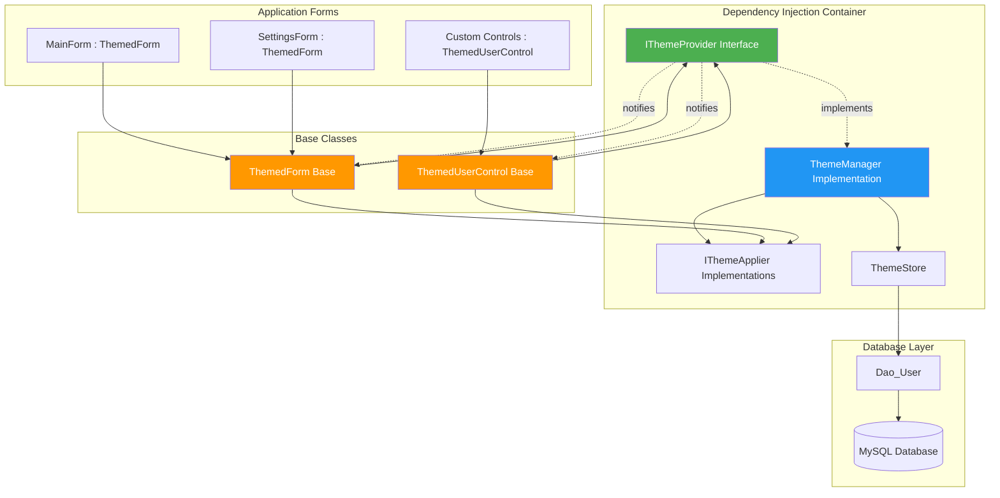
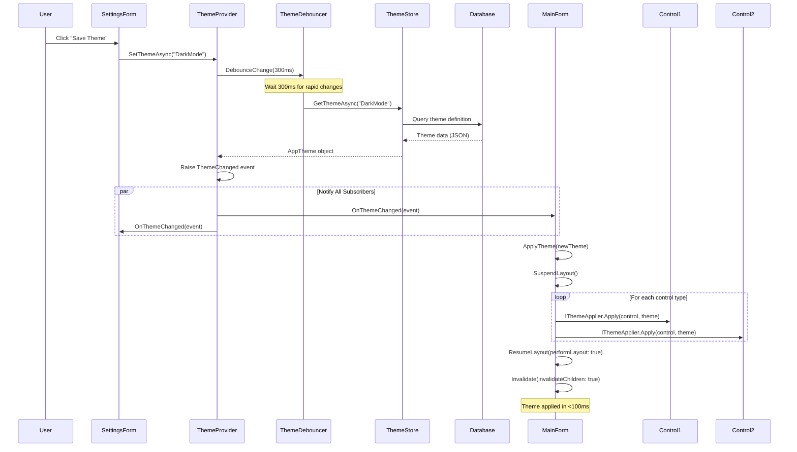
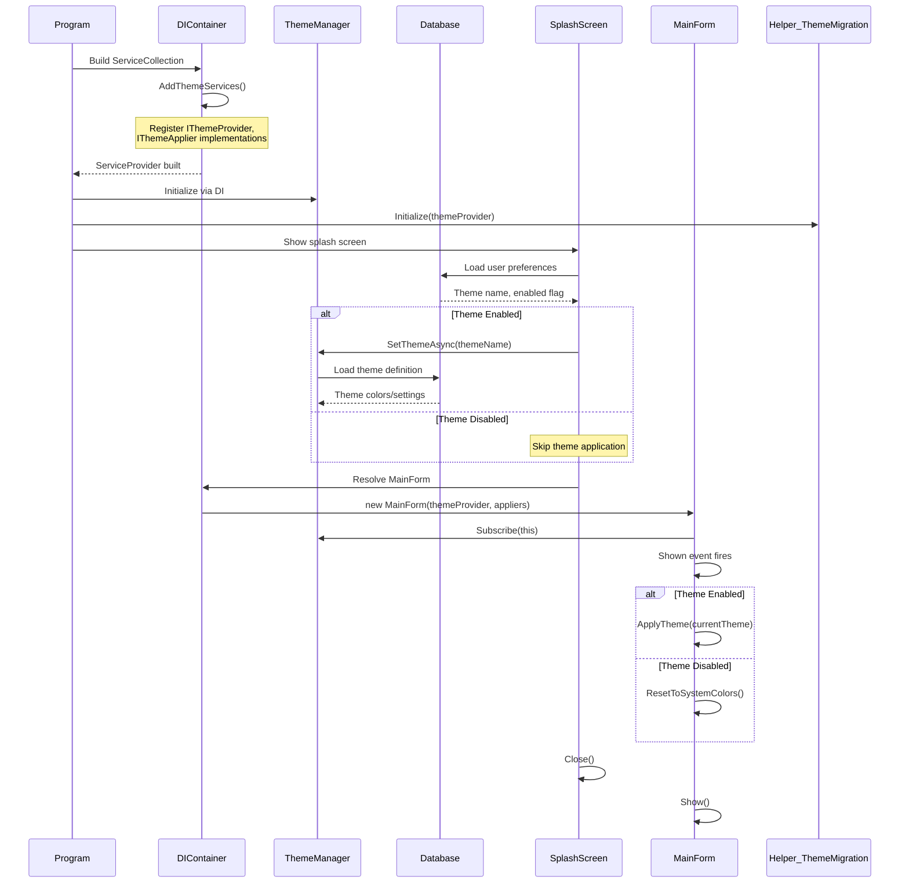
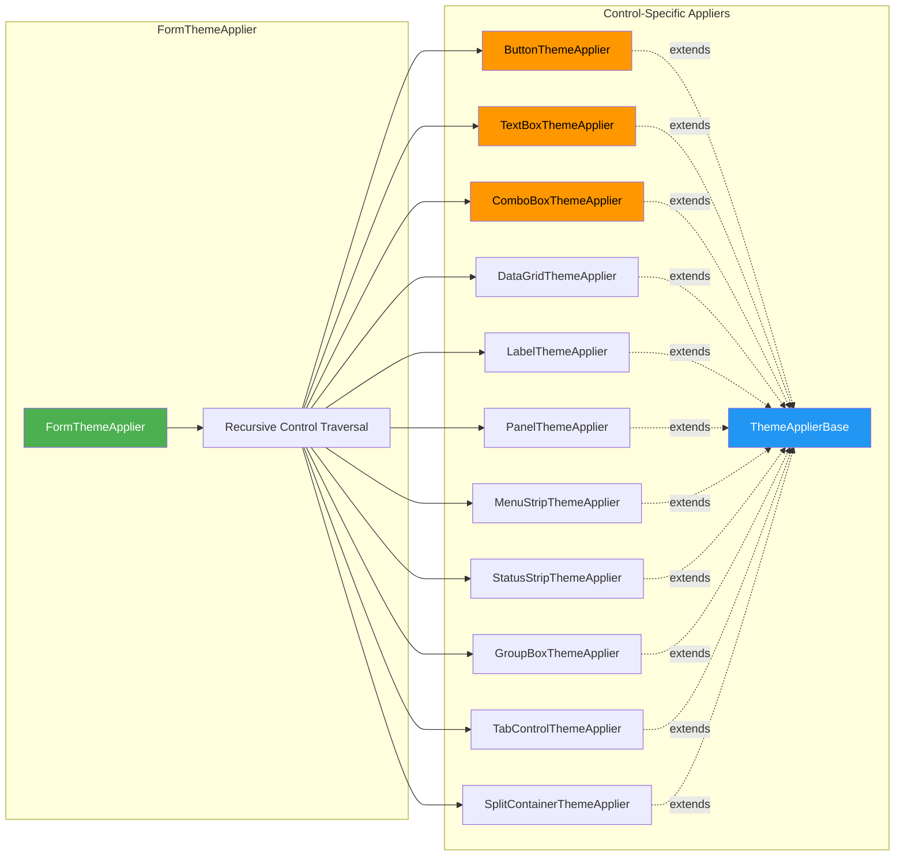

# WinForms Theme System Implementation Guide

Comprehensive guide for implementing the dependency injection-based theme system in MTM WIP Application.

## System Architecture Overview

The theme system uses a **dependency injection-based observer pattern** with automatic form/control subscription for real-time theme updates across the entire application.

### Core Components

- **IThemeProvider**: Central theme management service (singleton)
- **IThemeApplier**: Strategy pattern for control-specific styling
- **ThemeManager**: Concrete implementation managing subscriptions and notifications
- **ThemedForm**: Base class for forms with automatic theme support
- **ThemedUserControl**: Base class for user controls with automatic theme support
- **ThemeStore**: Caches themes loaded from database
- **ThemeDebouncer**: Prevents rapid theme change events (300ms delay)

## Architecture Diagrams

### Component Relationships



### Theme Change Workflow



### Application Startup Flow



### Theme Applier Strategy Pattern



## File Relationships

### Core Theme System Files

```
Core/
├── Theming/
│   ├── Interfaces/
│   │   ├── IThemeProvider.cs          # Theme management interface
│   │   ├── IThemeApplier.cs           # Strategy pattern interface
│   │   └── IThemeStore.cs             # Theme caching interface
│   ├── Appliers/
│   │   ├── ThemeApplierBase.cs        # Base implementation
│   │   ├── FormThemeApplier.cs        # Recursive form traversal
│   │   ├── ButtonThemeApplier.cs      # Button-specific styling
│   │   ├── TextBoxThemeApplier.cs     # TextBox styling
│   │   ├── ComboBoxThemeApplier.cs    # ComboBox styling
│   │   ├── DataGridThemeApplier.cs    # DataGrid styling
│   │   ├── LabelThemeApplier.cs       # Label styling
│   │   ├── PanelThemeApplier.cs       # Panel/GroupBox styling
│   │   ├── MenuStripThemeApplier.cs   # MenuStrip styling
│   │   ├── StatusStripThemeApplier.cs # StatusStrip styling
│   │   └── [17 total appliers]        # One per control type
│   ├── ThemeManager.cs                # Concrete IThemeProvider
│   ├── ThemeStore.cs                  # Theme caching/loading
│   ├── ThemeDebouncer.cs              # 300ms debounce logic
│   └── ThemeChangedEventArgs.cs       # Event arguments
├── DependencyInjection/
│   └── ServiceCollectionExtensions.cs # DI registration
└── AppTheme.cs                        # Theme data model

Forms/
├── Shared/
│   ├── ThemedForm.cs                  # Base form class
│   └── ThemedUserControl.cs           # Base user control class
└── [Your Forms]/
    └── *.cs                           # Inherit from ThemedForm

Models/
└── Model_Shared_UserUiColors.cs       # Theme color definitions

Data/
└── Dao_User.cs                        # Theme persistence methods

Helpers/
└── Helper_ThemeMigration.cs           # Legacy system bridge

Program.cs                             # DI container setup
```

## Implementing Themes in New Forms

### Step 1: Create Form Inheriting from ThemedForm

```csharp
using MTM_WIP_Application_Winforms.Forms.Shared;
using MTM_WIP_Application_Winforms.Core.Theming.Interfaces;

namespace MTM_WIP_Application_Winforms.Forms.MyFeature
{
    /// <summary>
    /// My custom form with automatic theme support.
    /// </summary>
    public partial class MyCustomForm : ThemedForm
    {
        // ✅ CORRECT: Parameterless constructor for designer support
        public MyCustomForm()
        {
            InitializeComponent();
            
            // Theme automatically applied by ThemedForm base class
            // NO manual Core_Themes.ApplyTheme() calls needed!
        }
        
        // Optional: Override theme application for custom behavior
        protected override void ApplyTheme(Model_Shared_UserUiColors theme)
        {
            base.ApplyTheme(theme); // Always call base first
            
            // Custom theme logic here (rare - usually not needed)
            // Example: myCustomControl.SpecialColor = theme.AccentColor;
        }
    }
}
```

### Step 2: Designer File (No Changes Required)

```csharp
// MyCustomForm.Designer.cs - UNCHANGED from normal WinForms pattern
namespace MTM_WIP_Application_Winforms.Forms.MyFeature
{
    partial class MyCustomForm
    {
        private System.ComponentModel.IContainer components = null;
        
        protected override void Dispose(bool disposing)
        {
            if (disposing && (components != null))
            {
                components.Dispose();
            }
            base.Dispose(disposing); // ThemedForm handles unsubscription
        }
        
        private void InitializeComponent()
        {
            // Standard designer code - no theme-related changes needed
            this.button1 = new System.Windows.Forms.Button();
            // ...
        }
    }
}
```

### Step 3: Open Form from Parent

```csharp
// ✅ CORRECT: Simply instantiate - theme auto-applies
private void btnOpenCustomForm_Click(object sender, EventArgs e)
{
    using (var form = new MyCustomForm())
    {
        form.ShowDialog(this);
        // Theme already applied automatically
        // Form automatically updates if theme changes while open
    }
}

// ❌ WRONG: Do NOT call Core_Themes.ApplyTheme() manually
private void btnOpenCustomForm_Click_WRONG(object sender, EventArgs e)
{
    var form = new MyCustomForm();
    Core_Themes.ApplyTheme(form); // NEVER DO THIS - causes double application
    form.ShowDialog(this);
}
```

## Implementing Themes in User Controls

### Step 1: Inherit from ThemedUserControl

```csharp
using MTM_WIP_Application_Winforms.Forms.Shared;
using MTM_WIP_Application_Winforms.Core.Theming.Interfaces;

namespace MTM_WIP_Application_Winforms.Controls.MyFeature
{
    /// <summary>
    /// Custom user control with automatic theme support.
    /// </summary>
    public partial class Control_MyCustomControl : ThemedUserControl
    {
        // ✅ CORRECT: Parameterless constructor for designer support
        public Control_MyCustomControl()
        {
            InitializeComponent();
            
            // Theme automatically applied by ThemedUserControl base class
            // NO manual theme application needed
        }
        
        // Optional: Custom theme application
        protected override void ApplyTheme(Model_Shared_UserUiColors theme)
        {
            base.ApplyTheme(theme); // Always call base first
            
            // Custom control-specific theming
            // Example: mySpecialPanel.BorderColor = theme.BorderColor;
        }
    }
}
```

### Step 2: Use in Forms

```csharp
// Simply add to form - theme propagates automatically
public partial class MyForm : ThemedForm
{
    private Control_MyCustomControl customControl;
    
    public MyForm()
    {
        InitializeComponent();
        
        customControl = new Control_MyCustomControl();
        customControl.Dock = DockStyle.Fill;
        this.Controls.Add(customControl);
        
        // Theme automatically applied to customControl when form theme applies
    }
}
```

## Theme System Lifecycle

### What Happens Automatically

1. **Form Construction**: ThemedForm resolves IThemeProvider from Program.ServiceProvider
2. **Subscription**: Form subscribes to ThemeChanged event
3. **Initial Application**: Theme applied on Form.Shown event (when form becomes visible)
4. **Runtime Updates**: Theme changes propagate automatically via event subscription
5. **Disposal**: Form unsubscribes from theme events in Dispose()

### When Theme IS Applied

- ✅ Form.Shown event fires (first display)
- ✅ User changes theme in settings
- ✅ SetThemeAsync() called programmatically
- ✅ Preview mode activated
- ✅ After 300ms debounce period (prevents rapid changes)

### When Theme IS NOT Applied

- ❌ Model_Application_Variables.ThemeEnabled = false
- ❌ Form not yet shown (prevents designer issues)
- ❌ During rapid theme changes (debouncer active)
- ❌ ThemeChangeReason.Preview with theming disabled

## Common Patterns

### Pattern: Dialog Form with Theme

```csharp
public partial class MyDialogForm : ThemedForm
{
    public MyDialogForm()
    {
        InitializeComponent();
        // That's it - theme auto-applies
    }
}

// Usage
private void ShowDialog()
{
    using (var dialog = new MyDialogForm())
    {
        if (dialog.ShowDialog(this) == DialogResult.OK)
        {
            // Dialog had correct theme automatically
        }
    }
}
```

### Pattern: Dynamic Control Addition

```csharp
public partial class MyForm : ThemedForm
{
    public MyForm()
    {
        InitializeComponent();
    }
    
    private void AddDynamicButton()
    {
        var button = new Button
        {
            Text = "Dynamic Button",
            Dock = DockStyle.Top
        };
        
        this.Controls.Add(button);
        
        // ✅ Automatically themed by FormThemeApplier's recursive traversal
        // Controls.ControlAdded event triggers theme application
    }
}
```

### Pattern: Nested User Controls

```csharp
public partial class ParentControl : ThemedUserControl
{
    public ParentControl()
    {
        InitializeComponent();
        
        var childControl = new ChildControl();
        this.Controls.Add(childControl);
        
        // Both parent and child receive theme updates automatically
    }
}

public partial class ChildControl : ThemedUserControl
{
    public ChildControl()
    {
        InitializeComponent();
        // Inherits theme from parent automatically
    }
}
```

## Migration from Legacy System

### Before (Legacy Core_Themes)

```csharp
// ❌ OLD PATTERN - Do not use in new code
public partial class LegacyForm : Form
{
    public LegacyForm()
    {
        InitializeComponent();
        Core_Themes.ApplyTheme(this); // Manual application
    }
    
    private void OnSettingsChanged()
    {
        Core_Themes.ApplyTheme(this); // Must manually refresh
    }
}
```

### After (New DI System)

```csharp
// ✅ NEW PATTERN - Always use this
public partial class ModernForm : ThemedForm
{
    public ModernForm()
    {
        InitializeComponent();
        // Automatic theme application - no manual calls
    }
    
    private void OnSettingsChanged()
    {
        // No action needed - theme updates automatically via subscription
    }
}
```

## Troubleshooting

### Problem: Form shows default colors instead of theme

**Cause**: Form does not inherit from ThemedForm

**Solution**:
```csharp
// Change from:
public partial class MyForm : Form { }

// To:
public partial class MyForm : ThemedForm { }
```

### Problem: Theme applied twice (colors too dark/bright)

**Cause**: Manual Core_Themes.ApplyTheme() call in ThemedForm-based form

**Solution**: Remove ALL Core_Themes.ApplyTheme() calls
```csharp
// ❌ REMOVE THIS
Core_Themes.ApplyTheme(this);

// ✅ Theme applies automatically via base class
```

### Problem: User controls don't receive theme

**Cause**: User control does not inherit from ThemedUserControl

**Solution**:
```csharp
// Change from:
public partial class MyControl : UserControl { }

// To:
public partial class MyControl : ThemedUserControl { }
```

### Problem: Designer shows errors about missing constructors

**Cause**: DI constructor conflicts with designer expectations

**Solution**: Keep parameterless constructor for designer:
```csharp
public partial class MyForm : ThemedForm
{
    // Designer-compatible constructor
    public MyForm()
    {
        InitializeComponent();
    }
}
```

### Problem: Theme doesn't apply in designer preview

**Expected Behavior**: Designer NEVER shows theme - only runtime

**Explanation**: ThemedForm resolves dependencies at runtime from Program.ServiceProvider. Designer uses parameterless constructor with no theme provider.

## Performance Characteristics

- **Theme Change Time**: <100ms for forms with 100+ controls
- **Memory Overhead**: <10% increase vs legacy system (WeakReference usage)
- **Debounce Period**: 300ms prevents rapid theme flicker
- **Subscription Cleanup**: Automatic via WeakReference and Dispose()
- **Layout Suspension**: SuspendLayout()/ResumeLayout() prevents flicker

## Best Practices

### DO

- ✅ Always inherit from ThemedForm for new forms
- ✅ Always inherit from ThemedUserControl for custom controls
- ✅ Let the base class handle theme application automatically
- ✅ Use Model_Application_Variables.ThemeEnabled check for conditional theming
- ✅ Test theme changes with both light and dark themes
- ✅ Override ApplyTheme() only for truly custom behavior
- ✅ Call base.ApplyTheme() first in overrides

### DON'T

- ❌ Never call Core_Themes.ApplyTheme() on ThemedForm/ThemedUserControl
- ❌ Never manually subscribe to ThemeProvider.ThemeChanged (base class handles it)
- ❌ Never forget to call base.Dispose() in form cleanup
- ❌ Don't apply theme in constructor (use Shown event or base class)
- ❌ Don't create custom theme application logic (use IThemeApplier instead)
- ❌ Don't modify theme colors directly on controls (defeats observer pattern)

## Advanced: Creating Custom Theme Appliers

Only needed for completely custom control types not covered by existing appliers.

```csharp
using MTM_WIP_Application_Winforms.Core.Theming.Appliers;
using MTM_WIP_Application_Winforms.Core.Theming.Interfaces;
using Microsoft.Extensions.Logging;

namespace MTM_WIP_Application_Winforms.Core.Theming.Appliers
{
    /// <summary>
    /// Theme applier for custom control type.
    /// </summary>
    public class MyCustomControlApplier : ThemeApplierBase
    {
        public MyCustomControlApplier(ILogger<MyCustomControlApplier> logger) 
            : base(logger)
        {
        }
        
        public override bool CanApply(Control control)
        {
            return control is MyCustomControl;
        }
        
        public override void Apply(Control control, Model_Shared_UserUiColors theme)
        {
            if (control is not MyCustomControl customControl)
            {
                return;
            }
            
            try
            {
                Logger?.LogDebug($"Applying theme to {control.Name}");
                
                // Apply theme properties
                customControl.BackColor = GetColorOrDefault(theme.ControlBackColor, Color.White);
                customControl.ForeColor = GetColorOrDefault(theme.ControlForeColor, Color.Black);
                customControl.BorderColor = GetColorOrDefault(theme.BorderColor, Color.Gray);
                
                // Apply to child controls recursively
                ApplyToControlHierarchy(customControl.Controls, theme);
            }
            catch (Exception ex)
            {
                Logger?.LogError(ex, $"Failed to apply theme to {control.Name}");
            }
        }
    }
}
```

Register in DI container:
```csharp
// ServiceCollectionExtensions.cs
services.AddSingleton<IThemeApplier, MyCustomControlApplier>();
```

## Database Schema

Themes are stored in MySQL database with JSON color definitions.

```sql
-- app_themes table
CREATE TABLE app_themes (
    ThemeName VARCHAR(50) PRIMARY KEY,
    DisplayName VARCHAR(100) NOT NULL,
    SettingsJson TEXT NOT NULL,  -- JSON with color properties
    IsActive BOOLEAN DEFAULT TRUE,
    CreatedDate DATETIME DEFAULT CURRENT_TIMESTAMP,
    ModifiedDate DATETIME DEFAULT CURRENT_TIMESTAMP ON UPDATE CURRENT_TIMESTAMP
);

-- app_users table (theme preferences)
CREATE TABLE app_users (
    UserName VARCHAR(50) PRIMARY KEY,
    ThemeName VARCHAR(50),
    ThemeEnabled BOOLEAN DEFAULT TRUE,
    -- other user fields
    FOREIGN KEY (ThemeName) REFERENCES app_themes(ThemeName)
);
```

## Configuration

### Enable/Disable Theming

```csharp
// Set globally
Model_Application_Variables.ThemeEnabled = true; // or false

// Check before applying
if (Model_Application_Variables.ThemeEnabled)
{
    // Theme system active
}
else
{
    // Use system default colors
}
```

### Change Theme Programmatically

```csharp
// Via IThemeProvider (recommended)
var themeProvider = Program.ServiceProvider?.GetService<IThemeProvider>();
if (themeProvider != null)
{
    await themeProvider.SetThemeAsync(
        "DarkMode", 
        ThemeChangeReason.UserSelection, 
        Model_Application_Variables.User);
}
```

### Preview Theme (Temporary)

```csharp
// Preview without saving to database
await themeProvider.SetThemeAsync(
    "DarkMode", 
    ThemeChangeReason.Preview, 
    Model_Application_Variables.User);

// Revert to original
await themeProvider.SetThemeAsync(
    originalThemeName, 
    ThemeChangeReason.UserSelection, 
    Model_Application_Variables.User);
```

## Related Documentation

- **Architecture Analysis**: `Documentation/Architecture/Core_Themes-Analysis.md`
- **Implementation Tasks**: `specs/001-theme-refactor/tasks.md`
- **Quickstart Guide**: `specs/001-theme-refactor/quickstart.md`
- **Interface Contracts**: `specs/001-theme-refactor/contracts/README.md`
- **Data Model**: `specs/001-theme-refactor/data-model.md`

## Summary

The WinForms theme system provides:

1. **Automatic theme application** - No manual Core_Themes.ApplyTheme() calls
2. **Real-time updates** - All forms update when theme changes
3. **Designer compatibility** - Parameterless constructors work with Visual Studio Designer
4. **Memory safe** - WeakReference prevents memory leaks
5. **Performance optimized** - <100ms theme changes, 300ms debounce
6. **Extensible** - Custom IThemeApplier implementations for new control types

**Key Pattern**: Inherit from ThemedForm or ThemedUserControl, and the rest happens automatically.