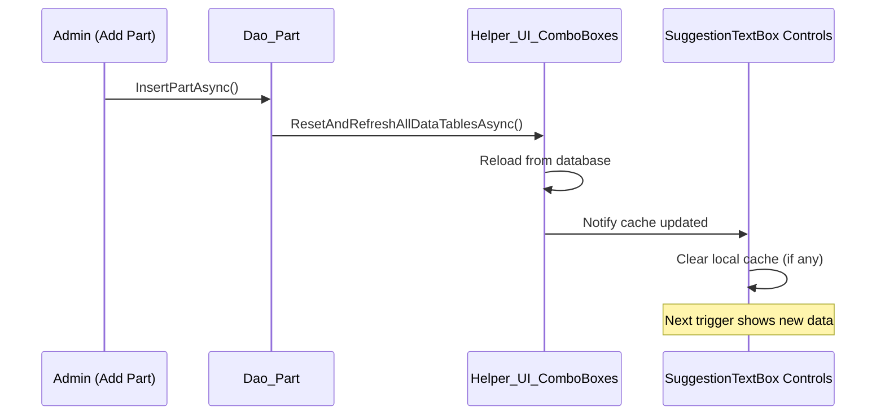
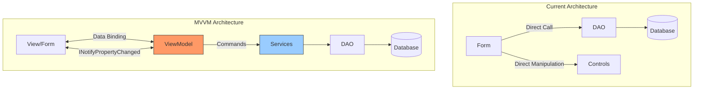
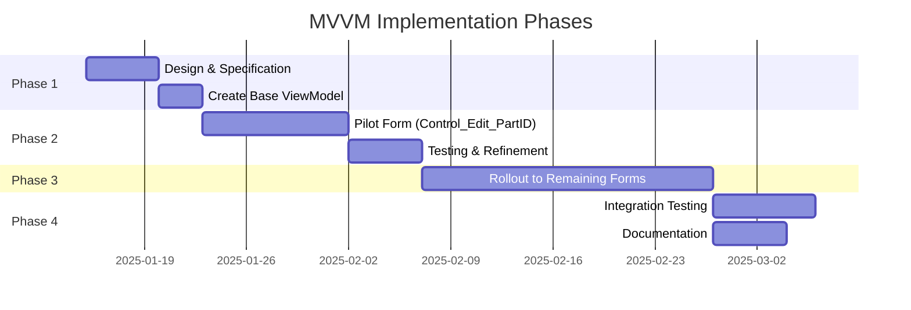

# SuggestionTextBox Generate Enhancement Suggestions

## OBJECTIVE
Generate structured enhancement suggestion files from existing code analysis. This prompt creates separate markdown files categorized by scope (File-Only, System, Speckit) instead of embedding suggestions in code files.

## INPUT REQUIREMENTS

Before executing this prompt:
1. **Target File**: Full path to the .cs file to analyze (e.g., `Control_Edit_PartID.cs`)
2. **Include Existing Suggestions**: If file already has embedded `#region PROPOSED_IMPROVEMENTS`, extract them
3. **Additional Analysis**: Optional - perform fresh analysis for new suggestions

## EXECUTION STEPS

### Step 1: Read Target File and Template

<tool>read_file</tool> on:
```
{target_file}
.github/suggestions/execution-files/suggestion-file-template.md
.github/suggestions/execution-files/suggestion-template.yml
```

### Step 2: Extract Existing Suggestions (if any)

If target file contains `#region PROPOSED_IMPROVEMENTS`:
1. Parse all existing suggestions
2. Categorize by ID prefix (UI, UX, VAL, PERF, ARCH, DATA, SEC, ACCESS, TEST, DOC, BATCH)
3. Extract: ID, Title, Priority, Scope, User Benefit, Why Needed, Implementation
4. Preserve checkboxes and metadata

### Step 3: Analyze Code for New Suggestions

Analyze the target file for enhancement opportunities in these categories:

#### File-Only Enhancement Categories

**UI Enhancements** (Priority: 4-7, Scope: 2-3):
- Visual indicators for state changes
- Tooltips for complex fields
- Validation summaries
- Color coding for status
- Icons for actions

**UX Enhancements** (Priority: 4-8, Scope: 2-4):
- Keyboard shortcuts (Ctrl+S, Ctrl+R, Esc)
- Recent item history dropdowns
- Auto-save drafts
- Confirmation dialogs with change summaries
- Focus management improvements

**Validation Improvements** (Priority: 5-9, Scope: 2-4):
- Real-time format validation
- Business rule enforcement
- Duplicate detection
- Cross-field validation
- Warning dialogs for impacts

**Accessibility** (Priority: 3-6, Scope: 1-3):
- Screen reader support (ARIA labels)
- High contrast mode support
- Keyboard navigation improvements
- Focus indicators
- Tab order optimization

**Documentation** (Priority: 2-4, Scope: 1-2):
- Inline help text
- Field descriptions
- User guides
- Troubleshooting tips

#### System Enhancement Categories

**Performance** (Priority: 5-8, Scope: 3-5):
- Caching improvements
- Background pre-loading
- Query optimization
- Lazy loading
- Debouncing/throttling

**Helper Improvements** (Priority: 4-7, Scope: 3-5):
- New helper methods
- Enhanced error patterns
- Cache invalidation
- Shared validation logic

**Error Handling** (Priority: 6-9, Scope: 3-5):
- Specialized error handlers
- Better context enrichment
- Retry strategies
- Fallback mechanisms

#### Speckit Enhancement Categories (Scope >= 5)

**Architecture** (Priority: 5-8, Scope: 7-9):
- MVVM pattern implementation
- Command pattern
- Service layer introduction
- Repository pattern
- Event aggregation

**Data Integrity** (Priority: 7-10, Scope: 6-8):
- Optimistic locking
- Audit logging
- Change tracking
- Concurrency handling
- Transaction management

**Security** (Priority: 8-10, Scope: 7-9):
- Role-based access control (RBAC)
- Permission systems
- Encryption
- Rate limiting
- Audit trails

**Batch Operations** (Priority: 6-9, Scope: 6-8):
- Bulk updates
- Import/export features
- Mass data operations
- Progress tracking
- Transaction batching

**Testing Infrastructure** (Priority: 5-7, Scope: 6-8):
- Unit test frameworks
- Integration test harnesses
- Mock data generators
- Test automation
- Coverage reporting

### Step 4: Categorize Suggestions

For each suggestion, determine category:

**File-Only** (`.github/suggestions/{FileName}-suggestions.md`):
- Changes affect ONLY the target file (and `.Designer.cs` if applicable)
- No interface changes
- No breaking changes to other components
- Can be implemented independently
- Examples: Tooltips, validation messages, keyboard shortcuts

**System** (`.github/suggestions/{SystemName}-suggestions.md`):
- Affects specific system/component (Service_ErrorHandler, Helper_SuggestionTextBox, etc.)
- Multiple files in same subsystem
- Shared component improvements
- No architectural changes
- Examples: New helper methods, cache improvements, error handling patterns

**Speckit** (`.github/suggestions/speckit/{FeatureName}-suggestion.md`):
- Requires Scope >= 5 OR
- Architectural changes OR
- Database schema modifications OR
- Security/permission systems OR
- Breaking changes OR
- New major features
- Examples: MVVM refactor, RBAC system, batch operations

### Step 5: Check for Duplicate Suggestions

For each suggestion file that will be created/updated:

```powershell
$filePath = ".github/suggestions/{FileName}-suggestions.md"
if (Test-Path $filePath) {
    $existingContent = Get-Content $filePath -Raw
    
    # Parse existing suggestion IDs
    $existingIds = [regex]::Matches($existingContent, '### ([A-Z]+-\d+):') | 
        ForEach-Object { $_.Groups[1].Value }
    
    # Check for duplicates
    foreach ($newSuggestion in $newSuggestions) {
        if ($existingIds -contains $newSuggestion.Id) {
            # Compare content
            # If different approach, UPDATE with reasoning
            # If identical, SKIP
        }
    }
}
```

### Step 6: Generate Suggestion Files

Use the template structure from `suggestion-file-template.md`:

#### File-Only Suggestions File

```markdown
# Suggestions: Control_Edit_PartID
**Generated**: 2025-11-15 14:30:00
**Category**: File-Only
**Target File**: `Controls/SettingsForm/Control_Edit_PartID.cs`

---

## Summary

**Total Suggestions**: 22
**Priority Breakdown**:
- Critical (9-10): 0
- Important (7-8): 4
- Helpful (4-6): 12
- Nice to Have (1-3): 6

---

## Suggestions

### UI-001: Add visual indication when RequiresColorCode flag changes
**Priority**: 5/10 _Helpful_
**Scope**: 2/10 _Single control, minor UI change_

#### User Benefit
You'll see a visual highlight (like yellow background) when you change the "Requires Color Code" checkbox, making it obvious that this important setting has been modified before you save.

#### Why Needed
Currently, there's no visual feedback when you toggle this critical setting. Users might forget they changed it or accidentally toggle it without noticing, leading to confusion when work orders behave differently.

#### Current Behavior
Checkbox state changes silently with no visual confirmation beyond the checkmark itself.

#### Proposed Implementation
```csharp
private void Control_Edit_PartID_CheckBox_RequiresColorCode_CheckedChanged(object? sender, EventArgs e)
{
    // Highlight panel when value differs from original
    if (Control_Edit_PartID_CheckBox_RequiresColorCode.Checked != _originalRequiresColorCode)
    {
        // Add highlight
        panel.BackColor = Color.LightYellow;
        panel.BorderStyle = BorderStyle.FixedSingle;
    }
    else
    {
        // Remove highlight
        panel.BackColor = SystemColors.Control;
        panel.BorderStyle = BorderStyle.None;
    }
}
```

#### Affected Components
- File: `Controls/SettingsForm/Control_Edit_PartID.cs`
- Method: New `CheckedChanged` event handler
- Control: `Control_Edit_PartID_CheckBox_RequiresColorCode`

#### Estimated Effort
- **Time**: 1 hour
- **Complexity**: LOW
- **Risk**: LOW

---

{REPEAT FOR ALL FILE-ONLY SUGGESTIONS}
```

#### System Suggestions File

```markdown
# Suggestions: Helper_SuggestionTextBox
**Generated**: 2025-11-15 14:30:00
**Category**: System
**Target File**: `Helpers/Helper_SuggestionTextBox.cs`
**Related Files**:
- `Helpers/Helper_UI_ComboBoxes.cs`
- `Controls/Shared/SuggestionTextBox.cs`

---

## Summary

**Total Suggestions**: 5
**Affected Components**: Helper_SuggestionTextBox, Helper_UI_ComboBoxes, SuggestionTextBox

---

## Suggestions

### PERF-003: Add cache invalidation/refresh mechanism
**Priority**: 6/10 _Recommended_
**Scope**: 3/10 _Single helper method, event broadcasting_

#### User Benefit
When master data changes (new part added, item type renamed), SuggestionTextBox suggestions update immediately without restarting application.

#### Why Needed
Cache is loaded once at startup. If admin adds a new part via Settings screen, users won't see it in SuggestionTextBox until they restart. This creates confusion and workaround behaviors.

#### System Architecture Impact


#### Implementation Steps
1. Add event to `Helper_UI_ComboBoxes`: `public static event EventHandler? CacheRefreshed`
2. Fire event after `ResetAndRefreshAllDataTablesAsync()` completes
3. Subscribe in DAO methods after successful Insert/Update/Delete operations
4. Optional: Add `SuggestionTextBox.RefreshDataSource()` method

#### Affected Files
- `Helpers/Helper_UI_ComboBoxes.cs` - Add event
- `Data/Dao_Part.cs` - Trigger refresh after Insert/Update/Delete
- `Data/Dao_ItemType.cs` - Trigger refresh
- `Data/Dao_Operation.cs` - Trigger refresh

#### Testing Requirements
- [ ] Verify cache refreshes after part insert
- [ ] Verify SuggestionTextBox shows new data immediately
- [ ] Verify multi-user scenario (User A adds part, User B sees it)

#### Estimated Effort
- **Time**: 3 hours
- **Complexity**: MEDIUM
- **Risk**: LOW

---

{REPEAT FOR ALL SYSTEM SUGGESTIONS}
```

#### Speckit Suggestions File

```markdown
# Suggestions: MVVM-Pattern-Refactor
**Generated**: 2025-11-15 14:30:00
**Category**: Multi-File / Speckit
**Requires Speckit**: ✅ Yes
**Feature Name**: MVVM Pattern Implementation

---

## Summary

**Priority**: 5/10 _Helpful_
**Scope**: 9/10 _Major architectural change_
**Systems Affected**: Forms, Controls, Data Binding, Services

---

## Suggestion

### ARCH-002: Create dedicated EditPartViewModel (MVVM pattern)
**Priority**: 5/10 _Helpful_
**Scope**: 9/10 _Major architectural change_
**Requires Speckit**: ✅ Yes

#### User Benefit
(Indirect) Form becomes easier to test and maintain. New features are easier to add without breaking existing functionality. Better separation of concerns leads to fewer bugs.

#### Why Needed
Current code mixes UI and business logic. This makes unit testing difficult and increases risk of bugs when making changes. MVVM provides clean separation of presentation, business logic, and data access.

#### Systems Affected
- **Forms Layer**: All forms refactored to use data binding
- **ViewModels**: New layer for presentation logic
- **Data Binding**: Two-way binding infrastructure
- **Services**: Enhanced to support ViewModels
- **Testing**: New unit test layer for ViewModels

#### High-Level Architecture


#### Implementation Timeline


#### Migration Strategy
- **Breaking Changes**: NO (coexist with current pattern during migration)
- **Backward Compatibility**: MAINTAINED (old forms work alongside new)
- **Rollback Plan**: Revert to current architecture (ViewModels are additive)

#### Implementation Steps
1. Create `ViewModels/` folder structure
2. Implement base `ViewModelBase : INotifyPropertyChanged`
3. Create `EditPartViewModel` for pilot
4. Implement `RelayCommand` pattern
5. Refactor `Control_Edit_PartID` to use ViewModel
6. Create unit tests for ViewModel
7. Document patterns for team
8. Migrate remaining forms incrementally

#### Dependencies
- [ ] MVVM Community Toolkit (or custom implementation)
- [ ] Data binding infrastructure
- [ ] Command pattern implementation
- [ ] Unit test framework for ViewModels

#### Affected Files (Pilot Phase)
- NEW: `ViewModels/ViewModelBase.cs`
- NEW: `ViewModels/RelayCommand.cs`
- NEW: `ViewModels/EditPartViewModel.cs`
- MODIFIED: `Controls/SettingsForm/Control_Edit_PartID.cs`
- NEW: `Tests/ViewModels/EditPartViewModelTests.cs`

#### Testing Requirements
- [ ] ViewModel unit tests (data binding, commands, validation)
- [ ] Integration tests (ViewModel → DAO → Database)
- [ ] UI automation tests (ensure data binding works)
- [ ] Performance benchmarks (compare to current)

#### Documentation Requirements
- [ ] MVVM pattern guide for team
- [ ] ViewModel creation checklist
- [ ] Migration guide for existing forms
- [ ] Best practices document

#### Estimated Effort
- **Pilot (Single Form)**: 40 hours
- **Full Migration (All Forms)**: 200+ hours
- **Complexity**: HIGH
- **Risk**: MEDIUM (coexistence reduces risk)

---
```

### Step 7: Update Target File with Minimal Reference

Replace verbose embedded suggestions with minimal reference block:

```csharp
#region PROPOSED_IMPROVEMENTS

/*
 * ═══════════════════════════════════════════════════════════════════════════════
 * CONSTITUTION COMPLIANCE AUDIT RESULTS
 * ═══════════════════════════════════════════════════════════════════════════════
 * Audit Date: {YYYY-MM-DD}
 * Compliance Score: {XX}%
 * Critical Issues Fixed: {COUNT}
 * Warnings Fixed: {COUNT}
 * 
 * ═══════════════════════════════════════════════════════════════════════════════
 * PROPOSED IMPROVEMENTS
 * ═══════════════════════════════════════════════════════════════════════════════
 * 
 * Enhancement suggestions have been extracted to dedicated markdown files.
 * 
 * SUGGESTION FILES:
 * - File-Only: .github/suggestions/{FileName}-suggestions.md
 * - System: .github/suggestions/{SystemName}-suggestions.md (if applicable)
 * - Speckit: .github/suggestions/speckit/{FeatureName}-suggestion.md (if applicable)
 * 
 * SUGGESTION SUMMARY (Total: {TOTAL}):
 * - File-Only Suggestions: {COUNT}
 * - System Suggestions: {COUNT}
 * - Multi-File (Speckit) Suggestions: {COUNT}
 * 
 * TO IMPLEMENT:
 * 1. Review suggestion files linked above
 * 2. Prioritize based on Priority (1-10) and Scope (1-10) ratings
 * 3. For Speckit suggestions, run `/speckit.specify` to create feature branch
 * 4. Implement and test incrementally
 * 
 * ═══════════════════════════════════════════════════════════════════════════════
 */

#endregion
```

## OUTPUT FORMAT

### 1. Summary
```
Suggestion Files Generated
Target File: {target_file}
Date: {date}

Files Created/Updated:
✅ .github/suggestions/{FileName}-suggestions.md ({COUNT} suggestions)
✅ .github/suggestions/{SystemName}-suggestions.md ({COUNT} suggestions)
✅ .github/suggestions/speckit/{Feature1}-suggestion.md
✅ .github/suggestions/speckit/{Feature2}-suggestion.md

Total Suggestions: {COUNT}
- File-Only: {COUNT}
- System: {COUNT}
- Speckit: {COUNT}
```

### 2. Suggestion Breakdown
```
File-Only Suggestions ({COUNT}):
  UI Enhancements: {COUNT}
  UX Enhancements: {COUNT}
  Validation: {COUNT}
  Accessibility: {COUNT}
  Documentation: {COUNT}

System Suggestions ({COUNT}):
  Performance: {COUNT}
  Helper Improvements: {COUNT}
  Error Handling: {COUNT}

Speckit Suggestions ({COUNT}):
  Architecture: {COUNT}
  Data Integrity: {COUNT}
  Security: {COUNT}
  Batch Operations: {COUNT}
  Testing: {COUNT}
```

### 3. Next Steps
```
TO REVIEW SUGGESTIONS:
1. Open: .github/suggestions/{FileName}-suggestions.md
2. Prioritize by Priority (1-10) and estimated effort
3. Check dependencies between suggestions

TO IMPLEMENT FILE-ONLY SUGGESTIONS:
- No special process needed
- Implement directly in feature branch
- Test and PR

TO IMPLEMENT SYSTEM SUGGESTIONS:
- Review affected files first
- Create feature branch
- Coordinate with other developers if shared components

TO IMPLEMENT SPECKIT SUGGESTIONS:
- Run: /speckit.specify
- Follow specification workflow
- Create detailed implementation plan
- Review with team before starting
```

## VERSION
v1.0 - 2025-11-15

## RELATED PROMPTS
- `suggestiontextbox-constitution-audit.prompt.md` - Run audit first
- `suggestiontextbox-implement-enhancements.prompt.md` - Implement selected suggestions
- `speckit.specify.prompt.md` - Create specifications for Speckit suggestions
