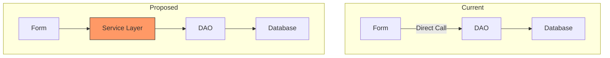

# SuggestionTextBox Constitution Compliance Audit

## OBJECTIVE
Audit an existing file that uses SuggestionTextBox controls to ensure full compliance with the MTM constitution. This prompt performs a comprehensive review and refactors code to meet all standards without losing any logic. It also generates a proposed improvements section for enhancements beyond the audit scope.

## INPUT REQUIREMENTS

Before executing this prompt:
1. **Target File**: Full path to the .cs file to audit (must contain SuggestionTextBox controls)
2. **Audit Scope**: Full audit or specific focus areas (error handling, logging, async patterns, etc.)

## EXECUTION STEPS

### Step 1: Read Constitution and Instructions

<tool>read_file</tool> on:
```
c:\Users\johnk\source\repos\MTM_WIP_Application_WinForms\.specify\memory\constitution.md
c:\Users\johnk\source\repos\MTM_WIP_Application_WinForms\.github\instructions\suggestiontextbox-implementation.instructions.md
{target_file}
```

### Step 2: Analyze Current Implementation

Create a checklist of constitution requirements:

#### 2.1: Error Handling (Principle I)
- [ ] All exceptions caught and handled
- [ ] Service_ErrorHandler used (NEVER MessageBox.Show directly)
- [ ] Appropriate severity levels (Low, Medium, High, Fatal)
- [ ] Context dictionaries provided for debugging
- [ ] Specialized handlers used (HandleDatabaseError, HandleValidationError, etc.)
- [ ] ShowWarning/ShowInformation/ShowConfirmation for non-errors

#### 2.2: Structured Logging (Principle II)
- [ ] LoggingUtility.Log() used for operations
- [ ] LoggingUtility.LogApplicationError() for app errors
- [ ] LoggingUtility.LogDatabaseError() for DB errors
- [ ] No Console.WriteLine() or Debug.WriteLine() (except in LoggingUtility itself)
- [ ] Meaningful log messages with context

#### 2.3: Model_Dao_Result Pattern (Principle III)
- [ ] All DAO methods return Model_Dao_Result<T>
- [ ] Result.IsSuccess checked before using Result.Data
- [ ] Result.ErrorMessage used for user-friendly errors
- [ ] No direct exception throwing from DAO layer

#### 2.4: Async-First Database Operations (Principle IV)
- [ ] All database operations use async/await
- [ ] No .Result or .Wait() blocking calls
- [ ] Async event handlers use async void pattern correctly
- [ ] Proper exception handling in async methods

#### 2.5: WinForms Best Practices (Principle V)
- [ ] Event handlers subscribed and unsubscribed properly
- [ ] Dispose() method properly implemented
- [ ] No memory leaks from event subscriptions
- [ ] Proper null-conditional operators used

#### 2.6: Code Organization
- [ ] Proper #region structure (Fields, Events, Constructors, etc.)
- [ ] Methods in appropriate regions
- [ ] XML documentation on all public methods
- [ ] Consistent naming conventions

### Step 3: Create Audit Report

Generate a detailed audit report:

```markdown
# Constitution Compliance Audit Report
**File**: {target_file}
**Date**: {current_date}
**Auditor**: AI Agent
**Version**: v1.0

## Executive Summary
- **Overall Compliance**: {percentage}%
- **Critical Issues**: {count}
- **Warnings**: {count}
- **Suggestions**: {count}

## Principle I: Error Handling
### Critical Issues
- [ ] Line {X}: Direct MessageBox.Show() usage - MUST use Service_ErrorHandler
- [ ] Line {Y}: Exception swallowed without logging

### Warnings
- [ ] Line {X}: Missing context dictionary for exception
- [ ] Line {Y}: Generic error severity - could be more specific

### Compliant
- ✅ Lines {X-Y}: Proper Service_ErrorHandler usage
- ✅ Line {Z}: Good context enrichment

## Principle II: Structured Logging
### Critical Issues
- [ ] Line {X}: Console.WriteLine() used - MUST use LoggingUtility

### Warnings
- [ ] Line {X}: Log message lacks context

### Compliant
- ✅ Lines {X-Y}: Proper LoggingUtility usage
- ✅ Line {Z}: Meaningful log messages

## Principle III: Model_Dao_Result Pattern
{Similar detailed breakdown}

## Principle IV: Async-First Database Operations
{Similar detailed breakdown}

## Principle V: WinForms Best Practices
{Similar detailed breakdown}

## Code Organization
{Similar detailed breakdown}
```

### Step 4: Fix Critical Issues

Address all CRITICAL issues first:

#### 4.1: Replace MessageBox.Show
```csharp
// ❌ CRITICAL ISSUE
MessageBox.Show("Error occurred!");

// ✅ FIX
Service_ErrorHandler.ShowWarning("Error occurred!");
```

#### 4.2: Add Missing Error Handling
```csharp
// ❌ CRITICAL ISSUE - No error handling
private async void SaveButton_Click(object sender, EventArgs e)
{
    await SaveDataAsync();
}

// ✅ FIX
private async void SaveButton_Click(object? sender, EventArgs e)
{
    try
    {
        await SaveDataAsync();
    }
    catch (Exception ex)
    {
        Service_ErrorHandler.HandleException(ex, Enum_ErrorSeverity.Medium,
            contextData: new Dictionary<string, object>
            {
                ["Operation"] = "SaveData"
            },
            controlName: nameof(MyControl),
            callerName: nameof(SaveButton_Click));
    }
}
```

#### 4.3: Replace Console.WriteLine
```csharp
// ❌ CRITICAL ISSUE
Console.WriteLine($"Part selected: {part}");

// ✅ FIX
LoggingUtility.Log($"[{nameof(MyControl)}] Part selected: {part}");
```

#### 4.4: Fix Blocking Async Calls
```csharp
// ❌ CRITICAL ISSUE
var result = GetDataAsync().Result; // Blocks UI thread!

// ✅ FIX
var result = await GetDataAsync();
```

### Step 5: Fix Warnings

Address warning-level issues:

#### 5.1: Add Context Dictionaries
```csharp
// ⚠️ WARNING - Minimal context
catch (Exception ex)
{
    Service_ErrorHandler.HandleException(ex, Enum_ErrorSeverity.Medium,
        controlName: nameof(MyControl));
}

// ✅ IMPROVED
catch (Exception ex)
{
    Service_ErrorHandler.HandleException(ex, Enum_ErrorSeverity.Medium,
        contextData: new Dictionary<string, object>
        {
            ["Operation"] = "LoadPartDetails",
            ["SelectedPart"] = selectedPart,
            ["User"] = Model_Application_Variables.User
        },
        controlName: nameof(MyControl),
        callerName: nameof(LoadPartDetails));
}
```

#### 5.2: Improve Error Severity Classification
```csharp
// ⚠️ WARNING - Generic severity
catch (Exception ex)
{
    Service_ErrorHandler.HandleException(ex, Enum_ErrorSeverity.Medium, ...);
}

// ✅ IMPROVED - More specific
catch (MySqlException ex)
{
    // Database errors should be High severity
    Service_ErrorHandler.HandleException(ex, Enum_ErrorSeverity.High, ...);
}
catch (Exception ex)
{
    // General errors can be Medium
    Service_ErrorHandler.HandleException(ex, Enum_ErrorSeverity.Medium, ...);
}
```

#### 5.3: Enhance Log Messages
```csharp
// ⚠️ WARNING - Vague message
LoggingUtility.Log("Data loaded");

// ✅ IMPROVED - Specific and contextual
LoggingUtility.Log($"[{nameof(MyControl)}] Part '{selectedPart}' loaded with {rowCount} operations");
```

### Step 6: Improve Code Organization

#### 6.1: Reorganize Regions
Ensure proper order:
```csharp
#region Fields
  // Private fields only
#endregion

#region Events
  // Public event declarations
#endregion

#region Constructors
  // Constructor(s)
#endregion

#region Initialization
  // Setup methods called from constructor
  ConfigureSuggestionTextBoxes()
  WireUpEventHandlers()
#endregion

#region Events
  // Event handler implementations
  XXX_Click(object? sender, EventArgs e)
  XXX_SuggestionSelected(object? sender, SuggestionSelectedEventArgs e)
#endregion

#region Data Providers
  // SuggestionTextBox data providers
  GetXXXSuggestionsAsync()
#endregion

#region Validation
  // Validation methods
  ValidateXXX()
#endregion

#region Methods
  // Public methods
  // Protected methods
  // Private methods
#endregion

#region Helpers
  // Private helper methods
#endregion

#region Cleanup
  // Dispose() override
#endregion
```

#### 6.2: Add Missing XML Documentation
```csharp
// ⚠️ WARNING - No XML documentation
private async Task SaveDataAsync()
{
    // implementation
}

// ✅ IMPROVED
/// <summary>
/// Saves form data to database using DAO layer.
/// Validates inputs before saving and shows success/error messages.
/// </summary>
/// <returns>Task representing the async save operation</returns>
private async Task SaveDataAsync()
{
    // implementation
}
```

### Step 7: Remove Obsolete/Dead Code

Identify and remove:
- [ ] Commented-out code blocks (unless marked as backup)
- [ ] Unused private methods
- [ ] Unused fields/properties
- [ ] Duplicate logic
- [ ] Debug code left in accidentally

**IMPORTANT**: Only remove code you're certain is unused. When in doubt, leave it.

### Step 8: Enhance Null Safety

#### 8.1: Add Null-Conditional Operators
```csharp
// ⚠️ POTENTIAL NULL REFERENCE
string partId = _currentPart["PartID"].ToString();

// ✅ NULL-SAFE
string partId = _currentPart["PartID"]?.ToString() ?? string.Empty;
```

#### 8.2: Add DBNull Checks
```csharp
// ⚠️ POTENTIAL DBNULL ISSUE
bool requiresColorCode = Convert.ToBoolean(_currentPart["RequiresColorCode"]);

// ✅ DBNULL-SAFE
var colorCodeValue = _currentPart["RequiresColorCode"];
bool requiresColorCode = colorCodeValue != DBNull.Value && Convert.ToBoolean(colorCodeValue);
```

#### 8.3: Add Nullable Reference Checks
```csharp
// ⚠️ WARNING - Assumes not null
private void UpdateUI(DataRow data)
{
    labelValue.Text = data["Value"].ToString(); // Could throw NullReferenceException
}

// ✅ NULL-SAFE
private void UpdateUI(DataRow? data)
{
    if (data == null)
    {
        return;
    }

    labelValue.Text = data["Value"]?.ToString() ?? string.Empty;
}
```

### Step 9: Verify Dispose Pattern

Ensure proper cleanup:

```csharp
protected override void Dispose(bool disposing)
{
    if (disposing)
    {
        try
        {
            // Unsubscribe from ALL events
            if (partSuggestionTextBox != null)
            {
                partSuggestionTextBox.SuggestionSelected -= PartSuggestionTextBox_SuggestionSelected;
            }

            if (operationSuggestionTextBox != null)
            {
                operationSuggestionTextBox.SuggestionSelected -= OperationSuggestionTextBox_SuggestionSelected;
            }

            if (saveButton != null)
            {
                saveButton.Click -= SaveButton_Click;
            }

            // Dispose any IDisposable fields
            _someDisposableResource?.Dispose();
        }
        catch (Exception ex)
        {
            // Log but don't throw during disposal
            LoggingUtility.LogApplicationError(ex);
        }
    }

    base.Dispose(disposing);
}
```

### Step 10: Performance Optimizations

Identify opportunities:

#### 10.1: List Capacity Hints
```csharp
// ⚠️ SUBOPTIMAL - List grows dynamically
var suggestions = new List<string>();

// ✅ OPTIMIZED - Pre-allocate capacity
var suggestions = new List<string>(result.Data.Rows.Count);
```

#### 10.2: String Concatenation
```csharp
// ⚠️ SUBOPTIMAL - Multiple string allocations
string message = "Part " + partId + " selected";

// ✅ OPTIMIZED - Single allocation
string message = $"Part {partId} selected";
```

### Step 11: Build and Verify

```powershell
dotnet build
```

Ensure:
- [ ] No compilation errors
- [ ] No new warnings introduced
- [ ] All changes backward compatible

### Step 12: Generate Suggestion Files (Not Embedded in Code)

**IMPORTANT**: Do NOT embed suggestions in the code file. Generate separate markdown files instead.

#### 12.1: Categorize Suggestions

Group all proposed improvements into THREE categories:

**1. File-Only Suggestions**
- Affect ONLY the audited file (and `.Designer.cs` if applicable)
- Can be implemented without touching other files
- No breaking changes to interfaces or shared components
- Examples: Add tooltips, improve validation messages, enhance logging context

**2. System Suggestions**
- Affect a specific system/component (e.g., `Service_ErrorHandler`, `Helper_SuggestionTextBox`)
- Multiple files in same subsystem
- Shared component improvements
- Examples: Add new helper methods, enhance error handling patterns, improve caching

**3. Multi-File / Speckit Suggestions**
- Require coordinated changes across multiple systems
- Architectural changes, breaking changes, new features
- Database schema modifications
- Examples: MVVM refactor, new security system, batch operations feature

#### 12.2: Generate Suggestion Files

Use the suggestion file template and generation script:

**For File-Only Suggestions:**
```
Output: .github/suggestions/{FileName}-suggestions.md
Example: .github/suggestions/Control_Edit_PartID-suggestions.md
```

**For System Suggestions:**
```
Output: .github/suggestions/{SystemName}-suggestions.md
Example: .github/suggestions/Service_ErrorHandler-suggestions.md
```

**For Speckit Suggestions:**
```
Output: .github/suggestions/speckit/{FeatureName}-suggestion.md
Example: .github/suggestions/speckit/MVVM-Pattern-Refactor-suggestion.md
```

#### 12.3: Check for Duplicate Suggestions

Before creating new suggestion:
1. Check if suggestion file already exists
2. If exists, read content and search for similar suggestion ID
3. If duplicate found:
   - Compare your version with existing
   - If different approach, UPDATE existing with reasoning
   - If identical, SKIP (don't duplicate)
4. If new suggestion, ADD to appropriate file

#### 12.4: Suggestion File Structure

Each suggestion must include:

```markdown
### {CATEGORY}-{ID}: {TITLE}
**Priority**: {X}/10 _{PRIORITY_LABEL}_  
**Scope**: {Y}/10 _{SCOPE_LABEL}_
{**Requires Speckit**: ✅ Yes} _(if multi-file)_

#### User Benefit
{Plain English - what user experiences/gains}

#### Why Needed  
{Business justification - problem solved, pain point addressed}

#### Current Behavior
{What happens now that's suboptimal}

#### Proposed Implementation
```{LANGUAGE}
{CODE_SAMPLE}
```

#### Affected Components
- File: `{PATH}`
- Methods: `{NAMES}`
- Controls: `{NAMES}` _(if applicable)_

#### Implementation Diagram _(if helpful)_
```mermaid
{DIAGRAM}
```

#### Estimated Effort
- **Time**: {HOURS} hours
- **Complexity**: {LOW|MEDIUM|HIGH}
- **Risk**: {LOW|MEDIUM|HIGH}
```

#### 12.5: Priority and Scope Guidelines

**Priority Scale:**
- 1-3: Nice to Have (polish, minor UX improvements)
- 4-6: Helpful/Recommended (workflow improvements, error prevention)
- 7-8: Important/Very Important (compliance, data integrity)
- 9-10: Critical (security, breaking bugs, regulatory)

**Scope Scale:**
- 1-2: Single file, minimal impact
- 3-4: Few files, isolated feature
- 5-6: Multiple files, moderate architectural impact
- 7-8: System-wide changes, significant refactor
- 9-10: Constitutional changes, codebase-wide

**Speckit Required If:**
- Scope >= 5
- Architectural changes (MVVM, Command pattern, etc.)
- Database schema changes
- Security/permission system changes
- New major features (forms, batch operations, workflows)

#### 12.6: Use Mermaid Diagrams Effectively

**When to use diagrams:**
- Workflow changes (flowchart)
- Interaction patterns (sequence)
- Architecture refactors (class/graph)
- State management (state)
- Implementation timeline (gantt - speckit only)

**Example - Architecture Change:**


#### 12.7: Update Audited File with Reference

After generating suggestion files, add MINIMAL reference block to audited file:

```csharp
#region PROPOSED_IMPROVEMENTS

/*
 * ═══════════════════════════════════════════════════════════════════════════════
 * CONSTITUTION COMPLIANCE AUDIT RESULTS
 * ═══════════════════════════════════════════════════════════════════════════════
 * Audit Date: {YYYY-MM-DD}
 * Compliance Score: {XX}%
 * Critical Issues Fixed: {COUNT}
 * Warnings Fixed: {COUNT}
 * 
 * ═══════════════════════════════════════════════════════════════════════════════
 * PROPOSED IMPROVEMENTS
 * ═══════════════════════════════════════════════════════════════════════════════
 * 
 * Suggestions have been extracted to dedicated files for better organization
 * and to avoid cluttering the codebase with extensive improvement proposals.
 * 
 * SUGGESTION FILES:
 * - File-Only: .github/suggestions/{FileName}-suggestions.md
 * - System: .github/suggestions/{SystemName}-suggestions.md (if applicable)
 * - Speckit: .github/suggestions/speckit/{FeatureName}-suggestion.md (if applicable)
 * 
 * SUGGESTION SUMMARY:
 * - File-Only Suggestions: {COUNT}
 * - System Suggestions: {COUNT}
 * - Multi-File (Speckit) Suggestions: {COUNT}
 * 
 * TO IMPLEMENT:
 * 1. Review suggestion files linked above
 * 2. Prioritize based on Priority and Scope ratings
 * 3. For Speckit suggestions, run /speckit.specify to create feature branch
 * 4. Implement and test incrementally
 * 
 * ═══════════════════════════════════════════════════════════════════════════════
 */

#endregion
```

**DO NOT** include the full suggestion list in the code file anymore.

## OUTPUT FORMAT

### 1. Audit Report Summary
```
Constitution Compliance Audit Complete
File: {target_file}
Overall Compliance: 94% → 100% ✅

Critical Issues Fixed: 3
- Replaced MessageBox.Show with Service_ErrorHandler
- Added missing try-catch blocks
- Fixed blocking .Result call

Warnings Fixed: 8
- Added context dictionaries to 5 exception handlers
- Improved error severity classification in 2 locations
- Enhanced log messages with better context

Code Organization Improvements: 4
- Reorganized regions into proper structure
- Added XML documentation to 8 methods
- Removed 3 obsolete methods
- Fixed 6 null safety issues

Performance Optimizations: 2
- Added List capacity hints
- Improved string concatenation patterns
```

### 2. Before/After Metrics
```
Code Quality Metrics:
- Lines of Code: 580 → 595 (+15 documentation)
- Methods: 24 → 21 (-3 obsolete)
- XML Documented Methods: 12 → 21 (+9)
- Error Handlers: 8 → 11 (+3)
- Context Dictionaries: 3 → 11 (+8)
- Log Statements: 6 → 14 (+8)

Constitution Compliance:
- Error Handling: 75% → 100% ✅
- Structured Logging: 60% → 100% ✅
- Async Patterns: 90% → 100% ✅
- Code Organization: 80% → 100% ✅
- Null Safety: 70% → 95% ✅
```

### 3. Testing Checklist
```
Verification Required:
[ ] All critical fixes tested manually
[ ] No regressions in existing functionality
[ ] Error messages still user-friendly
[ ] Performance not degraded
[ ] Memory leaks addressed (events properly unsubscribed)
```

### 4. Proposed Improvements
```
Generated comprehensive improvement suggestions in 12 categories:
✅ Architecture Enhancements
✅ Performance Optimization
✅ User Experience
✅ Validation Improvements
✅ Accessibility
✅ Testing
✅ Code Quality
✅ Observability
✅ Resilience
✅ Security
✅ Documentation
✅ Maintainability

See #region PROPOSED_IMPROVEMENTS at end of file for details.
```

### 5. Next Steps
```
✅ Constitution compliance achieved (100%)
✅ Build successful with no errors
✅ Code quality improved
✅ Proposed improvements documented

RECOMMENDED ACTIONS:
1. Manual testing of all affected workflows
2. Code review by team member
3. User acceptance testing
4. Consider implementing high-priority proposed improvements

SUGGESTED NEXT PROMPT:
If more files need auditing:
  Run "suggestiontextbox-constitution-audit.prompt.md" on next file

If done with audits:
  Session complete - all SuggestionTextBox implementations are constitution-compliant
```

## VERSION
v1.0 - 2025-11-15

## RELATED PROMPTS
- `suggestiontextbox-implement-new.prompt.md` - Create new controls
- `suggestiontextbox-refactor-combobox.prompt.md` - Migrate ComboBox
- `suggestiontextbox-refactor-textbox.prompt.md` - Migrate TextBox
