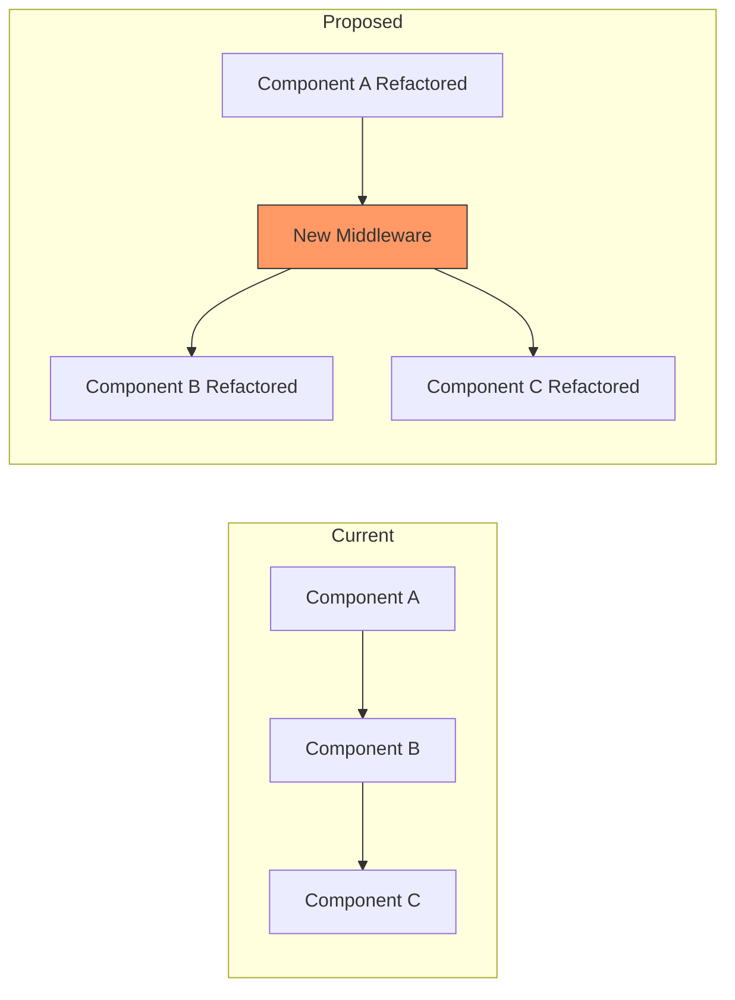
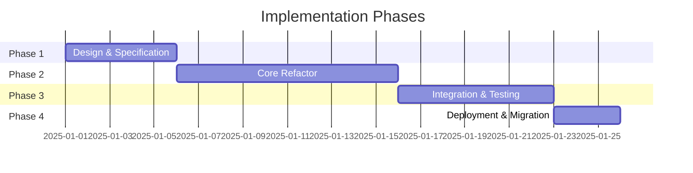

# Suggestions: {TARGET_FILE_NAME}
**Generated**: {GENERATION_DATE}  
**Category**: {CATEGORY}  
**Target File**: `{TARGET_FILE_PATH}`  
**System**: `{SYSTEM_NAME}` _(if applicable)_

---

## Table of Contents
- [Summary](#summary)
- [File-Only Suggestions](#file-only-suggestions)
- [System Suggestions](#system-suggestions)
- [Multi-File / Speckit Suggestions](#multi-file--speckit-suggestions)
- [Implementation Notes](#implementation-notes)
- [Related Documentation](#related-documentation)

---

## Summary

**Total Suggestions**: {TOTAL_COUNT}  
**Category Breakdown**:
- File-Only: {FILE_ONLY_COUNT}
- System-Level: {SYSTEM_COUNT}
- Multi-File (Speckit): {SPECKIT_COUNT}

**Priority Breakdown**:
- Critical (9-10): {CRITICAL_COUNT}
- Important (7-8): {IMPORTANT_COUNT}
- Helpful (4-6): {HELPFUL_COUNT}
- Nice to Have (1-3): {NICE_COUNT}

---

## File-Only Suggestions
> Suggestions affecting only `{TARGET_FILE}` (and `.Designer.cs` if applicable)

### {CATEGORY}-{ID}: {TITLE}
**Priority**: {X}/10 _{PRIORITY_LABEL}_  
**Scope**: {Y}/10 _{SCOPE_LABEL}_

#### User Benefit
{Plain English description of what user gains/experiences}

#### Why Needed
{Business justification - what problem solved, pain point addressed}

#### Current Behavior
{What happens now that's suboptimal}

#### Proposed Implementation
```{LANGUAGE}
{CODE_SAMPLE}
```

#### Affected Components
- File: `{FILE_PATH}`
- Method(s): `{METHOD_NAMES}`
- Control(s): `{CONTROL_NAMES}` _(if applicable)_

#### Implementation Diagram _(optional)_
```mermaid
{MERMAID_DIAGRAM}
```

#### Estimated Effort
- **Time**: {HOURS} hours
- **Complexity**: {LOW|MEDIUM|HIGH}
- **Risk**: {LOW|MEDIUM|HIGH}

---

## System Suggestions
> Suggestions affecting `{SYSTEM_NAME}` system (multiple files, single subsystem)

### {SYSTEM}-{ID}: {TITLE}
**Priority**: {X}/10 _{PRIORITY_LABEL}_  
**Scope**: {Y}/10 _{SCOPE_LABEL}_

#### User Benefit
{Plain English description}

#### Why Needed
{Business justification}

#### Affected Files
- `{FILE_1}`
- `{FILE_2}`
- `{FILE_3}`

#### System Architecture Impact
```mermaid
graph TB
    A[{COMPONENT_A}] -->|{RELATIONSHIP}| B[{COMPONENT_B}]
    B --> C[{COMPONENT_C}]
    
    style A fill:#f9f,stroke:#333
    style B fill:#bbf,stroke:#333
```

#### Implementation Steps
1. {STEP_1}
2. {STEP_2}
3. {STEP_3}

#### Testing Requirements
- [ ] Unit tests for `{CLASS_NAME}`
- [ ] Integration tests for `{WORKFLOW}`
- [ ] Manual regression testing

---

## Multi-File / Speckit Suggestions
> Architectural changes requiring `/speckit.specify` - coordinated multi-system changes

### SPECKIT-{ID}: {TITLE}
**Priority**: {X}/10 _{PRIORITY_LABEL}_  
**Scope**: {Y}/10 _{SCOPE_LABEL}_  
**Requires Speckit**: ✅ Yes

#### User Benefit
{Significant business value proposition}

#### Why Needed
{Strategic/architectural justification}

#### Systems Affected
- **{SYSTEM_1}**: {IMPACT_DESCRIPTION}
- **{SYSTEM_2}**: {IMPACT_DESCRIPTION}
- **Database**: {SCHEMA_CHANGES}
- **Infrastructure**: {INFRASTRUCTURE_CHANGES}

#### High-Level Architecture


#### Implementation Timeline


#### Migration Strategy
- **Breaking Changes**: {YES|NO}
- **Backward Compatibility**: {MAINTAINED|PHASED_DEPRECATION}
- **Rollback Plan**: {DESCRIPTION}

#### Dependencies
- [ ] Dependency 1
- [ ] Dependency 2
- [ ] Dependency 3

---

## Implementation Notes

### General Guidelines
- Review all suggestions before implementing
- Test each change independently when possible
- Update tests as changes are made
- Verify constitution compliance after each change
- Document any deviations from proposed implementation

### Suggested Implementation Order
1. **{SUGGESTION_ID}** - {REASON_FOR_PRIORITY}
2. **{SUGGESTION_ID}** - {REASON_FOR_PRIORITY}
3. **{SUGGESTION_ID}** - {REASON_FOR_PRIORITY}

### Testing Checklist
- [ ] Unit tests written/updated
- [ ] Integration tests pass
- [ ] Manual smoke testing complete
- [ ] Performance benchmarks reviewed (if applicable)
- [ ] Constitution compliance verified
- [ ] Security review complete (if applicable)

### Rollback Strategy
If implementation causes issues:
1. {ROLLBACK_STEP_1}
2. {ROLLBACK_STEP_2}
3. {ROLLBACK_STEP_3}

---

## Related Documentation

### Constitution References
- Principle I: Error Handling → `.specify/memory/constitution.md#principle-i`
- Principle II: Structured Logging → `.specify/memory/constitution.md#principle-ii`
- Principle III: Model_Dao_Result → `.specify/memory/constitution.md#principle-iii`

### Instruction Files
- SuggestionTextBox Implementation → `.github/instructions/suggestiontextbox-implementation.instructions.md`
- Error Handler Guide → `.github/instructions/service-error-handler.instructions.md`
- Theme System → `.github/instructions/theme-system.instructions.md`

### Related Specifications
- {SPEC_001}: {TITLE} → `specs/{folder}/spec.md`
- {SPEC_002}: {TITLE} → `specs/{folder}/spec.md`

---

**Auto-generated by**: `suggestiontextbox-constitution-audit.prompt.md`  
**Template Version**: 1.0.0  
**Generation Script**: `.github/suggestions/execution-files/Generate-SuggestionFile.ps1`

---

## Changelog

### {DATE} - Initial Generation
- Generated {TOTAL_COUNT} suggestions from audit of `{TARGET_FILE}`
- Categorized into File-Only ({FILE_ONLY_COUNT}), System ({SYSTEM_COUNT}), and Speckit ({SPECKIT_COUNT})

### {DATE} - Updated
- _{CHANGE_DESCRIPTION}_
