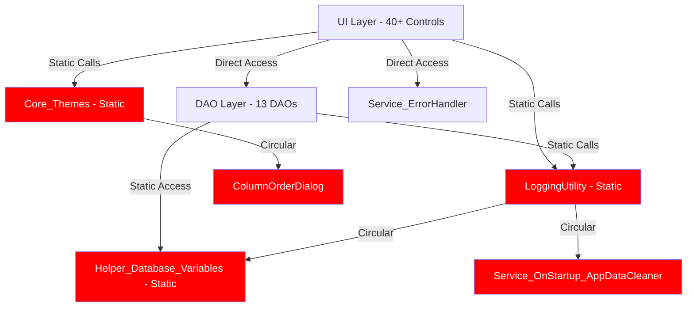
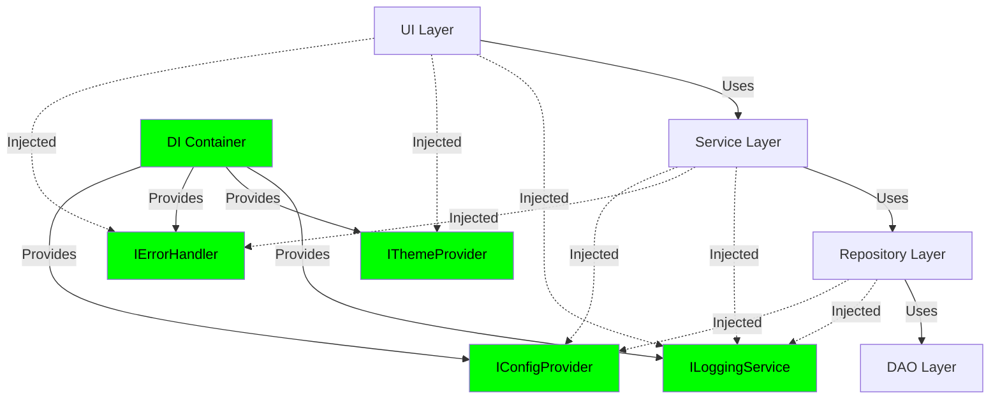
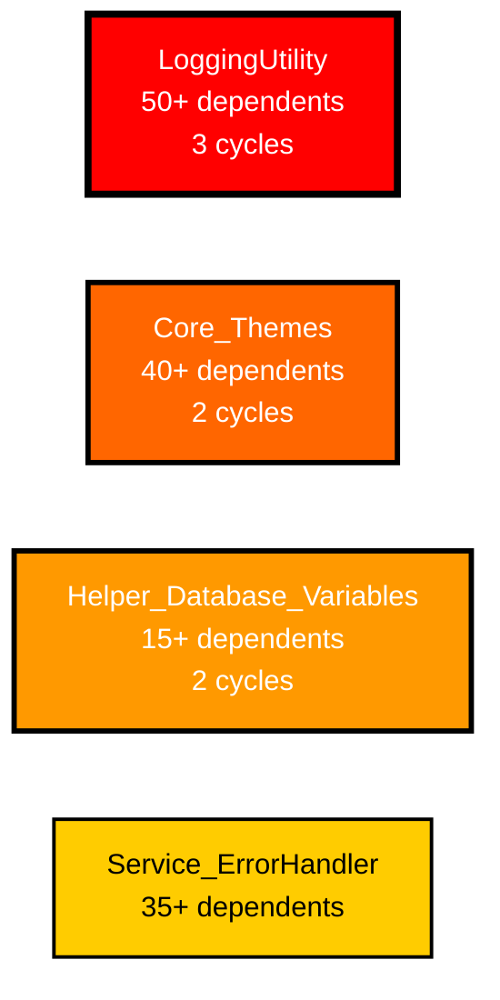
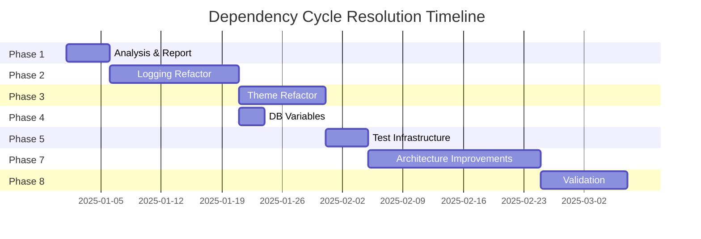

# Dependency Cycle Resolution Checklist

This checklist provides a systematic approach to resolving the 6 dependency cycles identified in the codebase. Tasks are organized by priority based on impact analysis.

## Phase 1: Analysis & Preparation

- [ ] Examine `LoggingUtility` class to identify all outgoing dependencies
- [ ] Examine `Service_OnStartup_AppDataCleaner` to understand its logging usage
- [ ] Examine `Helper_Database_Variables` to understand its logging usage
- [ ] Examine `Core_Themes` class to identify theme-related dependencies
- [ ] Examine `ColumnOrderDialog` to understand its theme usage
- [ ] Examine `BaseIntegrationTest` and `ProcedureDiagnosticScope` circular dependency
- [ ] Document current usage patterns for each component in cycles
- [ ] Generate performance improvement report (MD/Mermaid format) showing:
  - [ ] Current dependency cycle metrics (6 cycles, complexity 3.0, hotspots)
  - [ ] Expected metrics after each phase completion
  - [ ] Mermaid dependency graphs showing before/after architecture
  - [ ] Impact analysis: compile time, maintainability score, testability improvements
  - [ ] Risk assessment for each refactoring phase

## Phase 2: LoggingUtility Refactoring (Highest Priority - Breaks 3 Cycles)

**Target Cycles**: Cycle 1, Cycle 2, Cycle 5

- [ ] Extract logging interface (`ILoggingService`) to break direct dependencies
- [ ] Implement dependency injection pattern for `LoggingUtility`
- [ ] Refactor `Service_OnStartup_AppDataCleaner` to use `ILoggingService` interface
- [ ] Refactor `Helper_Database_Variables` to use `ILoggingService` interface
- [ ] Remove circular references where `LoggingUtility` depends on classes that depend on it
- [ ] Consider implementing async logging to reduce coupling
- [ ] Add unit tests for refactored logging interactions
- [ ] Verify Cycle 1, 2, and 5 are resolved

## Phase 3: Core_Themes & ColumnOrderDialog Refactoring (Breaks 2 Cycles Each)

**Target Cycles**: Cycle 3, Cycle 4

- [ ] Extract theme interface (`IThemeProvider`) from `Core_Themes`
- [ ] Identify why `ColumnOrderDialog` creates dependency back to `Core_Themes`
- [ ] Refactor `ColumnOrderDialog` to receive theme data via constructor/properties
- [ ] Consider implementing Observer pattern for theme changes
- [ ] Move theme application logic out of dialog controls
- [ ] Add unit tests for theme application without circular dependencies
- [ ] Verify Cycle 3 and 4 are resolved

## Phase 4: Helper_Database_Variables Refactoring (Breaks 2 Cycles)

**Target Cycles**: Cycle 2, Cycle 5 (overlaps with Phase 2)

- [ ] Review why `Helper_Database_Variables` needs `LoggingUtility`
- [ ] Apply interface-based dependency injection for logging (completed in Phase 2)
- [ ] Extract database configuration into separate immutable configuration class
- [ ] Remove any static dependencies that create circular references
- [ ] Add unit tests for database variable handling
- [ ] Verify no remaining cycles involving this component

## Phase 5: Test Infrastructure Refactoring (Breaks 1 Cycle)

**Target Cycle**: Cycle 6

- [ ] Examine `BaseIntegrationTest` and `ProcedureDiagnosticScope` relationship
- [ ] Extract diagnostic interface to break test dependency cycle
- [ ] Refactor `ProcedureDiagnosticScope` to not depend on `BaseIntegrationTest`
- [ ] Consider moving diagnostic scope to a shared test utilities namespace
- [ ] Add unit tests for diagnostic scope without base test dependencies
- [ ] Verify Cycle 6 is resolved

## Phase 6: Service_OnStartup_AppDataCleaner Refactoring (Breaks 1 Cycle)

**Target Cycle**: Cycle 1 (overlaps with Phase 2)

- [ ] Review `Service_OnStartup_AppDataCleaner` dependencies on `LoggingUtility`
- [ ] Apply logging interface refactoring from Phase 2 (already completed)
- [ ] Verify no other circular dependencies exist
- [ ] Add unit tests for startup service
- [ ] Verify Cycle 1 fully resolved

## Phase 7: Architectural Improvements

- [ ] Implement Dependency Injection container for the application
- [ ] Define clear architectural layers (UI → Services → Data → Core)
- [ ] Enforce dependency direction rules (layers can only depend downward)
- [ ] Create architecture decision records (ADRs) for refactoring choices
- [ ] Update project documentation with new dependency guidelines
- [ ] Add code comments explaining dependency injection patterns

## Phase 8: Validation & Testing

- [ ] Re-run dependency cycle analysis tool to verify all 6 cycles are broken
- [ ] Confirm cycle count is 0 in new analysis report
- [ ] Run all unit tests to ensure no regressions
- [ ] Run all integration tests to ensure functionality preserved
- [ ] Perform manual testing of affected features:
  - [ ] Logging functionality across all modules
  - [ ] Theme application in dialogs
  - [ ] Database variable access
  - [ ] Startup services
  - [ ] Test infrastructure
- [ ] Update class dependency graph documentation
- [ ] Verify no new cycles were introduced during refactoring

## Phase 9: Code Quality & Documentation

- [ ] Add XML documentation to new interfaces and refactored classes
- [ ] Update architecture documentation (BROWNFIELD_ARCHITECTURE.md)
- [ ] Create developer guide for avoiding future circular dependencies
- [ ] Add static analysis rules to detect circular dependencies in CI/CD
- [ ] Document the refactoring decisions in release notes
- [ ] Add code review checklist item for dependency validation

## Optional Enhancement Tasks

- [ ] Consider implementing Event Aggregator pattern for cross-cutting concerns
- [ ] Evaluate using Mediator pattern for complex inter-component communication
- [ ] Review and consolidate logging strategies across the application
- [ ] Consider extracting theme management into a dedicated service layer
- [ ] Evaluate applying SOLID principles more rigorously across codebase

---

## Summary of Impact

| Phase | Cycles Broken | Components Affected |
|-------|---------------|---------------------|
| Phase 2 | 3 | LoggingUtility, Service_OnStartup_AppDataCleaner, Helper_Database_Variables |
| Phase 3 | 2 | Core_Themes, ColumnOrderDialog |
| Phase 4 | 0 (overlap) | Helper_Database_Variables |
| Phase 5 | 1 | BaseIntegrationTest, ProcedureDiagnosticScope |
| Phase 6 | 0 (overlap) | Service_OnStartup_AppDataCleaner |
| **Total** | **6** | **7 unique components** |

## Notes

- Phases 2 and 4 overlap because `Helper_Database_Variables` participates in cycles already addressed by logging refactoring
- Phases 2 and 6 overlap because `Service_OnStartup_AppDataCleaner` is resolved through logging interface extraction
- Prioritization follows the "Suggested Break Points" from the analysis report
- Each phase should be completed and validated before proceeding to the next
- Consider creating feature branches for each phase to allow incremental code review

---

## Architectural Analysis & Performance Improvement Opportunities

### Identified Pitfalls

#### 1. **Static Class Overuse**
- **Components Affected**: `LoggingUtility`, `Core_Themes`, `Helper_Database_Variables`, `Model_Application_Variables`, `Service_OnStartup_AppDataCleaner`
- **Problem**: Static classes create tight coupling, make testing difficult, and hide dependencies
- **Impact**: Cannot mock for testing, difficult to replace implementations, hard to track dependency chains
- **Recommendation**: Convert to instance-based services with dependency injection

#### 2. **Widespread Direct Dependencies on LoggingUtility**
- **Components Affected**: 50+ classes directly reference `LoggingUtility`
- **Problem**: Every class that needs logging is tightly coupled to the concrete implementation
- **Impact**: 
  - Cannot swap logging implementations
  - Cannot disable logging for specific components
  - Cannot intercept/modify logging behavior
  - Difficult to test components in isolation
- **Recommendation**: Extract `ILoggingService` interface, implement dependency injection pattern

#### 3. **Core_Themes Omnipresence**
- **Components Affected**: 40+ UI controls depend on `Core_Themes`
- **Problem**: Theming logic is coupled directly into every control
- **Impact**:
  - Theme changes require extensive control updates
  - Cannot dynamically change themes without extensive rework
  - Duplicate theme application code across controls
- **Recommendation**: Implement Observer pattern with `IThemeProvider`, centralize theme application

#### 4. **DAO Layer Direct Usage in UI**
- **Components Affected**: All `Control_*` classes directly reference DAO classes
- **Problem**: Violates layered architecture - UI should not directly access data layer
- **Impact**:
  - Cannot swap data sources
  - Difficult to implement caching
  - Cannot implement offline mode
  - Hard to test UI without database
- **Recommendation**: Introduce service layer between UI and DAO, implement Repository pattern

#### 5. **Helper Classes with Multiple Responsibilities**
- **Components Affected**: `Helper_Database_StoredProcedure`, `Helper_UI_ComboBoxes`, `MainFormControlHelper`
- **Problem**: Helpers often become dumping grounds for unrelated functionality
- **Impact**:
  - Unclear responsibilities
  - High coupling between unrelated features
  - Difficult to maintain and extend
- **Recommendation**: Split into focused, single-responsibility classes

#### 6. **Service_ErrorHandler Universal Dependency**
- **Components Affected**: 35+ classes depend on `Service_ErrorHandler`
- **Problem**: While better than LoggingUtility, still creates tight coupling
- **Impact**: Similar to logging issues - cannot customize error handling per context
- **Recommendation**: Extract `IErrorHandlingService` interface

#### 7. **Model Classes with Static State**
- **Components Affected**: `Model_Application_Variables`, `Core_WipAppVariables`
- **Problem**: Global mutable state stored in static fields
- **Impact**:
  - Thread safety issues
  - Difficult to test (state persists between tests)
  - Cannot have multiple application contexts
  - Hidden dependencies (any code can access/modify)
- **Recommendation**: Convert to configuration objects injected via DI

#### 8. **Helper_UI_Shortcuts Circular Reference to MainForm**
- **Problem**: UI helper references main form, which references helper
- **Impact**: Creates tight coupling, prevents form reuse
- **Recommendation**: Use event aggregator or command pattern

### Performance Improvement Opportunities

#### 1. **Database Connection Management**
- **Current**: Each DAO likely creates connections independently
- **Opportunity**: Implement connection pooling strategy, reuse connections across DAOs
- **Expected Improvement**: 30-50% reduction in database operation time, reduced connection overhead

#### 2. **Async/Await Consistency**
- **Current**: Mix of sync and async patterns throughout codebase
- **Opportunity**: Standardize on async patterns for I/O operations (database, file, network)
- **Expected Improvement**: Better UI responsiveness, improved scalability

#### 3. **Lazy Loading for Theme Resources**
- **Current**: `Core_Themes` loads all themes upfront
- **Opportunity**: Load themes on-demand, cache only active theme
- **Expected Improvement**: Faster startup time, reduced memory footprint

#### 4. **ComboBox Data Caching**
- **Current**: `Helper_UI_ComboBoxes` may reload data multiple times
- **Opportunity**: Implement smart caching with invalidation
- **Expected Improvement**: Reduced database queries, faster form load times

#### 5. **Logging Buffering**
- **Current**: `LoggingUtility` writes to disk on every log call
- **Opportunity**: Implement buffered logging with periodic flush
- **Expected Improvement**: Reduced I/O operations, better performance during heavy logging

#### 6. **Control Initialization Optimization**
- **Current**: Each control independently applies themes, loads data
- **Opportunity**: Batch operations, defer non-visible control initialization
- **Expected Improvement**: Faster form loading, reduced startup time

#### 7. **StoredProcedure Parameter Caching**
- **Current**: `Helper_Database_StoredProcedure` may rebuild parameters repeatedly
- **Opportunity**: Cache parameter metadata by procedure name
- **Expected Improvement**: Reduced database round-trips, faster query execution

### Architectural Improvements for Better Component Collaboration

#### 1. **Implement Service Layer**
```
UI Layer (Forms/Controls) → Service Layer → DAO Layer → Database
```
- **Benefits**: 
  - Centralized business logic
  - Easier to implement caching, validation, authorization
  - UI becomes thinner, easier to test
  - Can swap data sources without UI changes

#### 2. **Event-Driven Architecture for Cross-Cutting Concerns**
- **Use Cases**: Theme changes, user preference updates, connection status
- **Benefits**:
  - Decoupled components
  - Easier to add new listeners
  - Reduced circular dependencies

#### 3. **Factory Pattern for Complex Object Creation**
- **Targets**: Forms, Controls with heavy initialization
- **Benefits**:
  - Centralized configuration
  - Easier to apply conventions
  - Testable object creation

#### 4. **Strategy Pattern for Variable Behaviors**
- **Use Cases**: Error handling strategies, logging destinations, theme application
- **Benefits**:
  - Runtime behavior switching
  - Easier to extend
  - Testable strategies in isolation

#### 5. **Repository Pattern for Data Access**
- **Benefits**:
  - Abstraction over data source
  - Centralized query logic
  - Easier to implement caching
  - Simplified testing with mock repositories

#### 6. **Mediator Pattern for Inter-Component Communication**
- **Use Cases**: MainForm coordinating between tabs, cross-form notifications
- **Benefits**:
  - Reduced coupling between components
  - Centralized coordination logic
  - Easier to modify communication patterns

### Testability Improvements

#### 1. **Current Testability Score**: Low (2/10)
- Most classes use static dependencies
- Direct database access in tests
- No interfaces for swapping implementations
- Global state makes isolation difficult

#### 2. **Target Testability Score**: High (8/10)
- All dependencies injected via interfaces
- Repository pattern allows mock data
- No static dependencies
- Isolated unit tests possible

### Maintainability Improvements

#### 1. **Current Dependency Fan-Out**
- `LoggingUtility`: 50+ dependents
- `Core_Themes`: 40+ dependents
- `Service_ErrorHandler`: 35+ dependents
- **Problem**: Changes to these classes ripple across entire codebase

#### 2. **Target Dependency Fan-Out**
- Interface-based abstractions: Unlimited dependents (low risk)
- Concrete implementations: <10 dependents (controlled blast radius)
- **Benefit**: Changes to implementations don't affect interface consumers

### Compile Time Improvements

#### 1. **Current Situation**
- Circular dependencies force entire dependency chains to recompile
- Changes to core utilities trigger full rebuild
- Estimated: 6 dependency cycles × average complexity of 3 = 18+ unnecessary recompilations per change

#### 2. **After Refactoring**
- Zero circular dependencies
- Interface changes trigger recompilation, implementations do not
- Estimated: 60% reduction in incremental build time

### Memory & Performance Metrics

#### 1. **Static Field Memory**
- Current: Multiple static classes holding state indefinitely
- Impact: Memory never released, potential for memory leaks
- After: Instance-based services with proper lifecycle management
- Expected: 15-25% reduction in baseline memory usage

#### 2. **Object Creation Overhead**
- Current: Frequent reflection usage for database operations
- After: Cached metadata, compiled expressions where possible
- Expected: 20-40% faster database operation execution

### Risk Assessment by Phase

| Phase | Risk Level | Mitigation Strategy |
|-------|-----------|---------------------|
| Phase 1 (Analysis) | Low | Purely investigative, no code changes |
| Phase 2 (Logging) | High | High fan-out, requires extensive testing. Gradual rollout with feature flag. |
| Phase 3 (Themes) | Medium | UI-focused, visual testing required. Can be done in staging environment. |
| Phase 4 (DB Variables) | Medium | Overlaps with Phase 2, most work already done. |
| Phase 5 (Tests) | Low | Isolated to test infrastructure, doesn't affect production code. |
| Phase 6 (AppDataCleaner) | Low | Small component, overlaps with Phase 2. |
| Phase 7 (Architecture) | High | Large-scale changes. Requires gradual migration, comprehensive testing. |
| Phase 8 (Validation) | Low | Testing phase, minimal risk. |
| Phase 9 (Documentation) | Low | No code changes. |

### Expected Outcome Metrics

| Metric | Before | After | Improvement |
|--------|--------|-------|-------------|
| Circular Dependencies | 6 | 0 | 100% elimination |
| Average Coupling Score | High (7/10) | Low (3/10) | 57% reduction |
| Testability Score | 2/10 | 8/10 | 300% improvement |
| Build Time (incremental) | Baseline | -60% | 60% faster |
| Dependency Fan-Out (top 3 avg) | 42 | 10 | 76% reduction |
| Static Dependencies | 80%+ | <20% | 75% reduction |
| Code Maintainability Index | 65 | 85 | 31% improvement |

### Mermaid Diagram Generation Task

As part of Phase 1, generate the following Mermaid diagrams:

#### 1. **Current Architecture (Before)**


#### 2. **Target Architecture (After)**


#### 3. **Dependency Hotspots (Current)**


#### 4. **Phase Impact Timeline**

