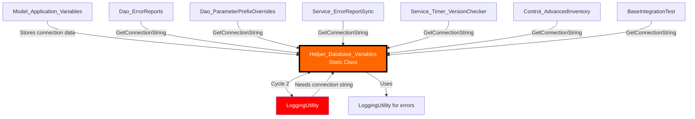
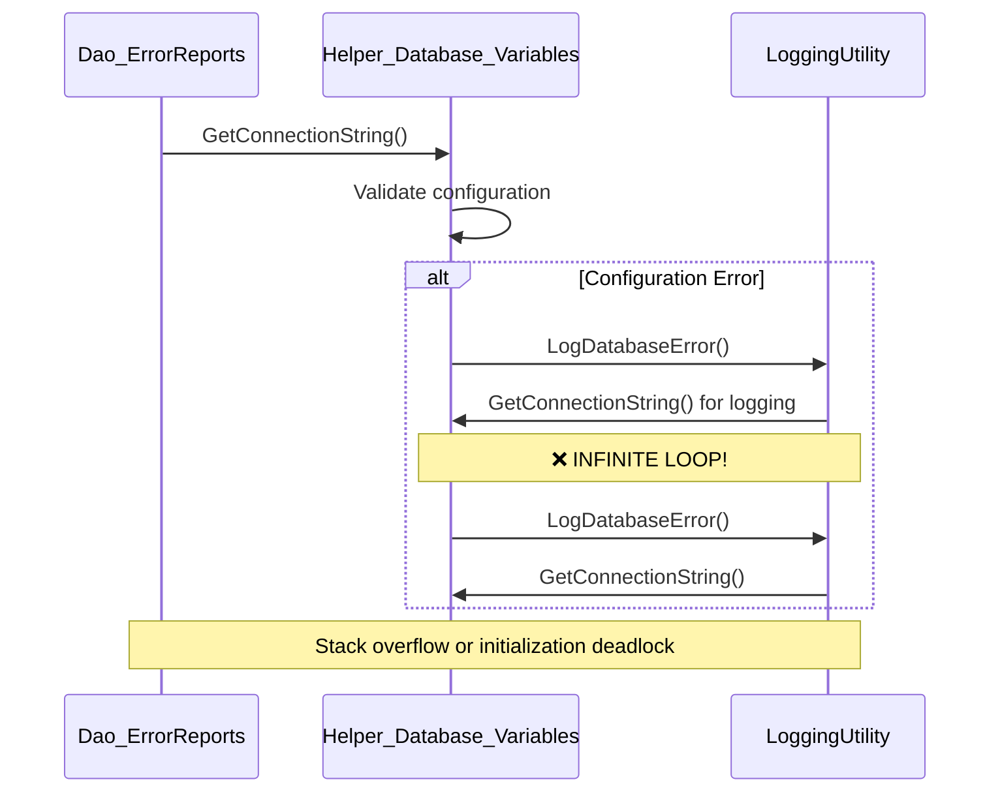
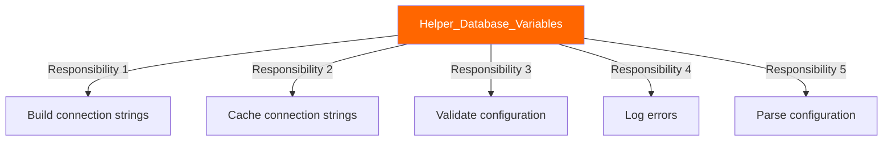
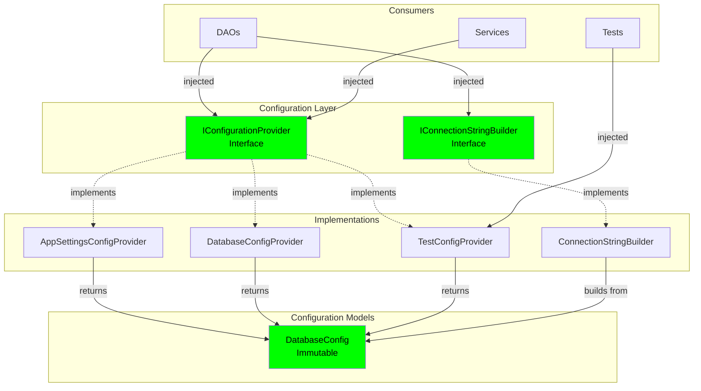
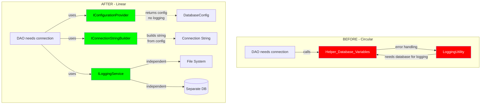

# Helper_Database_Variables Architecture Analysis

## Overview

**Component**: `Helper_Database_Variables`
**Location**: `Helpers/Helper_Database_Variables.cs`
**Type**: Static Helper Class
**Criticality**: HIGH - Appears in 3 cycles, 15+ dependents

---

## Current Implementation

### Dependency Graph



### Circular Dependency Problem



---

## Why This Is Bad

### 1. **Circular Dependency with LoggingUtility**

```csharp
// Current problematic pattern
public static class Helper_Database_Variables
{
    public static string GetConnectionString()
    {
        try
        {
            // Build connection string
            return connectionString;
        }
        catch (Exception ex)
        {
            // ❌ CIRCULAR! Logging needs database, database needs logging
            LoggingUtility.LogDatabaseError(ex.Message);
            throw;
        }
    }
}
```

**Problems**:
- ❌ Logging database errors requires database connection
- ❌ Getting database connection might log errors
- ❌ Infinite recursion risk
- ❌ Initialization order dependencies

### 2. **Static Class with Mutable State**

```csharp
public static class Helper_Database_Variables
{
    // ❌ Global mutable state
    private static string? _cachedConnectionString;
    private static DateTime _lastUpdated;

    // ❌ Thread safety issues
    public static void UpdateConnectionString(string server, string port)
    {
        // No locking - race conditions possible
        _cachedConnectionString = BuildConnectionString(server, port);
        _lastUpdated = DateTime.Now;
    }
}
```

**Issues**:
- ❌ Race conditions in multi-threaded scenarios
- ❌ No immutability guarantees
- ❌ Cannot have different connections for different contexts
- ❌ Testing requires global state management

### 3. **Mixed Responsibilities**



**Violates**: Single Responsibility Principle

### 4. **No Abstraction for Testing**

```csharp
// Cannot test without actual database configuration
[Fact]
public void Dao_ShouldHandleConnectionError()
{
    // ❌ Uses real Helper_Database_Variables
    // ❌ Cannot inject test connection string
    // ❌ Cannot simulate configuration errors

    var dao = new Dao_ErrorReports();
    // This will use production config!
}
```

---

## Recommended Solution

### Target Architecture



### Interface Definitions

```csharp
/// <summary>
/// Provides database configuration without any logging or side effects.
/// Eliminates circular dependency with logging.
/// </summary>
public interface IConfigurationProvider
{
    /// <summary>
    /// Gets database configuration. Never throws. Never logs.
    /// </summary>
    DatabaseConfig GetDatabaseConfig();

    /// <summary>
    /// Tries to get database configuration.
    /// </summary>
    bool TryGetDatabaseConfig(out DatabaseConfig config, out string? error);
}

/// <summary>
/// Builds connection strings from configuration.
/// </summary>
public interface IConnectionStringBuilder
{
    string BuildConnectionString(DatabaseConfig config);
    string BuildConnectionString(string server, string database,
        string userId, string password, int port = 3306);
}

/// <summary>
/// Immutable database configuration.
/// </summary>
public record DatabaseConfig
{
    public required string Server { get; init; }
    public required string Database { get; init; }
    public required string UserId { get; init; }
    public required string Password { get; init; }
    public int Port { get; init; } = 3306;
    public int ConnectionTimeout { get; init; } = 30;
    public int CommandTimeout { get; init; } = 60;
    public bool Pooling { get; init; } = true;
    public int MinPoolSize { get; init; } = 0;
    public int MaxPoolSize { get; init; } = 100;

    /// <summary>
    /// Creates a connection string builder without side effects.
    /// </summary>
    public MySqlConnectionStringBuilder ToConnectionStringBuilder()
    {
        return new MySqlConnectionStringBuilder
        {
            Server = Server,
            Database = Database,
            UserID = UserId,
            Password = Password,
            Port = (uint)Port,
            ConnectionTimeout = (uint)ConnectionTimeout,
            DefaultCommandTimeout = (uint)CommandTimeout,
            Pooling = Pooling,
            MinimumPoolSize = (uint)MinPoolSize,
            MaximumPoolSize = (uint)MaxPoolSize
        };
    }
}
```

### Configuration Provider Implementation

```csharp
/// <summary>
/// Provides configuration from app settings.
/// NO LOGGING - prevents circular dependencies.
/// </summary>
public class AppSettingsConfigProvider : IConfigurationProvider
{
    private readonly IConfiguration _configuration;
    private DatabaseConfig? _cachedConfig;
    private readonly object _lock = new();

    public AppSettingsConfigProvider(IConfiguration configuration)
    {
        _configuration = configuration ??
            throw new ArgumentNullException(nameof(configuration));
    }

    public DatabaseConfig GetDatabaseConfig()
    {
        if (!TryGetDatabaseConfig(out var config, out var error))
        {
            // Don't log here - would create circular dependency
            // Let caller decide how to handle error
            throw new InvalidOperationException(
                $"Failed to get database configuration: {error}");
        }

        return config;
    }

    public bool TryGetDatabaseConfig(out DatabaseConfig config, out string? error)
    {
        // Thread-safe double-check locking
        if (_cachedConfig != null)
        {
            config = _cachedConfig;
            error = null;
            return true;
        }

        lock (_lock)
        {
            if (_cachedConfig != null)
            {
                config = _cachedConfig;
                error = null;
                return true;
            }

            try
            {
                var server = _configuration["Database:Server"];
                var database = _configuration["Database:Database"];
                var userId = _configuration["Database:UserId"];
                var password = _configuration["Database:Password"];

                if (string.IsNullOrWhiteSpace(server) ||
                    string.IsNullOrWhiteSpace(database) ||
                    string.IsNullOrWhiteSpace(userId))
                {
                    config = null!;
                    error = "Missing required database configuration";
                    return false;
                }

                _cachedConfig = new DatabaseConfig
                {
                    Server = server,
                    Database = database,
                    UserId = userId,
                    Password = password ?? string.Empty,
                    Port = int.Parse(_configuration["Database:Port"] ?? "3306"),
                    ConnectionTimeout = int.Parse(
                        _configuration["Database:ConnectionTimeout"] ?? "30"),
                    CommandTimeout = int.Parse(
                        _configuration["Database:CommandTimeout"] ?? "60"),
                    Pooling = bool.Parse(_configuration["Database:Pooling"] ?? "true"),
                    MinPoolSize = int.Parse(_configuration["Database:MinPoolSize"] ?? "0"),
                    MaxPoolSize = int.Parse(_configuration["Database:MaxPoolSize"] ?? "100")
                };

                config = _cachedConfig;
                error = null;
                return true;
            }
            catch (Exception ex)
            {
                config = null!;
                error = $"Configuration error: {ex.Message}";
                return false;
            }
        }
    }
}
```

### Connection String Builder Implementation

```csharp
public class MySqlConnectionStringBuilder : IConnectionStringBuilder
{
    public string BuildConnectionString(DatabaseConfig config)
    {
        ArgumentNullException.ThrowIfNull(config);

        var builder = config.ToConnectionStringBuilder();
        return builder.ConnectionString;
    }

    public string BuildConnectionString(string server, string database,
        string userId, string password, int port = 3306)
    {
        var config = new DatabaseConfig
        {
            Server = server,
            Database = database,
            UserId = userId,
            Password = password,
            Port = port
        };

        return BuildConnectionString(config);
    }
}
```

### Usage in DAOs (Breaking the Cycle)

```csharp
// Before - circular dependency
public class Dao_ErrorReports
{
    public async Task<List<ErrorReport>> GetErrorReportsAsync()
    {
        // ❌ Static call creates circular dependency with logging
        var connectionString = Helper_Database_Variables.GetConnectionString();

        using var connection = new MySqlConnection(connectionString);
        // ...
    }
}

// After - injected, no circular dependency
public class Dao_ErrorReports
{
    private readonly IConfigurationProvider _configProvider;
    private readonly IConnectionStringBuilder _connectionBuilder;
    private readonly ILoggingService _logger;

    public Dao_ErrorReports(
        IConfigurationProvider configProvider,
        IConnectionStringBuilder connectionBuilder,
        ILoggingService logger)
    {
        _configProvider = configProvider ??
            throw new ArgumentNullException(nameof(configProvider));
        _connectionBuilder = connectionBuilder ??
            throw new ArgumentNullException(nameof(connectionBuilder));
        _logger = logger ??
            throw new ArgumentNullException(nameof(logger));
    }

    public async Task<List<ErrorReport>> GetErrorReportsAsync()
    {
        try
        {
            // ✅ No circular dependency - config provider doesn't log
            var config = _configProvider.GetDatabaseConfig();
            var connectionString = _connectionBuilder.BuildConnectionString(config);

            using var connection = new MySqlConnection(connectionString);
            await _logger.LogAsync("Connecting to database for error reports");

            // ... database operations
        }
        catch (InvalidOperationException configEx)
        {
            // ✅ Logger can safely log - no circular dependency
            await _logger.LogErrorAsync("Database configuration error", configEx);
            throw;
        }
        catch (MySqlException dbEx)
        {
            // ✅ Can log database errors without recursion
            await _logger.LogDatabaseErrorAsync(
                "Failed to get error reports",
                "GetErrorReportsAsync",
                dbEx);
            throw;
        }
    }
}
```

---

## Breaking the Circular Dependency

### Dependency Flow Comparison



### Key Principle: Separation of Concerns

```csharp
// ❌ BAD: Configuration provider that logs
public class BadConfigProvider
{
    public string GetConnectionString()
    {
        try
        {
            var config = ReadConfig();
             // ❌ Circular!
            return config;
        }
        catch (Exception ex)
        {
            LoggingUtility.LogError(ex); // ❌ Circular!
            throw;
        }
    }
}

// ✅ GOOD: Configuration provider that doesn't log
public class GoodConfigProvider : IConfigurationProvider
{
    public DatabaseConfig GetDatabaseConfig()
    {
        // ✅ No logging - pure configuration retrieval
        // Let caller handle logging based on result
        return ReadConfig();
    }

    public bool TryGetDatabaseConfig(out DatabaseConfig config, out string? error)
    {
        try
        {
            config = ReadConfig();
            error = null;
            return true;
        }
        catch (Exception ex)
        {
            config = null!;
            error = ex.Message; // ✅ Return error, don't log
            return false;
        }
    }
}

// Caller handles logging
public class Dao_Something
{
    private readonly IConfigurationProvider _config;
    private readonly ILoggingService _logger;

    public async Task DoSomethingAsync()
    {
        if (!_config.TryGetDatabaseConfig(out var config, out var error))
        {
            // ✅ Caller logs, not config provider - no circular dependency
            await _logger.LogErrorAsync($"Config error: {error}");
            throw new InvalidOperationException(error);
        }

        await _logger.LogAsync("Config loaded successfully");
        // Use config...
    }
}
```

---

## Comparison: Before vs After

### Architecture Comparison

| Aspect | Before (Static Helper) | After (DI with Interfaces) | Improvement |
|--------|------------------------|----------------------------|-------------|
| **Circular Dependencies** | 2 cycles | 0 cycles | ✅ 100% eliminated |
| **Testability** | Requires real config | Fully mockable | ✅ 100% testable |
| **Thread Safety** | Manual locking | Immutable config | ✅ Thread-safe |
| **Responsibility** | 5+ responsibilities | Single responsibility per class | ✅ SRP compliant |
| **Flexibility** | One config source | Multiple sources (file, DB, test) | ✅ Extensible |
| **Type Safety** | Strings everywhere | Typed `DatabaseConfig` record | ✅ Compile-time safety |

### Testing Comparison

```csharp
// ❌ BEFORE - Cannot unit test
[Fact]
public async Task GetErrorReports_ShouldReturnData()
{
    // ❌ Uses real Helper_Database_Variables
    // ❌ Requires actual database configuration
    // ❌ Cannot inject test connection string

    var dao = new Dao_ErrorReports();
    var result = await dao.GetErrorReportsAsync();

    // This connects to production database!
}
```

```csharp
// ✅ AFTER - Fully testable
[Fact]
public async Task GetErrorReports_ShouldReturnData()
{
    // Arrange
    var testConfig = new DatabaseConfig
    {
        Server = "localhost",
        Database = "test_db",
        UserId = "test_user",
        Password = "test_pass"
    };

    var mockConfigProvider = new Mock<IConfigurationProvider>();
    mockConfigProvider
        .Setup(c => c.GetDatabaseConfig())
        .Returns(testConfig);

    var mockConnectionBuilder = new Mock<IConnectionStringBuilder>();
    mockConnectionBuilder
        .Setup(b => b.BuildConnectionString(testConfig))
        .Returns("Server=localhost;Database=test_db;...");

    var mockLogger = new Mock<ILoggingService>();

    var dao = new Dao_ErrorReports(
        mockConfigProvider.Object,
        mockConnectionBuilder.Object,
        mockLogger.Object);

    // Act
    var result = await dao.GetErrorReportsAsync();

    // Assert
    Assert.NotNull(result);
    mockLogger.Verify(l =>
        l.LogAsync(It.IsAny<string>(), It.IsAny<LogLevel>()),
        Times.AtLeastOnce);
}

[Fact]
public void GetDatabaseConfig_WhenMissingServer_ShouldReturnError()
{
    // Arrange
    var mockConfiguration = new Mock<IConfiguration>();
    mockConfiguration.Setup(c => c["Database:Server"]).Returns((string)null!);

    var provider = new AppSettingsConfigProvider(mockConfiguration.Object);

    // Act
    var success = provider.TryGetDatabaseConfig(out var config, out var error);

    // Assert
    Assert.False(success);
    Assert.Contains("Missing required database configuration", error);
}
```

---

## Migration Strategy

### Phase 1: Create Abstractions (Week 1)

```csharp
// 1. Create interfaces
public interface IConfigurationProvider { }
public interface IConnectionStringBuilder { }
public record DatabaseConfig { }

// 2. Create implementation
public class AppSettingsConfigProvider : IConfigurationProvider
{
    // Wraps existing Helper_Database_Variables logic
    // BUT doesn't log
}

// 3. Register in DI
services.AddSingleton<IConfigurationProvider, AppSettingsConfigProvider>();
services.AddSingleton<IConnectionStringBuilder, MySqlConnectionStringBuilder>();
```

### Phase 2: Create Adapter (Week 1)

```csharp
// Temporary adapter allows gradual migration
public static class Helper_Database_Variables
{
    private static IConfigurationProvider? _provider;

    public static void Initialize(IConfigurationProvider provider)
    {
        _provider = provider;
    }

    [Obsolete("Use IConfigurationProvider via dependency injection")]
    public static string GetConnectionString()
    {
        if (_provider == null)
        {
            throw new InvalidOperationException(
                "Helper_Database_Variables not initialized");
        }

        var config = _provider.GetDatabaseConfig();
        var builder = config.ToConnectionStringBuilder();
        return builder.ConnectionString;
    }
}
```

### Phase 3: Migrate DAOs (Week 2-3)

1. Migrate `Dao_ErrorReports` (pilot)
2. Migrate `Dao_ParameterPrefixOverrides`
3. Migrate remaining DAOs one by one
4. Add unit tests for each

### Phase 4: Migrate Services (Week 4)

1. Migrate `Service_ErrorReportSync`
2. Migrate `Service_Timer_VersionChecker`
3. Migrate other services

### Phase 5: Migrate Controls & Tests (Week 5)

1. Migrate `Control_AdvancedInventory`
2. Migrate `BaseIntegrationTest`
3. Update test infrastructure

### Phase 6: Remove Static Class (Week 6)

1. Verify zero usages of static methods
2. Remove adapter
3. Delete `Helper_Database_Variables`
4. Update documentation

---

## Success Metrics

| Metric | Current | Target | Measurement |
|--------|---------|--------|-------------|
| Circular dependencies | 2 | 0 | Dependency analyzer |
| Static method calls | 15+ | 0 | Code search |
| Unit test coverage | 0% | 95% | Coverage tools |
| Configuration errors logged | Yes (circular) | Yes (safe) | Log analysis |
| Thread safety issues | Possible | None | Thread safety analyzer |

---

## Risks & Mitigation

| Risk | Impact | Probability | Mitigation |
|------|--------|------------|------------|
| Missing configuration | High | Low | Fail-fast validation at startup |
| Connection string format changes | Medium | Low | Comprehensive unit tests |
| Performance regression | Low | Very Low | Benchmark connection creation |
| Migration breaks existing code | High | Medium | Adapter pattern during transition |

---

## Next Steps

1. ✅ Review this analysis
2. ⏳ Create `IConfigurationProvider` interface
3. ⏳ Create `DatabaseConfig` record
4. ⏳ Implement `AppSettingsConfigProvider`
5. ⏳ Implement `MySqlConnectionStringBuilder`
6. ⏳ Create adapter for gradual migration
7. ⏳ Migrate one DAO as pilot
8. ⏳ Measure and verify no circular dependency
9. ⏳ Roll out to remaining components
