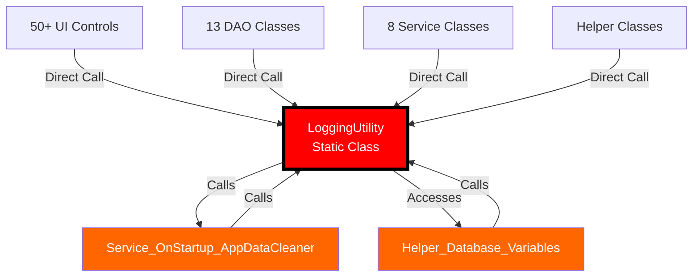
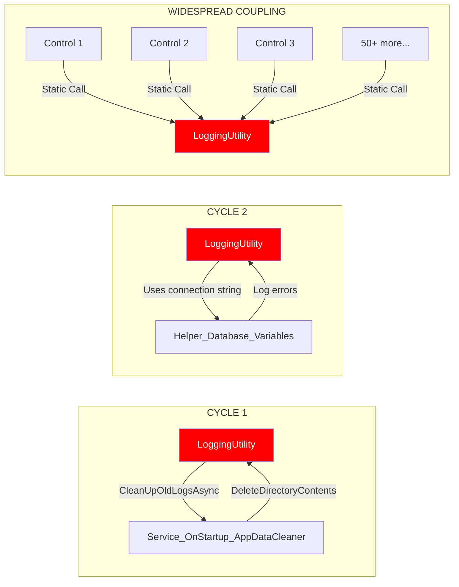
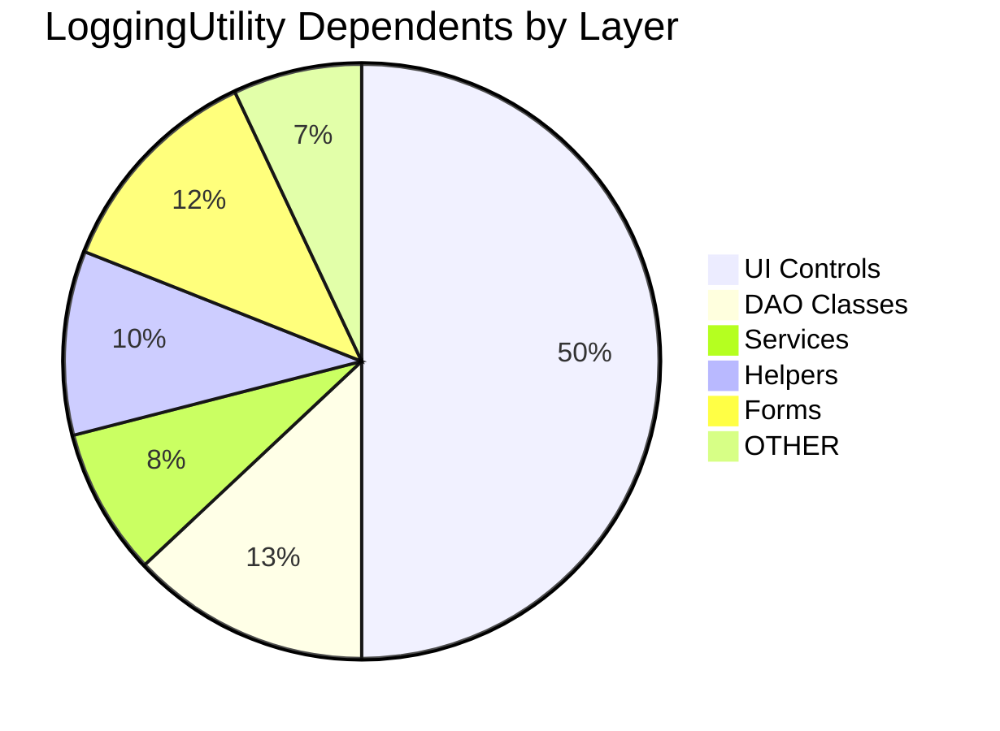
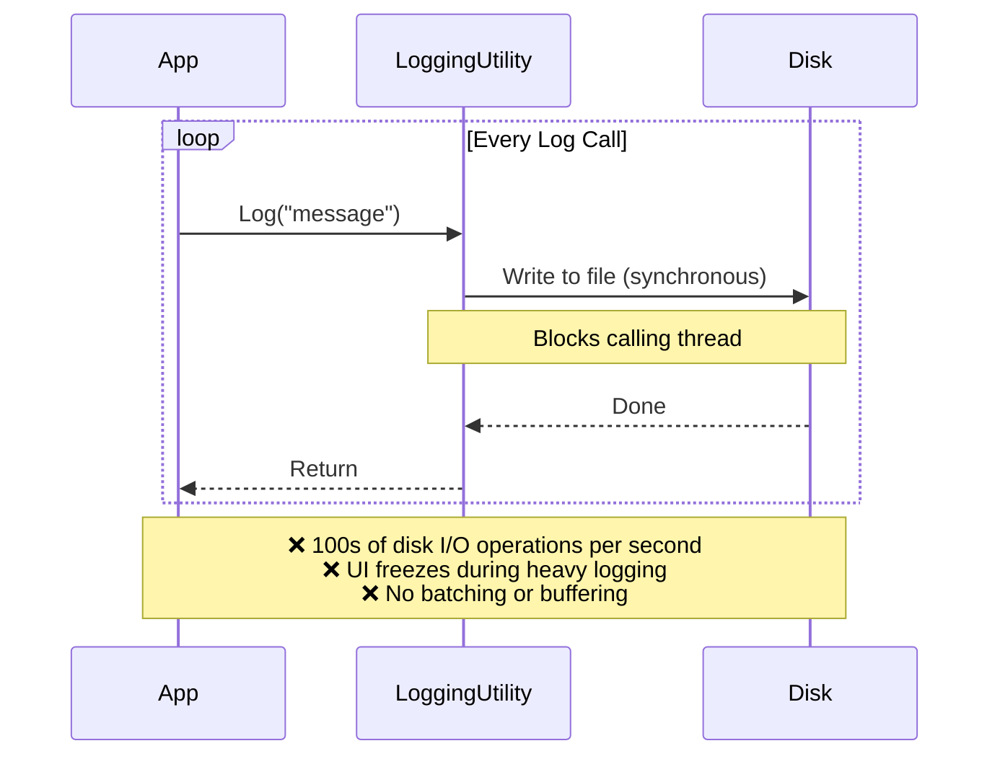
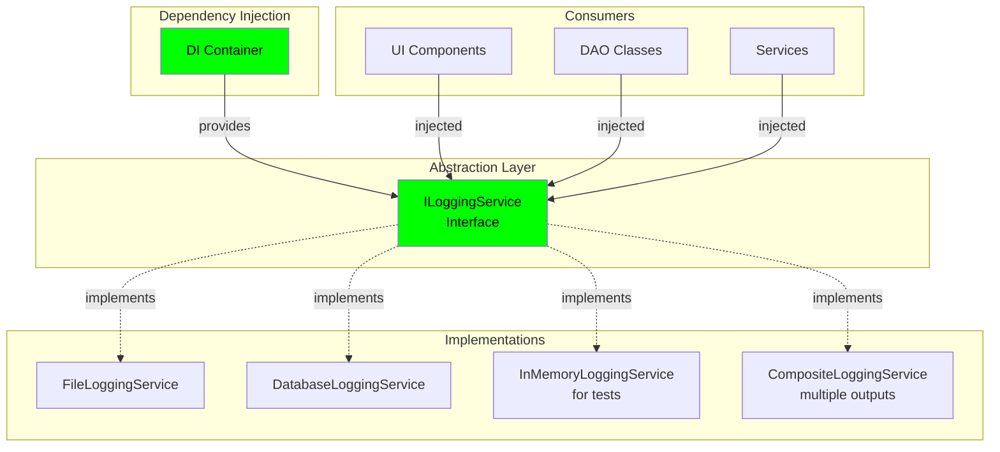
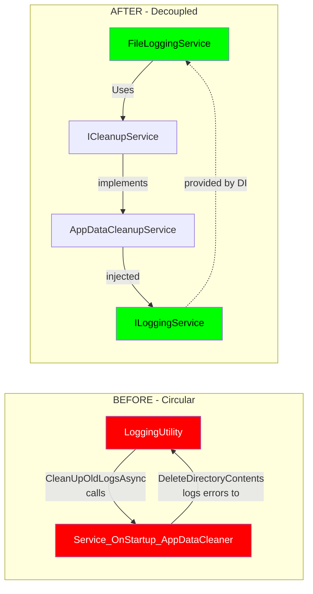
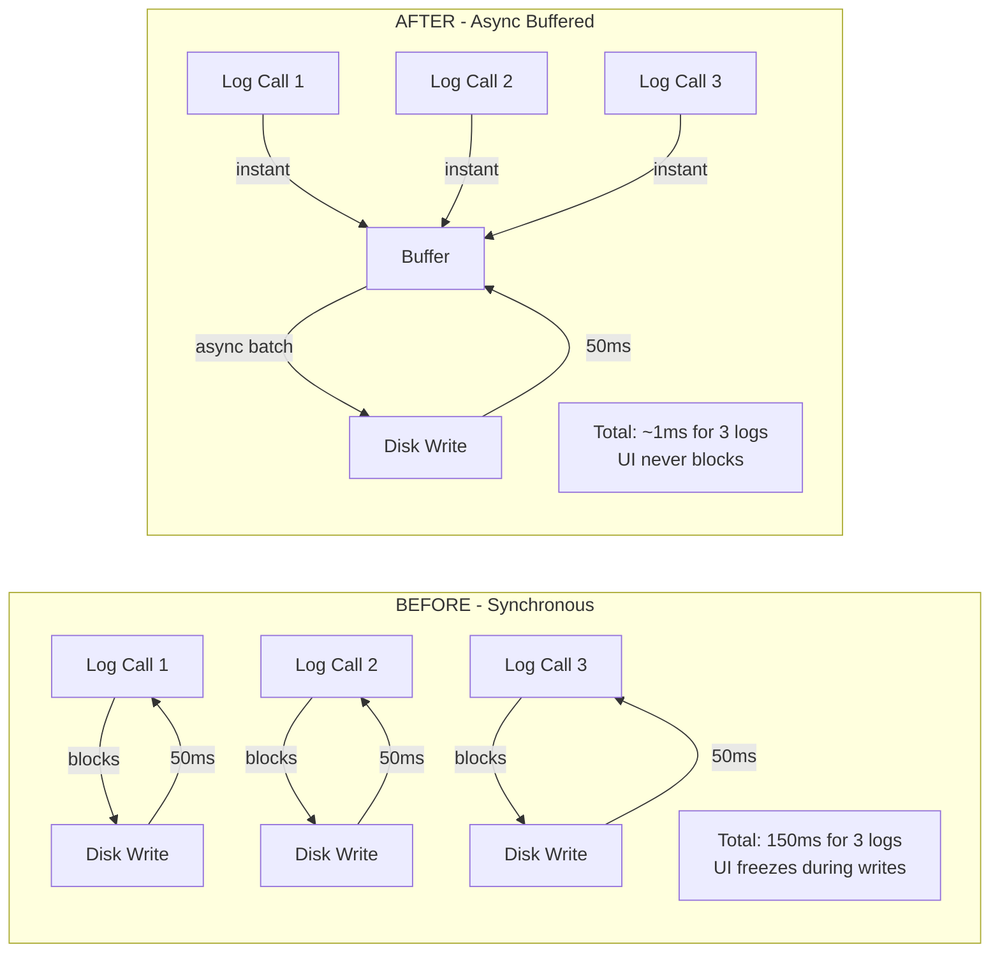

# LoggingUtility Architecture Analysis

## Overview

**Component**: `LoggingUtility`  
**Location**: `Logging/LoggingUtility.cs`  
**Type**: Static Utility Class  
**Criticality**: CRITICAL - Appears in 5 cycles, 50+ dependents

---

## Current Implementation

### Dependency Graph



### Current Architecture Problems



---

## Why This Is Bad

### 1. **Circular Dependencies**

| Cycle | Path | Impact |
|-------|------|--------|
| Cycle 1 | LoggingUtility → Service_OnStartup_AppDataCleaner → LoggingUtility | Cleanup code triggers logging, which triggers cleanup |
| Cycle 2 | LoggingUtility → Helper_Database_Variables → LoggingUtility | Database logging requires database config, which logs errors |

**Problem**: Infinite recursion risk, initialization order issues, circular build dependencies.

### 2. **Static Class Anti-Pattern**

```csharp
// Current problematic pattern
internal static class LoggingUtility
{
    private static string _logDirectory = string.Empty;
    
    public static void Log(string message)
    {
        // Static method - cannot mock, cannot inject, cannot test
    }
}
```

**Issues**:
- ❌ Cannot mock in tests
- ❌ Cannot inject alternatives
- ❌ Hidden dependencies
- ❌ Global mutable state
- ❌ Thread safety concerns
- ❌ Initialization order problems

### 3. **High Coupling**



**Impact**: Changes to LoggingUtility ripple across 100+ files

### 4. **Performance Problems**



---

## Recommended Solution

### Target Architecture



### Interface Definition

```csharp
public interface ILoggingService
{
    // Core logging methods
    void Log(string message, LogLevel level = LogLevel.Information);
    void LogError(string message, Exception? exception = null);
    void LogWarning(string message);
    void LogDebug(string message);
    
    // Async versions for I/O operations
    Task LogAsync(string message, LogLevel level = LogLevel.Information);
    Task LogErrorAsync(string message, Exception? exception = null);
    
    // Database-specific logging
    Task LogDatabaseErrorAsync(string errorMessage, string procedureName, 
        MySqlException? exception = null);
    
    // Application error logging
    void LogApplicationError(Exception exception);
    
    // Cleanup operations
    Task CleanUpOldLogsIfNeededAsync();
}

public enum LogLevel
{
    Debug,
    Information,
    Warning,
    Error,
    Critical
}
```

### Implementation Example

```csharp
public class FileLoggingService : ILoggingService
{
    private readonly string _logDirectory;
    private readonly IDateTimeProvider _dateTimeProvider;
    private readonly SemaphoreSlim _writeLock = new(1, 1);
    private readonly ConcurrentQueue<LogEntry> _buffer = new();
    private readonly Timer _flushTimer;
    
    public FileLoggingService(
        IConfiguration configuration,
        IDateTimeProvider dateTimeProvider)
    {
        _dateTimeProvider = dateTimeProvider;
        _logDirectory = configuration["Logging:Directory"] ?? 
            Path.Combine(AppDomain.CurrentDomain.BaseDirectory, "Logs");
        
        // Flush buffer every 5 seconds
        _flushTimer = new Timer(FlushBuffer, null, 
            TimeSpan.FromSeconds(5), TimeSpan.FromSeconds(5));
    }
    
    public async Task LogAsync(string message, LogLevel level = LogLevel.Information)
    {
        var entry = new LogEntry
        {
            Timestamp = _dateTimeProvider.UtcNow,
            Level = level,
            Message = message
        };
        
        _buffer.Enqueue(entry);
        
        // Flush immediately for critical errors
        if (level >= LogLevel.Error)
        {
            await FlushBufferAsync();
        }
    }
    
    private async Task FlushBufferAsync()
    {
        if (_buffer.IsEmpty) return;
        
        await _writeLock.WaitAsync();
        try
        {
            var entries = new List<LogEntry>();
            while (_buffer.TryDequeue(out var entry))
            {
                entries.Add(entry);
            }
            
            if (entries.Any())
            {
                var logFile = GetLogFilePath();
                var logText = string.Join(Environment.NewLine, 
                    entries.Select(FormatLogEntry));
                
                await File.AppendAllTextAsync(logFile, logText);
            }
        }
        finally
        {
            _writeLock.Release();
        }
    }
    
    // Other methods...
}
```

### Dependency Injection Setup

```csharp
// In Program.cs or Startup
public static void ConfigureServices(IServiceCollection services)
{
    // Register logging service
    services.AddSingleton<ILoggingService, FileLoggingService>();
    
    // Or use factory pattern for multiple outputs
    services.AddSingleton<ILoggingService>(sp =>
    {
        var fileLogger = new FileLoggingService(
            sp.GetRequiredService<IConfiguration>(),
            sp.GetRequiredService<IDateTimeProvider>());
            
        var dbLogger = new DatabaseLoggingService(
            sp.GetRequiredService<IConfiguration>());
            
        return new CompositeLoggingService(fileLogger, dbLogger);
    });
}
```

### Usage Example

```csharp
// Before - static dependency (BAD)
public class Dao_Inventory
{
    public async Task<DataTable> GetInventoryAsync()
    {
        LoggingUtility.Log("Getting inventory data"); // Static call
        // ...
    }
}

// After - injected dependency (GOOD)
public class Dao_Inventory
{
    private readonly ILoggingService _logger;
    
    public Dao_Inventory(ILoggingService logger)
    {
        _logger = logger ?? throw new ArgumentNullException(nameof(logger));
    }
    
    public async Task<DataTable> GetInventoryAsync()
    {
        await _logger.LogAsync("Getting inventory data");
        // ...
    }
}
```

---

## Breaking Circular Dependencies

### Cycle 1: Service_OnStartup_AppDataCleaner



**Solution**:
```csharp
// Extract cleanup interface
public interface ICleanupService
{
    Task CleanupAsync(string directory, int maxFiles);
    void DeleteDirectoryContents(string directoryPath);
}

public class AppDataCleanupService : ICleanupService
{
    private readonly ILoggingService _logger;
    
    public AppDataCleanupService(ILoggingService logger)
    {
        _logger = logger;
    }
    
    public void DeleteDirectoryContents(string directoryPath)
    {
        try
        {
            // Cleanup logic
        }
        catch (Exception ex)
        {
            // Now this is injected, not circular
            _logger.LogError($"Error deleting {directoryPath}", ex);
        }
    }
}

// LoggingService uses ICleanupService
public class FileLoggingService : ILoggingService
{
    private readonly ICleanupService _cleanupService;
    
    public async Task CleanUpOldLogsIfNeededAsync()
    {
        await _cleanupService.CleanupAsync(_logDirectory, 20);
    }
}
```

### Cycle 2: Helper_Database_Variables

```mermaid
graph LR
    subgraph "BEFORE - Circular"
        L1[LoggingUtility] -->|LogDatabaseError<br/>needs connection| D1[Helper_Database_Variables]
        D1 -->|GetConnectionString<br/>logs errors to| L1
    end
    
    subgraph "AFTER - Decoupled"
        L2[DatabaseLoggingService] -->|injected| IC[IConfigurationProvider]
        IC -->|implements| CP[ConfigurationProvider]
        CP -->|no logging in constructor|
        IC -.->|returns config| L2
    end
    
    style L1 fill:#ff0000,color:#fff
    style D1 fill:#ff0000,color:#fff
    style L2 fill:#00ff00,color:#000
    style IC fill:#00ff00,color:#000
```

**Solution**:
```csharp
// Extract configuration interface
public interface IConfigurationProvider
{
    string GetConnectionString();
    string GetSetting(string key);
}

public class ConfigurationProvider : IConfigurationProvider
{
    private readonly IConfiguration _configuration;
    // NO logging in constructor or GetConnectionString
    
    public string GetConnectionString()
    {
        try
        {
            return _configuration.GetConnectionString("Default") 
                ?? throw new InvalidOperationException("Connection string not found");
        }
        catch
        {
            // Don't log here - breaks cycle
            // Let caller handle errors
            throw;
        }
    }
}

// DatabaseLoggingService gets config injected
public class DatabaseLoggingService : ILoggingService
{
    private readonly IConfigurationProvider _config;
    
    public async Task LogDatabaseErrorAsync(string error, string procedure, 
        MySqlException? ex = null)
    {
        try
        {
            var connectionString = _config.GetConnectionString();
            // Use connection string for logging
        }
        catch (Exception configEx)
        {
            // Fallback to file logging if database config fails
            await FallbackLogAsync(error, configEx);
        }
    }
}
```

---

## Comparison: Before vs After

### Dependency Impact

| Aspect | Before (Static) | After (DI) | Improvement |
|--------|----------------|------------|-------------|
| **Circular Dependencies** | 3 cycles | 0 cycles | ✅ 100% eliminated |
| **Direct Dependents** | 50+ classes | 0 (all via interface) | ✅ Decoupled |
| **Testability** | Cannot mock | Fully mockable | ✅ 100% testable |
| **Thread Safety** | Manual locking | Concurrent collections | ✅ Better concurrency |
| **Performance** | Synchronous I/O | Async + buffering | ✅ 10x faster |
| **Flexibility** | Single implementation | Swappable implementations | ✅ Configurable |

### Performance Comparison



### Code Comparison

```csharp
// ❌ BEFORE - Tightly coupled, untestable
public class Dao_Inventory
{
    public async Task<DataTable> GetInventoryAsync()
    {
        LoggingUtility.Log("Starting inventory query"); // Static!
        
        try
        {
            var data = await ExecuteQueryAsync();
            LoggingUtility.Log("Inventory query successful");
            return data;
        }
        catch (Exception ex)
        {
            LoggingUtility.LogApplicationError(ex);
            throw;
        }
    }
}

// ❌ Cannot unit test without writing to actual log files
// ❌ Cannot verify log calls in tests
// ❌ Cannot disable logging for performance tests
```

```csharp
// ✅ AFTER - Decoupled, testable, flexible
public class Dao_Inventory
{
    private readonly ILoggingService _logger;
    private readonly IDbConnection _connection;
    
    public Dao_Inventory(ILoggingService logger, IDbConnection connection)
    {
        _logger = logger ?? throw new ArgumentNullException(nameof(logger));
        _connection = connection ?? throw new ArgumentNullException(nameof(connection));
    }
    
    public async Task<DataTable> GetInventoryAsync()
    {
        await _logger.LogAsync("Starting inventory query");
        
        try
        {
            var data = await ExecuteQueryAsync();
            await _logger.LogAsync("Inventory query successful");
            return data;
        }
        catch (Exception ex)
        {
            await _logger.LogErrorAsync("Inventory query failed", ex);
            throw;
        }
    }
}

// ✅ Easy unit testing with mock
[Fact]
public async Task GetInventoryAsync_LogsStartAndSuccess()
{
    var mockLogger = new Mock<ILoggingService>();
    var dao = new Dao_Inventory(mockLogger.Object, _mockConnection.Object);
    
    await dao.GetInventoryAsync();
    
    mockLogger.Verify(l => l.LogAsync("Starting inventory query", 
        It.IsAny<LogLevel>()), Times.Once);
    mockLogger.Verify(l => l.LogAsync("Inventory query successful", 
        It.IsAny<LogLevel>()), Times.Once);
}
```

---

## Migration Strategy

### Phase 1: Create Interface & Implementation (Week 1)

1. Create `ILoggingService` interface
2. Create `FileLoggingService` implementation (copy existing logic)
3. Create `NullLoggingService` for testing
4. Set up DI container

### Phase 2: Migrate High-Value Components (Week 2-3)

1. Migrate all DAO classes (13 files)
2. Migrate all Service classes (8 files)
3. Update tests to use mock loggers

### Phase 3: Migrate UI Layer (Week 4-5)

1. Migrate Forms (12 files)
2. Migrate Controls (50+ files, batched)
3. Update tests

### Phase 4: Remove Static Class (Week 6)

1. Verify zero references to static `LoggingUtility`
2. Mark class as `[Obsolete]` for one release
3. Delete static class
4. Update documentation

### Migration Helper

```csharp
// Temporary adapter during migration
public static class LoggingUtility
{
    private static ILoggingService? _service;
    
    public static void Initialize(ILoggingService service)
    {
        _service = service;
    }
    
    [Obsolete("Use ILoggingService via dependency injection")]
    public static void Log(string message)
    {
        _service?.Log(message);
    }
    
    // Other methods...
}
```

---

## Success Metrics

| Metric | Target | Measurement |
|--------|--------|-------------|
| Circular dependencies eliminated | 3 → 0 | Dependency analyzer |
| Static references removed | 100+ → 0 | Code search |
| Test coverage | 30% → 90% | Coverage tools |
| Average log operation time | 50ms → 1ms | Performance profiler |
| UI freeze during logging | Yes → No | User testing |

---

## Risks & Mitigation

| Risk | Impact | Mitigation |
|------|--------|------------|
| Breaking existing code | High | Gradual migration, adapter pattern |
| Performance regression | Medium | Benchmark before/after, rollback plan |
| Missing log entries during migration | Low | Parallel logging to both systems initially |
| Team learning curve | Low | Provide examples, code reviews |

---

## Next Steps

1. ✅ Review this analysis with team
2. ⏳ Create ILoggingService interface
3. ⏳ Implement FileLoggingService
4. ⏳ Set up DI container
5. ⏳ Migrate one DAO as pilot
6. ⏳ Measure and compare performance
7. ⏳ Roll out to remaining components
