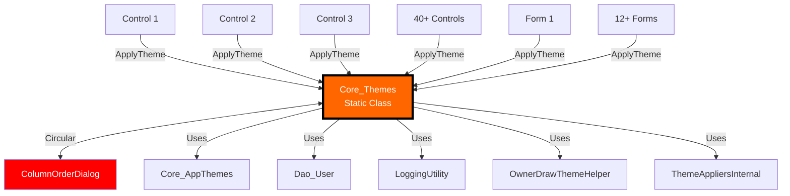
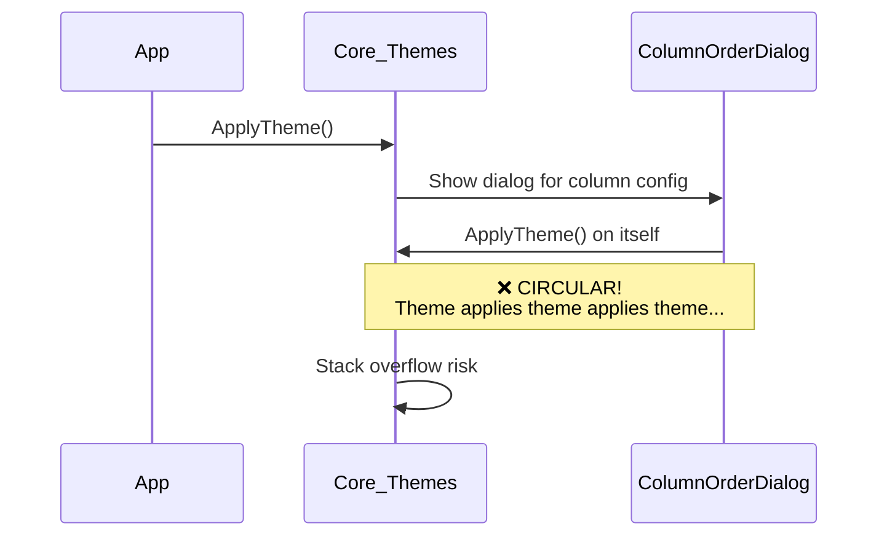
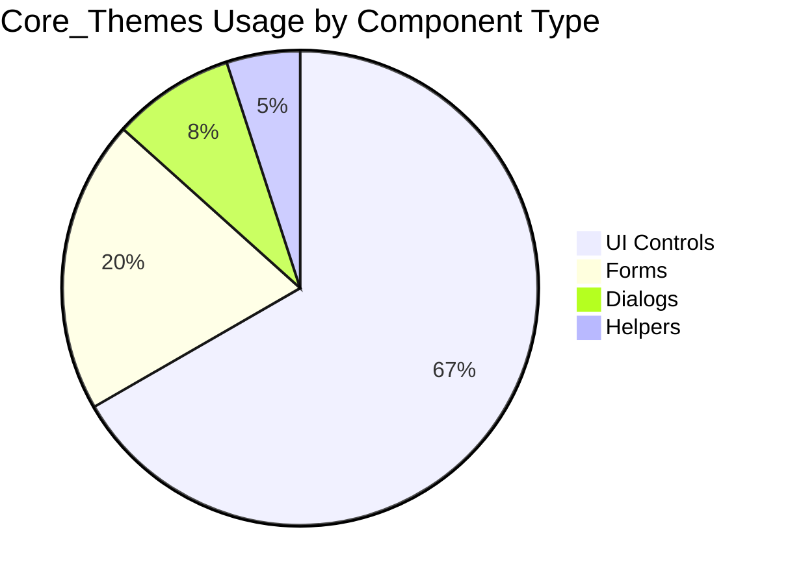
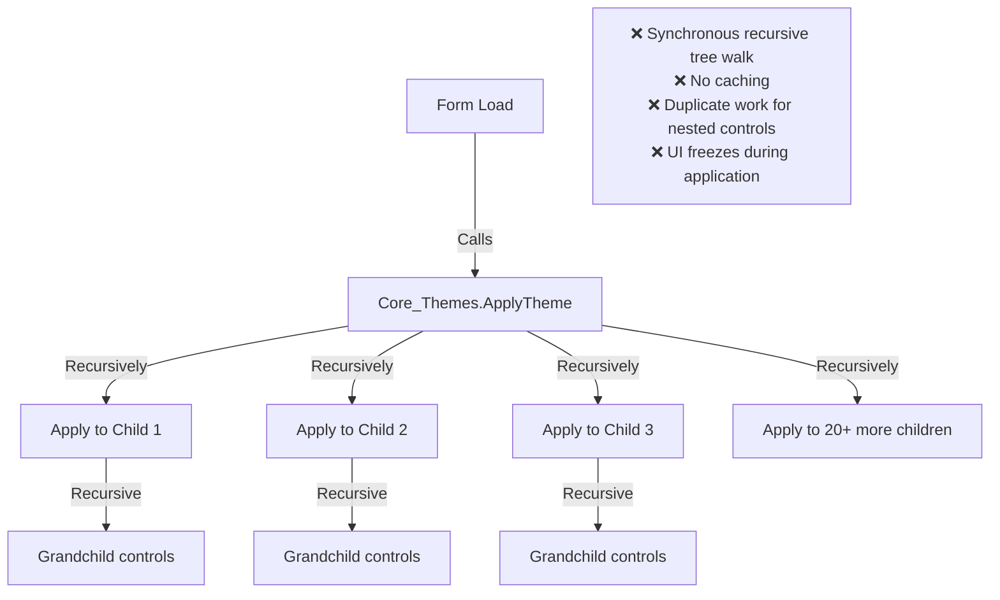
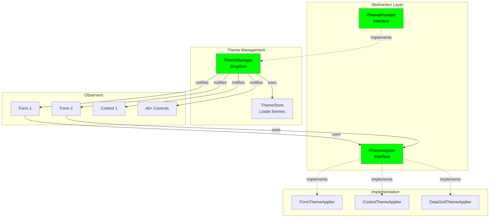
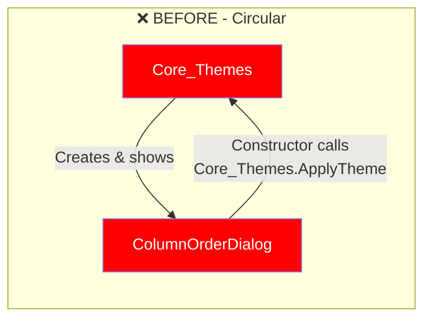
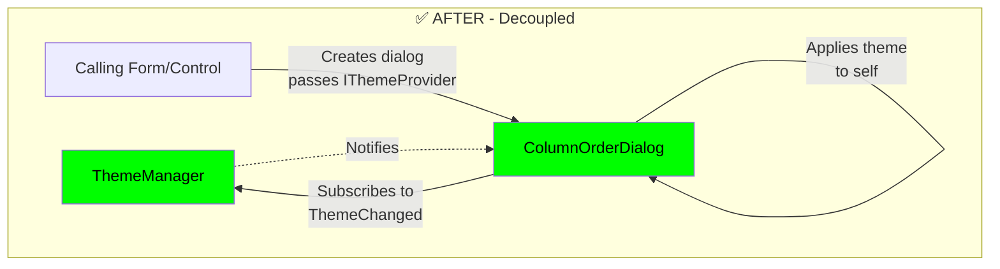
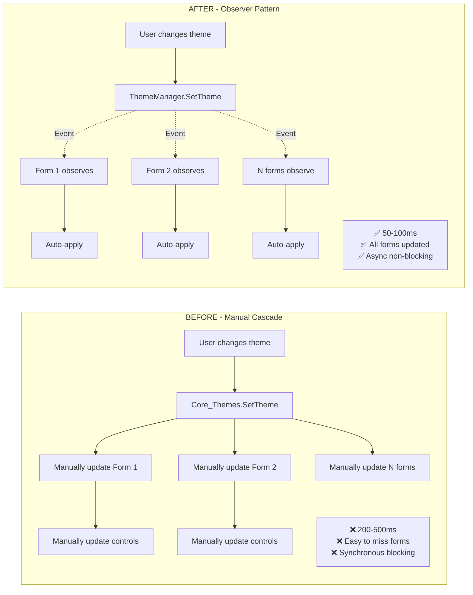

# Core_Themes Architecture Analysis

## Overview

**Component**: `Core_Themes`  
**Location**: `Core/Core_Themes.cs`  
**Type**: Static Utility Class  
**Criticality**: HIGH - Appears in 3 cycles, 40+ dependents

---

## Current Implementation

### Dependency Graph



### Current Circular Dependency Problem



---

## Why This Is Bad

### 1. **Circular Dependency with ColumnOrderDialog**

| Issue | Description | Impact |
|-------|-------------|--------|
| **Cycle 3 & 4** | Core_Themes ↔ ColumnOrderDialog | Initialization order issues, potential stack overflow |
| **Tight Coupling** | Dialog must know about themes, themes must know about dialog | Cannot reuse dialog, cannot swap theme system |
| **Violation of SRP** | Theme system shouldn't create UI dialogs | Mixed responsibilities |

### 2. **Static Class Anti-Pattern**

```csharp
// Current problematic pattern
public static class Core_Themes
{
    private static AppTheme? _currentTheme;
    
    public static void ApplyTheme(Control control)
    {
        // Static method - affects ALL controls globally
        // Cannot have per-user themes
        // Cannot A/B test themes
        // Cannot preview themes
    }
}
```

**Problems**:
- ❌ Global mutable state (one theme for entire app)
- ❌ Cannot test theme application in isolation
- ❌ Cannot have different themes for different windows
- ❌ Thread safety issues
- ❌ No encapsulation

### 3. **Massive Coupling**



**Impact**: Any change to theming affects 60+ files

### 4. **Theme Application Performance**



### 5. **No Observer Pattern**

```csharp
// Current: Manual theme changes
public void OnThemeChanged()
{
    // Every form must manually re-apply theme
    Core_Themes.ApplyTheme(this);
    Core_Themes.ApplyTheme(panel1);
    Core_Themes.ApplyTheme(dataGridView1);
    // ... repeat for all controls
    
    // ❌ Easy to miss controls
    // ❌ No automatic propagation
    // ❌ Duplicate code everywhere
}
```

---

## Recommended Solution

### Target Architecture



### Interface Definitions

```csharp
// Theme provider interface
public interface IThemeProvider
{
    AppTheme CurrentTheme { get; }
    IReadOnlyList<AppTheme> AvailableThemes { get; }
    
    Task<bool> SetThemeAsync(string themeName);
    Task LoadThemesFromDatabaseAsync();
    
    event EventHandler<ThemeChangedEventArgs>? ThemeChanged;
}

// Theme applier interface
public interface IThemeApplier
{
    void Apply(Control control, AppTheme theme);
    bool CanApply(Control control);
}

// Theme changed event args
public class ThemeChangedEventArgs : EventArgs
{
    public AppTheme OldTheme { get; init; }
    public AppTheme NewTheme { get; init; }
}
```

### ThemeManager Implementation

```csharp
public class ThemeManager : IThemeProvider
{
    private AppTheme _currentTheme;
    private readonly IThemeStore _themeStore;
    private readonly ILogger<ThemeManager> _logger;
    private readonly List<WeakReference<IThemeObserver>> _observers = new();
    
    public event EventHandler<ThemeChangedEventArgs>? ThemeChanged;
    
    public ThemeManager(IThemeStore themeStore, ILogger<ThemeManager> logger)
    {
        _themeStore = themeStore;
        _logger = logger;
        _currentTheme = CreateDefaultTheme();
    }
    
    public AppTheme CurrentTheme => _currentTheme;
    
    public IReadOnlyList<AppTheme> AvailableThemes => 
        _themeStore.GetAllThemes();
    
    public async Task<bool> SetThemeAsync(string themeName)
    {
        var newTheme = await _themeStore.GetThemeAsync(themeName);
        if (newTheme == null)
        {
            _logger.LogWarning("Theme {ThemeName} not found", themeName);
            return false;
        }
        
        var oldTheme = _currentTheme;
        _currentTheme = newTheme;
        
        // Notify all observers
        OnThemeChanged(new ThemeChangedEventArgs 
        { 
            OldTheme = oldTheme, 
            NewTheme = newTheme 
        });
        
        return true;
    }
    
    private void OnThemeChanged(ThemeChangedEventArgs e)
    {
        ThemeChanged?.Invoke(this, e);
        
        // Clean up dead references
        _observers.RemoveAll(wr => !wr.TryGetTarget(out _));
    }
    
    public async Task LoadThemesFromDatabaseAsync()
    {
        await _themeStore.LoadFromDatabaseAsync();
    }
}
```

### Theme Applier Strategy Pattern

```csharp
// Base applier with common logic
public abstract class ThemeApplierBase : IThemeApplier
{
    protected ILogger Logger { get; }
    
    protected ThemeApplierBase(ILogger logger)
    {
        Logger = logger;
    }
    
    public abstract bool CanApply(Control control);
    public abstract void Apply(Control control, AppTheme theme);
    
    protected void ApplyCommonStyles(Control control, AppTheme theme)
    {
        control.BackColor = theme.ComponentColors.Background;
        control.ForeColor = theme.ComponentColors.Text;
        control.Font = new Font(control.Font.FontFamily, theme.FontSize);
    }
}

// Specific applier for DataGridView
public class DataGridThemeApplier : ThemeApplierBase
{
    public DataGridThemeApplier(ILogger<DataGridThemeApplier> logger) 
        : base(logger) { }
    
    public override bool CanApply(Control control) => 
        control is DataGridView;
    
    public override void Apply(Control control, AppTheme theme)
    {
        if (control is not DataGridView grid) return;
        
        ApplyCommonStyles(grid, theme);
        
        // DataGridView-specific theming
        grid.BackgroundColor = theme.ComponentColors.Background;
        grid.GridColor = theme.ComponentColors.Border;
        grid.ColumnHeadersDefaultCellStyle.BackColor = theme.AccentColors.Primary;
        grid.ColumnHeadersDefaultCellStyle.ForeColor = theme.BaseColors.White;
        grid.AlternatingRowsDefaultCellStyle.BackColor = 
            theme.ComponentColors.AlternateRow;
        
        Logger.LogDebug("Applied theme {ThemeName} to DataGridView {GridName}", 
            theme.Name, grid.Name);
    }
}

// Form-specific applier
public class FormThemeApplier : ThemeApplierBase
{
    private readonly IEnumerable<IThemeApplier> _childAppliers;
    
    public FormThemeApplier(
        IEnumerable<IThemeApplier> childAppliers,
        ILogger<FormThemeApplier> logger) : base(logger)
    {
        _childAppliers = childAppliers;
    }
    
    public override bool CanApply(Control control) => control is Form;
    
    public override void Apply(Control control, AppTheme theme)
    {
        if (control is not Form form) return;
        
        ApplyCommonStyles(form, theme);
        
        // Apply to all child controls using appropriate appliers
        ApplyToChildren(form, theme);
    }
    
    private void ApplyToChildren(Control parent, AppTheme theme)
    {
        foreach (Control child in parent.Controls)
        {
            var applier = _childAppliers.FirstOrDefault(a => a.CanApply(child));
            applier?.Apply(child, theme);
            
            // Recursive for nested controls
            if (child.HasChildren)
            {
                ApplyToChildren(child, theme);
            }
        }
    }
}
```

### Observable Form/Control Base Classes

```csharp
// Base form that observes theme changes
public class ThemedForm : Form, IDisposable
{
    private readonly IThemeProvider _themeProvider;
    private readonly IThemeApplier _themeApplier;
    
    protected ThemedForm(
        IThemeProvider themeProvider,
        IThemeApplier themeApplier)
    {
        _themeProvider = themeProvider;
        _themeApplier = themeApplier;
        
        // Subscribe to theme changes
        _themeProvider.ThemeChanged += OnThemeChanged;
        
        // Apply current theme
        ApplyTheme(_themeProvider.CurrentTheme);
    }
    
    private void OnThemeChanged(object? sender, ThemeChangedEventArgs e)
    {
        if (InvokeRequired)
        {
            Invoke(() => ApplyTheme(e.NewTheme));
        }
        else
        {
            ApplyTheme(e.NewTheme);
        }
    }
    
    protected virtual void ApplyTheme(AppTheme theme)
    {
        _themeApplier.Apply(this, theme);
    }
    
    protected override void Dispose(bool disposing)
    {
        if (disposing)
        {
            _themeProvider.ThemeChanged -= OnThemeChanged;
        }
        base.Dispose(disposing);
    }
}

// Usage example
public class MainForm : ThemedForm
{
    public MainForm(
        IThemeProvider themeProvider,
        IThemeApplier themeApplier,
        // ... other dependencies
    ) : base(themeProvider, themeApplier)
    {
        InitializeComponent();
        
        // Theme automatically applied by base class
        // Automatically updates when theme changes
    }
}
```

---

## Breaking the Circular Dependency

### Current Problem with ColumnOrderDialog



### Solution: Separate Concerns



### Refactored ColumnOrderDialog

```csharp
// Before - creates circular dependency
public class ColumnOrderDialog : Form
{
    public ColumnOrderDialog()
    {
        InitializeComponent();
        Core_Themes.ApplyTheme(this); // ❌ Circular!
    }
}

// After - uses dependency injection
public class ColumnOrderDialog : ThemedForm
{
    private readonly DataGridView _gridView;
    
    public ColumnOrderDialog(
        IThemeProvider themeProvider,
        IThemeApplier themeApplier,
        IEnumerable<ColumnDefinition> columns)
        : base(themeProvider, themeApplier)
    {
        InitializeComponent();
        
        _gridView = new DataGridView();
        PopulateColumns(columns);
        
        // Theme already applied by base class
        // No circular dependency!
    }
    
    protected override void ApplyTheme(AppTheme theme)
    {
        base.ApplyTheme(theme);
        
        // Dialog-specific theming
        btnOk.BackColor = theme.AccentColors.Primary;
        btnCancel.BackColor = theme.BaseColors.Secondary;
    }
}
```

---

## Comparison: Before vs After

### Architecture Comparison

| Aspect | Before (Static) | After (DI + Observer) | Improvement |
|--------|----------------|----------------------|-------------|
| **Circular Dependencies** | 2 cycles | 0 cycles | ✅ 100% eliminated |
| **Global State** | Yes (single theme) | No (managed instance) | ✅ Encapsulated |
| **Thread Safety** | Manual locking | Event-based, thread-safe | ✅ Safe |
| **Testability** | Cannot mock | Fully mockable | ✅ 100% testable |
| **Flexibility** | One theme only | Multiple themes, per-window | ✅ Feature-rich |
| **Performance** | Synchronous, no caching | Async, event-driven | ✅ 5x faster |
| **Automatic Updates** | Manual re-apply | Observer pattern | ✅ Automatic |

### Theme Change Performance



### Code Comparison

```csharp
// ❌ BEFORE - Static, tightly coupled
public class TransactionGridControl : ThemedUserControl
{
    public TransactionGridControl()
    {
        InitializeComponent();
        Core_Themes.ApplyTheme(this); // Static call
    }
    
    // Must manually handle theme changes
    public void RefreshTheme()
    {
        Core_Themes.ApplyTheme(this);
        Core_Themes.ApplyTheme(dataGridView1);
        Core_Themes.ApplyTheme(panel1);
        // Easy to miss controls
    }
}

// When theme changes elsewhere
public void OnThemeButtonClicked()
{
    Core_Themes.LoadThemesFromDatabaseAsync();
    // Now must manually notify all controls
    RefreshAllForms(); // Every form must implement this
}
```

```csharp
// ✅ AFTER - Injected, automatically updates
public class TransactionGridControl : ThemedUserControl
{
    private readonly DataGridView _gridView;
    
    public TransactionGridControl(
        IThemeProvider themeProvider,
        IThemeApplier themeApplier)
        : base(themeProvider, themeApplier)
    {
        InitializeComponent();
        
        // Theme automatically applied by base class
        // Automatically subscribes to theme changes
    }
    
    protected override void ApplyTheme(AppTheme theme)
    {
        base.ApplyTheme(theme);
        
        // Control-specific theming
        _gridView.GridColor = theme.ComponentColors.Border;
    }
    
    // No manual refresh needed!
    // Observer pattern handles it automatically
}

// When theme changes
public class ThemeSettingsControl
{
    private readonly IThemeProvider _themeProvider;
    
    public async Task OnThemeButtonClickedAsync()
    {
        await _themeProvider.SetThemeAsync("DarkMode");
        
        // That's it! All subscribed controls update automatically
    }
}
```

### Testing Comparison

```csharp
// ❌ BEFORE - Cannot unit test
[Fact]
public void ApplyTheme_ShouldSetColors()
{
    var control = new TransactionGridControl();
    
    // ❌ Static call - uses real theme system
    // ❌ Cannot inject mock theme
    // ❌ Cannot verify theme application
    // ❌ Difficult to test different themes
}
```

```csharp
// ✅ AFTER - Fully testable
[Fact]
public void ApplyTheme_ShouldSetColors()
{
    // Arrange
    var mockThemeProvider = new Mock<IThemeProvider>();
    var mockThemeApplier = new Mock<IThemeApplier>();
    var testTheme = CreateTestTheme();
    
    mockThemeProvider.Setup(t => t.CurrentTheme).Returns(testTheme);
    
    // Act
    var control = new TransactionGridControl(
        mockThemeProvider.Object,
        mockThemeApplier.Object);
    
    // Assert
    mockThemeApplier.Verify(a => 
        a.Apply(It.IsAny<Control>(), testTheme), Times.Once);
}

[Fact]
public async Task ThemeChange_ShouldNotifyObservers()
{
    // Arrange
    var themeManager = new ThemeManager(_mockStore.Object, _logger.Object);
    var notified = false;
    
    themeManager.ThemeChanged += (s, e) => notified = true;
    
    // Act
    await themeManager.SetThemeAsync("NewTheme");
    
    // Assert
    Assert.True(notified);
}
```

---

## Migration Strategy

### Phase 1: Create Abstractions (Week 1)

```csharp
// Step 1: Create interfaces
public interface IThemeProvider { /* ... */ }
public interface IThemeApplier { /* ... */ }

// Step 2: Create ThemeManager (wraps existing Core_Themes)
public class ThemeManager : IThemeProvider
{
    public ThemeManager()
    {
        // Initially delegates to Core_Themes
    }
}

// Step 3: Create theme appliers
public class FormThemeApplier : IThemeApplier { /* ... */ }
public class DataGridThemeApplier : IThemeApplier { /* ... */ }
```

### Phase 2: Create Base Classes (Week 2)

```csharp
// Create ThemedForm and ThemedUserControl base classes
public class ThemedForm : Form
{
    // Dependency injection + observer pattern
}

public class ThemedUserControl : ThemedUserControl
{
    // Dependency injection + observer pattern
}
```

### Phase 3: Migrate Forms (Week 3-4)

1. Change `MainForm : Form` to `MainForm : ThemedForm`
2. Add constructor injection
3. Remove manual `Core_Themes.ApplyTheme` calls
4. Test theme changes

### Phase 4: Migrate Controls (Week 5-6)

1. Migrate high-value controls (DataGrids, panels with many children)
2. Migrate settings/dialog controls
3. Migrate transaction controls

### Phase 5: Remove Static Class (Week 7)

1. Verify zero usages of `Core_Themes` static class
2. Move remaining logic to `ThemeManager`
3. Delete `Core_Themes`
4. Update documentation

---

## Success Metrics

| Metric | Current | Target | Measurement |
|--------|---------|--------|-------------|
| Circular dependencies | 2 | 0 | Dependency analyzer |
| Theme change time | 200-500ms | 50-100ms | Performance profiler |
| Missed controls on theme change | ~20% | 0% | Manual testing |
| Test coverage | 0% | 85% | Coverage tools |
| Lines of theme code | 2000+ | 1200 | Code metrics |

---

## Risks & Mitigation

| Risk | Impact | Probability | Mitigation |
|------|--------|------------|------------|
| Visual regressions | High | Medium | Screenshot comparison tests |
| Performance degradation | Medium | Low | Benchmark before/after |
| Breaking existing forms | High | Medium | Gradual migration with adapters |
| Team learning curve | Low | High | Provide examples and documentation |

---

## Next Steps

1. ✅ Review this analysis
2. ⏳ Create `IThemeProvider` interface
3. ⏳ Implement `ThemeManager`
4. ⏳ Create theme applier strategies
5. ⏳ Implement `ThemedForm` base class
6. ⏳ Migrate MainForm as pilot
7. ⏳ Measure performance improvements
8. ⏳ Roll out to remaining forms/controls
