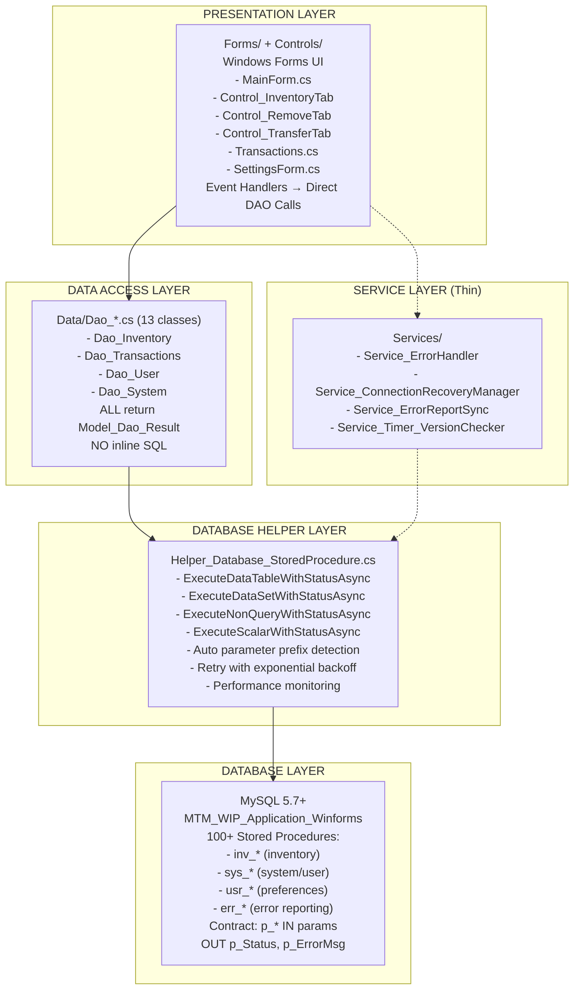
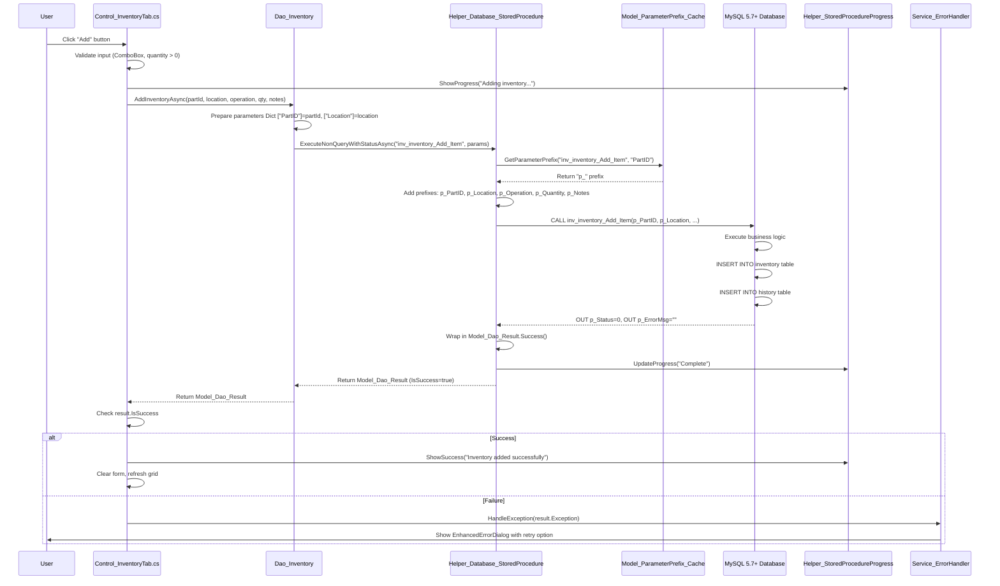
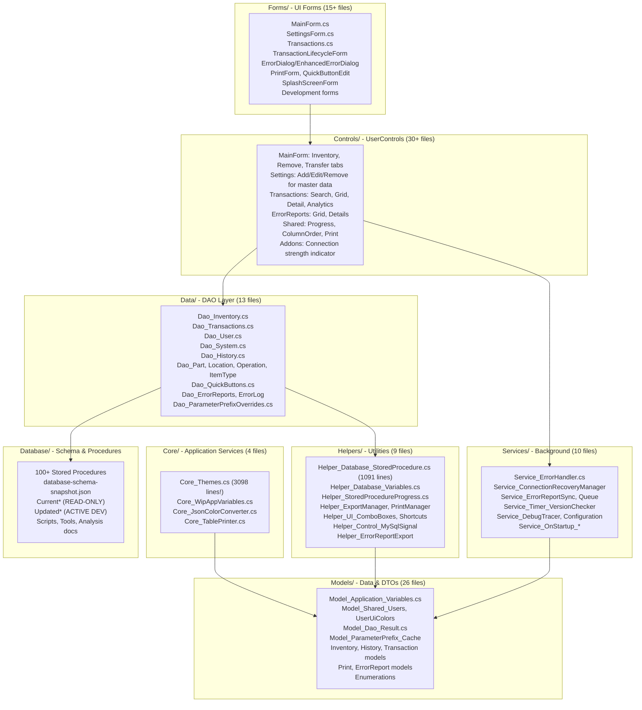
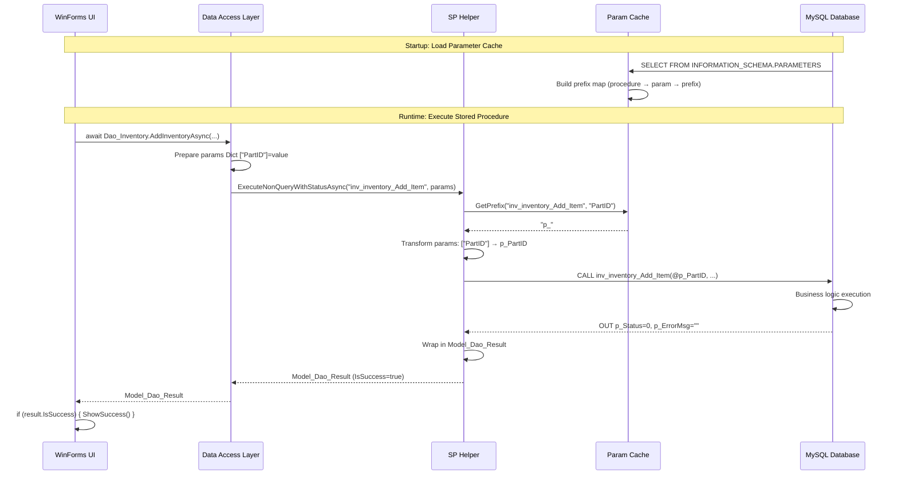

# MTM WIP Application - Brownfield Architecture Document

**Document Type:** Brownfield Architecture Analysis  
**Project:** MTM_WIP_Application_WinForms  
**Extraction Date:** November 11, 2025  
**Database:** MTM_WIP_Application_Winforms (MySQL 5.7+)  
**Framework:** .NET 8.0 Windows Forms  
**Branch:** 006-print-and-export (current), master (default)

---

## Document Purpose and Scope

This document captures the **CURRENT STATE** of the MTM WIP Application codebase as it actually exists, including:
- Technical debt and workarounds
- Inconsistent patterns between different modules
- Database-driven architecture with 100+ stored procedures
- Real-world constraints and integration points
- Performance bottlenecks and optimization strategies

**CRITICAL:** This is NOT an aspirational architecture document. It documents what EXISTS today, warts and all.

---

## Change Log

| Date | Version | Description | Author |
|------|---------|-------------|--------|
| 2025-11-11 | 1.0 | Initial brownfield architecture extraction | Winston (Architect Agent) |

---

## Executive Summary

### What This Application Does

The MTM WIP Application is a **manufacturing inventory management system** for Manitowoc Tool & Manufacturing that tracks Work-In-Progress (WIP) inventory with the following capabilities:

- **Inventory Management:** Add, remove, transfer parts across locations and operations
- **Transaction Tracking:** Comprehensive audit trail of all inventory movements
- **User Management:** Role-based access control (Developer, Admin, ReadOnly, Normal users)
- **Error Reporting:** Offline-capable error reporting with automatic sync
- **Theme System:** 9 database-driven themes with 203 customizable color properties
- **Print/Export:** Advanced printing with preview, column filtering, and Excel export

### Technical Stack Reality Check

| Category | Technology | Version | Notes |
|----------|-----------|---------|-------|
| **Runtime** | .NET | 8.0 | Windows Forms (WinForms) desktop application |
| **UI Framework** | Windows Forms | .NET 8.0 | Event-driven architecture, NOT MVVM |
| **Database** | MySQL | 5.7+ | MAMP-compatible, stored procedures ONLY |
| **DB Connector** | MySql.Data | 9.4.0 | Official MySQL connector |
| **Excel Export** | ClosedXML | 0.105.0 | For DataGridView to Excel functionality |
| **WebView** | Microsoft.Web.WebView2 | 1.0.2792.45 | For embedded help system |
| **Build System** | MSBuild (dotnet CLI) | .NET 8 SDK | Standard .NET project structure |
| **Version Control** | Git | GitHub | Repository: Dorotel/MTM_WIP_Application_WinForms |

### Repository Structure Type

- **Type:** Monorepo (single repository, single solution)
- **Package Manager:** NuGet (via .NET SDK)
- **Build Configuration:** Debug (test database) / Release (production database)
- **Notable Structure Decisions:**
  - Database files segregated into Current* (READ-ONLY reference) and Updated* (active development)
  - 100+ stored procedures in Database/UpdatedStoredProcedures/ReadyForVerification/
  - Controls split by functional area: MainForm, SettingsForm, Shared, Transactions, ErrorReports

---

## Quick Reference - Key Files and Entry Points

### Critical Files for Understanding the System

**Main Entry:**
- `Program.cs` - Application bootstrap with extensive error handling, DB connectivity validation, parameter cache initialization

**Configuration:**
- `Models/Model_Application_Variables.cs` - Global application state (user, theme, connection strings, performance thresholds)
- `Models/Model_Shared_Users.cs` - User model with DEBUG/RELEASE database switching logic
- `Helpers/Helper_Database_Variables.cs` - Connection string generation with environment awareness

**Core Business Logic:**
- `Data/Dao_*.cs` (13 DAO files) - Data access layer wrapping stored procedures
- `Helpers/Helper_Database_StoredProcedure.cs` - Centralized stored procedure executor with retry logic, parameter prefix detection
- `Services/Service_ErrorHandler.cs` - Centralized error handling with enhanced dialogs and automatic logging

**UI Entry Points:**
- `Forms/MainForm/MainForm.cs` - Main application window with tab-based navigation
- `Forms/Splash/SplashScreenForm.cs` - Startup splash screen
- `Controls/MainForm/Control_InventoryTab.cs` - Inventory addition operations
- `Controls/MainForm/Control_RemoveTab.cs` - Inventory removal operations  
- `Controls/MainForm/Control_TransferTab.cs` - Inventory transfer operations

**Database Schema:**
- `Database/database-schema-snapshot.json` - Complete database schema snapshot (tables, procedures, views)
- `Database/UpdatedStoredProcedures/ReadyForVerification/` - 100+ active stored procedures organized by module

**Theme System:**
- `Core/Core_Themes.cs` - Advanced DPI scaling, runtime layout adjustments, theme application (3098 lines!)
- `Models/Model_Shared_UserUiColors.cs` - Theme color model with 203 properties

### Key Algorithms and Complex Logic

- `Helper_Database_StoredProcedure.cs` - Automatic parameter prefix detection via INFORMATION_SCHEMA cache, retry logic with exponential backoff
- `Core_Themes.cs` - DPI scaling calculations, runtime margin/padding adjustments, multi-monitor DPI change handling
- `Service_ErrorHandler.cs` - Error frequency tracking, cooldown periods, automatic connection recovery
- `Models/Model_ParameterPrefix_Cache.cs` - Stored procedure parameter metadata cache for MySQL 5.7 compatibility

---

## High Level Architecture

### Architectural Style: Database-Centric Event-Driven Desktop Application

The MTM WIP Application follows a **database-centric architecture** where:

1. **MySQL database is the source of truth** for all business data, themes, and user settings
2. **Stored procedures encapsulate ALL business logic** - no inline SQL anywhere in C# code
3. **WinForms event handlers** drive user interactions (button clicks, combo box selections, keyboard shortcuts)
4. **DAO layer** wraps stored procedure calls with Model_Dao_Result pattern for consistent error handling
5. **Helper classes** provide reusable database execution, UI updates, and progress reporting

**NOT USED:** MVC, MVVM, Repository Pattern, Dependency Injection Container, ORM (Entity Framework)  
**ACTUAL PATTERN:** Direct DAO calls → Helper_Database_StoredProcedure → MySQL stored procedures → DataTable/DataSet results → UI binding

### Layer Architecture (Actual Implementation)



### Component Interaction Flow (Real-World Example: Add Inventory)



**Key Insights:**
- Business logic lives in stored procedures (INSERT + history tracking), NOT in C# code
- The C# layer is mostly orchestration, parameter preparation, and UI binding
- Automatic parameter prefix detection eliminates MySQL errors
- Progress feedback keeps UI responsive during database operations
- Consistent error handling via Model_Dao_Result pattern

---

## Source Tree and Module Organization

### Project Statistics (Actual Codebase Size)

- **Total C# Files:** 192 files
- **Total Lines of Code:** 64,804 lines
- **Stored Procedures:** 100+ procedures in ReadyForVerification
- **Data Models:** 26 model classes
- **DAO Classes:** 13 data access objects
- **Services:** 10 background services
- **Forms:** 15+ WinForms forms
- **UserControls:** 30+ reusable controls

### Detailed Source Tree Structure



### Module Descriptions and Key Files

#### **Core/ - Application Core Services (4 files, ~4000 lines)**

**Core_Themes.cs** (3098 lines) - **THE MONSTER FILE**
- Advanced DPI scaling for all Forms and UserControls
- Runtime layout adjustments (margins, padding, SplitContainer distances)
- Per-monitor DPI awareness (HighDpiMode.PerMonitorV2)
- Dynamic DPI change handling for multi-monitor scenarios
- Theme application with 203 color properties
- **Pattern:** Every Form/UserControl calls `Core_Themes.ApplyDpiScaling(this)` in constructor

**Core_WipAppVariables.cs**
- Application-wide constants and enumerations
- Database connection defaults
- Performance thresholds

**Core_JsonColorConverter.cs**
- Custom JSON serialization for `System.Drawing.Color` objects
- Required for theme storage in MySQL JSON columns

**Core_TablePrinter.cs**
- Console-based DataTable printing for debugging

#### **Data/ - DAO Layer (13 files, ~8000 lines)**

All DAOs follow strict patterns:
- **Return Type:** `Model_Dao_Result<T>` (for queries) or `Model_Dao_Result` (for operations)
- **Database Access:** Via `Helper_Database_StoredProcedure.Execute*WithStatusAsync(...)` ONLY
- **No Inline SQL:** All queries through stored procedures
- **Async-Only:** All methods are async (no synchronous database operations)
- **Transaction Support:** Optional `MySqlConnection` and `MySqlTransaction` parameters

**Key DAO Files:**

**Dao_Inventory.cs** - Inventory CRUD operations
- `AddInventoryAsync()` - Add new inventory
- `RemoveInventoryAsync()` - Remove inventory with history
- `TransferInventoryAsync()` - Transfer between locations/operations
- `GetInventoryByPartAsync()` - Query current inventory
- `SearchInventoryAdvancedAsync()` - Complex search with filters

**Dao_Transactions.cs** - Transaction history queries
- `GetTransactionsByDateRangeAsync()` - Date-filtered history
- `GetTransactionsByPartAsync()` - Part-specific history
- `GetTransactionAnalyticsAsync()` - Summary statistics
- `SearchTransactionsAsync()` - Advanced search with pagination

**Dao_System.cs** - System utilities and connectivity
- `System_GetUserName()` - Windows identity resolution
- `System_UserAccessTypeAsync()` - Load user permissions
- `CheckConnectivityAsync()` - Database health check
- `GetDatabaseVersionAsync()` - Schema version tracking

**Dao_User.cs** - User management
- `GetUserByIdAsync()`, `GetAllUsersAsync()`
- `AddUserAsync()`, `UpdateUserAsync()`, `DeleteUserAsync()`
- `GetThemeNameAsync()`, `SetThemeNameAsync()`
- User preferences and settings

**Dao_ParameterPrefixOverrides.cs** - **WORKAROUND for non-standard procedures**
- Maintains database table of stored procedures that don't follow `p_` prefix convention
- Allows manual override configuration via developer settings UI
- Critical for legacy procedure compatibility

#### **Helpers/ - Utility Classes (9 files, ~3500 lines)**

**Helper_Database_StoredProcedure.cs** (1091 lines) - **THE HEART OF DATA ACCESS**

Four execution methods:
1. `ExecuteDataTableWithStatusAsync()` - Single result set → DataTable
2. `ExecuteDataSetWithStatusAsync()` - Multiple result sets → DataSet
3. `ExecuteNonQueryWithStatusAsync()` - INSERT/UPDATE/DELETE → rows affected
4. `ExecuteScalarWithStatusAsync()` - COUNT/SUM/MAX → single value

**Key Features:**
- **Automatic parameter prefix detection** via `Model_ParameterPrefix_Cache` (loaded from INFORMATION_SCHEMA at startup)
- **Retry logic with exponential backoff** for transient MySQL errors (codes 1205, 1213, 2006, 2013)
- **Performance monitoring** - logs slow queries based on configurable thresholds
- **Progress integration** - optional `Helper_StoredProcedureProgress` for UI feedback
- **Transaction support** - accepts external `MySqlConnection` and `MySqlTransaction`

**Helper_StoredProcedureProgress.cs**
- StatusStrip integration for visual progress feedback
- Methods: `ShowProgress()`, `UpdateProgress()`, `ShowSuccess()`, `ShowError()`
- Automatic form reference for cross-thread Invoke

**Helper_ExportManager.cs**
- Excel export via ClosedXML
- DataGridView → XLSX with formatting
- Column filtering and custom headers

**Helper_PrintManager.cs**
- Advanced DataGridView printing
- Print preview with pagination
- Column selection and layout customization

**Helper_UI_ComboBoxes.cs**
- ComboBox population from database
- Standard data binding patterns
- Error color indication on validation failure

#### **Models/ - Data Models and DTOs (26 files, ~6000 lines)**

**Model_Application_Variables.cs** - **GLOBAL STATE SINGLETON**
- All static properties (global application state)
- User information (ID, name, role, permissions)
- Theme settings (name, enabled, font size)
- Database configuration (connection strings, thresholds)
- Performance thresholds (query, modification, batch, report)
- Error reporting configuration
- **Pattern:** Accessed everywhere as `Model_Application_Variables.User`, `Model_Application_Variables.ConnectionString`, etc.

**Model_Shared_Users.cs** - User model with environment logic
- Database name switching: `MTM_WIP_Application_Winforms` (both Debug and Release now use same DB)
- Server address: `localhost` default
- User properties: Pin, Shift, ThemeName, etc.

**Model_Shared_UserUiColors.cs** - **203 nullable Color? properties!**
- Form colors, Control colors, Label colors
- TextBox, MaskedTextBox, RichTextBox colors
- ComboBox, ListBox, CheckedListBox colors
- Button colors (normal, hover, pressed)
- DataGridView colors (background, foreground, alternating rows, headers, selection)
- Panel, GroupBox, TabControl, MenuStrip, ToolStrip colors
- StatusStrip, ProgressBar, TrackBar colors
- CheckBox, RadioButton, DateTimePicker colors
- TreeView, ListView, PictureBox colors
- SplitContainer, Splitter, ScrollBar colors
- ErrorProvider, ToolTip, LinkLabel colors
- Numeric UpDown, DomainUpDown colors
- Semantic colors: ErrorColor, SuccessColor, WarningColor, InfoColor, AccentColor

**Model_Dao_Result.cs** - Result wrapper pattern
- Generic `Model_Dao_Result<T>` for queries that return data
- Non-generic `Model_Dao_Result` for operations (INSERT/UPDATE/DELETE)
- Properties: `IsSuccess`, `Data`, `ErrorMessage`, `Exception`, `StatusMessage`, `RowsAffected`
- Factory methods: `Success()`, `Failure()`
- Eliminates try-catch in UI code

**Model_ParameterPrefix_Cache.cs** - **WORKAROUND for MySQL 5.7 parameter detection**
- Loaded at startup from INFORMATION_SCHEMA.PARAMETERS query
- Maps procedure name + parameter name → prefix (p_, o_, etc.)
- Enables automatic prefix detection in Helper_Database_StoredProcedure
- Critical for eliminating MySQL parameter errors

#### **Services/ - Background Services (10 files, ~3000 lines)**

**Service_ErrorHandler.cs** - Centralized error handling
- **Replaces ALL MessageBox.Show** with enhanced error dialog
- Error frequency tracking (prevents spam)
- Cooldown periods (5 second between same errors)
- Automatic logging to file and database
- Database connection recovery
- Retry mechanism with configurable action
- Severity levels: Low, Medium, High, Fatal

**Service_ConnectionRecoveryManager.cs**
- Automatic database reconnection on transient errors
- Exponential backoff retry strategy
- Connection pool health monitoring

**Service_ErrorReportSync.cs** - Offline error reporting
- Queues errors to local JSON files when database unavailable
- Automatic sync on startup
- Background sync timer
- Archive management (cleanup old reports)

**Service_ErrorReportQueue.cs**
- Local file system queue for error reports
- JSON serialization via System.Text.Json
- AppData directory management
- Thread-safe queue operations

**Service_Timer_VersionChecker.cs**
- Background polling for application updates
- Database version comparison
- User notification on new versions

**Service_DebugTracer.cs** - Development debugging
- Method entry/exit tracing
- Performance measurement
- Database operation tracking
- UI action logging
- Configurable debug levels: None, Low, Medium, High

#### **Forms/ - WinForms UI (15+ files, ~15000 lines)**

**MainForm.cs** - Main application window
- Tab-based navigation (Inventory, Remove, Transfer, Transactions)
- MenuStrip with File, Edit, View, Tools, Help menus
- StatusStrip with connection indicator, progress bar, status label
- Keyboard shortcuts (F1 help, Ctrl+S save, etc.)
- DPI scaling and theme application

**SettingsForm.cs** - Settings dialog
- Tab-based settings: Users, Parts, Locations, Operations, Item Types, Themes, Database, About
- Master data CRUD operations
- Theme selection with live preview
- Database connection configuration

**Transactions.cs** - Transaction viewer form
- Search filters (date range, part, location, operation, user)
- DataGridView with pagination (50 records per page)
- Detail panel for selected transaction
- Analytics summary (total transactions, parts moved, etc.)
- Print and Excel export

**EnhancedErrorDialog.cs** - Advanced error display
- Tabbed interface: Summary, Technical Details, Call Stack
- Color-coded call stack with component icons
- Plain English error explanations
- Action buttons: Retry, Copy Details, Report Issue, View Logs, Close
- Automatic error logging

#### **Controls/ - UserControls (30+ files, ~20000 lines)**

**MainForm Tab Controls:**

**Control_InventoryTab.cs** - Add inventory
- ComboBox selections: Part, Location, Operation, Item Type
- Quantity input with validation
- Notes field for additional information
- Add button with progress feedback
- Grid refresh after successful add

**Control_RemoveTab.cs** - Remove inventory
- Similar UI to Inventory tab
- Validates sufficient quantity before removal
- History tracking of removals

**Control_TransferTab.cs** - Transfer inventory
- Source and destination location/operation selection
- Quantity validation
- Transfer history tracking

**Settings Tab Controls:**

**Control_Add_User.cs, Control_Edit_User.cs** - User management
**Control_Add_PartID.cs, Control_Edit_PartID.cs** - Part master data
**Control_Add_Location.cs, Control_Edit_Location.cs** - Location master data
**Control_Add_Operation.cs, Control_Edit_Operation.cs** - Operation master data
**Control_Add_ItemType.cs, Control_Edit_ItemType.cs** - Item type master data
**Control_About.cs** - About tab with version, changelog, license

**Transaction Controls:**

**TransactionSearchControl.cs** - Search filters UI
**TransactionGridControl.cs** - DataGridView with pagination
**TransactionDetailPanel.cs** - Selected transaction details
**TransactionAnalyticsControl.cs** - Summary statistics and charts

**Error Reporting Controls:**

**Control_ErrorReportsGrid.cs** - Error report DataGridView
**Control_ErrorReportDetails.cs** - Error details panel with status management

#### **Database/ - Schema and Stored Procedures**

**Folder Structure Pattern:**
- `Current*` folders - **READ-ONLY** production snapshots (reference only, DO NOT MODIFY)
- `Updated*` folders - **ACTIVE DEVELOPMENT** (all changes go here)

**UpdatedStoredProcedures/ReadyForVerification/** - 100+ procedures organized by module:

**inv_\*** - Inventory operations (15+ procedures)
- `inv_inventory_Add_Item` - Add new inventory with history
- `inv_inventory_Remove_Item` - Remove inventory with history
- `inv_inventory_Transfer_Part` - Transfer entire part quantity
- `inv_inventory_Transfer_Quantity` - Transfer partial quantity
- `inv_inventory_Get_ByPartID` - Query current inventory
- `inv_inventory_Search_Advanced` - Complex search with filters
- `inv_inventory_Fix_BatchNumbers` - Batch number cleanup utility

**sys_\*** - System operations (20+ procedures)
- `sys_user_access_SetType` - Set user permissions
- `sys_user_access_GetType` - Get user permissions
- `sys_GetUserName` - User identification
- `sys_CheckConnectivity` - Database health check
- `sys_GetDatabaseVersion` - Schema version
- Master data CRUD for Parts, Locations, Operations, Item Types

**usr_\*** - User preferences (10+ procedures)
- `usr_ui_settings_Get` - Load user settings
- `usr_ui_settings_SetThemeJson` - Save theme preferences
- `usr_ui_settings_SetJsonSetting` - Save generic JSON settings
- `usr_ui_settings_GetJsonSetting` - Load generic JSON settings
- `usr_ui_settings_SetShortcutsJson` - Save keyboard shortcuts
- `usr_ui_settings_GetShortcutsJson` - Load keyboard shortcuts

**err_\*** - Error reporting (5+ procedures)
- `err_reports_Insert` - Log new error report
- `err_reports_Update` - Update error status
- `err_reports_Get_ByDateRange` - Query error reports
- `err_reports_Get_ById` - Get specific error report

**Stored Procedure Contract (MANDATORY):**
- **IN parameters:** Use `p_` prefix on MySQL side (e.g., `p_PartID`, `p_Quantity`)
- **OUT parameters:** `OUT p_Status INT`, `OUT p_ErrorMsg VARCHAR(500)`
- **Status codes:** 0 = success, 1 = success with no data, negative = error
- **C# parameters:** NO prefix (e.g., `["PartID"]`, `["Quantity"]`) - Helper auto-adds prefix

**database-schema-snapshot.json** - Complete schema metadata
- All tables with columns, types, constraints
- All stored procedures with parameters
- All views
- Indexes and foreign keys
- Created/modified timestamps

---

## Data Models and APIs

### Database Schema Overview

The MySQL database `MTM_WIP_Application_Winforms` contains:

**Core Tables:**
- `md_inventory_current` - Current inventory levels by part/location/operation
- `md_history_inventory` - Inventory addition history
- `md_history_remove` - Inventory removal history
- `md_history_transfer` - Inventory transfer history

**Master Data Tables:**
- `md_users` - User accounts and settings
- `md_parts` - Part master data
- `md_locations` - Location master data
- `md_operations` - Operation master data
- `md_item_types` - Item type classifications

**Configuration Tables:**
- `app_themes` - Theme definitions (9 themes with JSON color properties)
- `sys_parameter_prefix_overrides` - Stored procedure parameter overrides
- `error_reports` - Error report log

**System Tables:**
- `app_quick_buttons` - User-customizable quick action buttons

### Key Data Flow Patterns



### API Specifications (Stored Procedures)

Instead of duplicating procedure signatures here, see:
- **Actual Procedures:** `Database/UpdatedStoredProcedures/ReadyForVerification/`
- **Schema Metadata:** `Database/database-schema-snapshot.json`
- **Parameter Analysis:** `Database/parameter-prefix-conventions.md`
- **Call Hierarchy:** `Database/call-hierarchy-complete.json`

**Standard Procedure Pattern:**
```sql
CREATE PROCEDURE inv_inventory_Add_Item(
    IN p_PartID VARCHAR(50),
    IN p_Location VARCHAR(50),
    IN p_Operation VARCHAR(50),
    IN p_Quantity INT,
    IN p_Notes TEXT,
    IN p_User VARCHAR(50),
    OUT p_Status INT,
    OUT p_ErrorMsg VARCHAR(500)
)
BEGIN
    -- Input validation
    -- Business logic
    -- INSERT statements
    -- History tracking
    -- SET p_Status = 0 on success, negative on error
    -- SET p_ErrorMsg with details
END;
```

---

## Technical Debt and Known Issues

### Critical Technical Debt

#### **1. Global State Management (Model_Application_Variables)**

**Problem:** All static properties create global mutable state
- **Impact:** Thread safety issues, testing difficulties, hidden dependencies
- **Why It Exists:** Quick access throughout application without DI container
- **Mitigation:** Would require major refactor to proper dependency injection

**Example:**
```csharp
// Accessed everywhere without constructor injection
var user = Model_Application_Variables.User;
var connectionString = Model_Application_Variables.ConnectionString;
```

#### **2. Parameter Prefix Cache Workaround (Model_ParameterPrefix_Cache)**

**Problem:** INFORMATION_SCHEMA query at startup to detect parameter prefixes
- **Why It Exists:** MySQL 5.7 doesn't provide parameter metadata in MySqlCommand
- **Impact:** 100-200ms startup delay, potential failure if query times out
- **Alternative Would Be:** Hardcode all procedure signatures (maintenance nightmare)

**Code Location:** `Program.cs` lines 185-225

#### **3. Core_Themes.cs is 3098 Lines**

**Problem:** Single file handling DPI scaling, theme application, layout adjustments
- **Why It Exists:** Started small, grew organically as DPI issues emerged
- **Impact:** Difficult to maintain, understand, and test
- **Should Be:** Separate classes for DPI, Themes, Layout adjustments

#### **4. Mixed Async/Sync Patterns in UI Event Handlers**

**Problem:** Some event handlers use async void, some block with .GetAwaiter().GetResult()
- **Example (Good):** `private async void Button_Click(object sender, EventArgs e) { await DAO.Method(); }`
- **Example (Bad):** `var result = Dao_Method().GetAwaiter().GetResult();` (blocks UI thread)
- **Impact:** Inconsistent responsiveness, potential deadlocks

#### **5. No Unit Tests**

**Problem:** Zero automated test coverage
- **Why:** WinForms + database-centric architecture makes testing difficult
- **Reality:** Manual testing is the primary QA method
- **Risk:** Regression bugs, difficult refactoring

#### **6. Database Version Control is Manual**

**Problem:** No automated schema migration system (no Entity Framework, no Flyway/Liquibase)
- **Current Process:**
  1. Developer writes stored procedure SQL file
  2. File placed in `UpdatedStoredProcedures/ReadyForVerification/`
  3. Manual execution on test database
  4. Manual execution on production database
- **Risk:** Schema drift between environments

### Known Limitations

#### **Performance Bottlenecks:**

1. **Transaction Grid Pagination** - Loads 50 records at a time but queries full dataset
   - **Better:** Server-side pagination with LIMIT/OFFSET in stored procedure

2. **Theme Loading** - Queries all 9 themes from database even though user only needs one
   - **Workaround:** Could cache themes or only load selected theme

3. **Parameter Cache Query** - INFORMATION_SCHEMA.PARAMETERS can be slow on large databases
   - **Mitigation:** 10-second timeout, fallback to convention-based detection

#### **UI/UX Constraints:**

1. **WinForms Designer Limitations** - Complex layouts break designer, must use code-behind
   - **Example:** `Core_Themes.ApplyRuntimeLayoutAdjustments()` fixes designer issues

2. **No Real-Time Collaboration** - Desktop application, no multi-user edit detection
   - **Risk:** Two users editing same inventory simultaneously

3. **DPI Scaling Quirks** - Some controls (SplitContainer, custom controls) require manual scaling
   - **Solution:** `Core_Themes.ApplyDpiScaling()` handles most cases

### Workarounds and Hacks

#### **Dao_ParameterPrefixOverrides Table**

**Purpose:** Handle stored procedures that don't follow `p_` prefix convention
- **Why It Exists:** Legacy procedures, third-party procedures
- **How It Works:**
  1. Developer adds override via Settings → Developer → Parameter Prefix Maintenance
  2. Stored in `sys_parameter_prefix_overrides` table
  3. Helper checks override before using cache
- **Better Solution:** Standardize all procedures (requires database refactor)

#### **Error Report Offline Queue**

**Purpose:** Allow error reporting when database is unavailable
- **Why It Exists:** Users work in manufacturing plant with intermittent network
- **How It Works:**
  1. Error queued to local JSON file in `%APPDATA%\MTM_Application\ErrorReports\Pending`
  2. Background service syncs on startup and periodically
  3. Successfully synced errors moved to `Sent` folder
- **Trade-off:** Errors might be lost if user machine crashes before sync

#### **Connection Recovery Manager**

**Purpose:** Auto-reconnect on transient MySQL errors
- **Why It Exists:** Network hiccups, server restarts, connection pool issues
- **How It Works:**
  1. Detects transient error codes (1205, 1213, 2006, 2013)
  2. Exponential backoff retry (500ms, 1000ms, 2000ms)
  3. User notification on repeated failures
- **Limitation:** Can't recover from permanent connection loss (wrong credentials, server down)

---

## Integration Points and Dependencies

### External Systems

#### **MySQL Database Server**

**Connection:** TCP/IP socket connection
- **Default:** `localhost:3306` (development) or `172.16.1.104:3306` (production)
- **Authentication:** MySQL username/password (currently `root`/`root` for MAMP compatibility)
- **Driver:** MySql.Data 9.4.0 (official Oracle MySQL connector)

**Database Operations:**
- **ALL queries via stored procedures** - no dynamic SQL, no ORM
- **Transaction support** - optional external transaction for multi-procedure operations
- **Connection pooling** - managed by MySql.Data driver
- **SSL:** Disabled (`SslMode=none`) for local development

**Failure Modes:**
- **Connection timeout:** 10 seconds (configurable)
- **Command timeout:** 30 seconds (configurable in `Model_Application_Variables.CommandTimeoutSeconds`)
- **Retry logic:** 3 attempts with exponential backoff for transient errors

#### **Windows Operating System**

**Dependencies:**
- **Windows Identity:** `WindowsIdentity.GetCurrent().Name` for user identification
- **File System:** AppData folders for logs, error queue, temp files
- **Registry:** None (no registry dependencies)
- **.NET 8 Runtime:** Windows Forms requires .NET 8 Desktop Runtime

**Permissions Required:**
- **Read/Write:** `%APPDATA%\MTM_Application\` for error reports, logs
- **Read/Write:** `%USERPROFILE%\Documents\` for exported files (Excel, print)
- **Network Access:** TCP port 3306 for MySQL connection

#### **No External APIs or Web Services**

This is a completely self-contained desktop application:
- ❌ No REST APIs
- ❌ No SOAP services
- ❌ No cloud services
- ❌ No authentication providers (uses MySQL user table)
- ✅ Only dependency: MySQL database

### NuGet Package Dependencies

```xml
<PackageReference Include="ClosedXML" Version="0.105.0" />
<PackageReference Include="MySql.Data" Version="9.4.0" />
<PackageReference Include="Microsoft.Web.WebView2" Version="1.0.2792.45" />
<PackageReference Include="System.Text.Json" Version="9.0.*" /> (implicit via .NET 8)
```

**ClosedXML** - Excel export functionality
- Used in: `Helper_ExportManager.cs`
- Purpose: DataGridView → XLSX export with formatting
- License: MIT
- Alternative: Could use EPPlus (commercial) or OpenXML SDK (more complex)

**MySql.Data** - Official MySQL connector
- Used in: `Helper_Database_StoredProcedure.cs`, all DAO classes
- Purpose: MySQL database connectivity
- License: GPL with FOSS exception
- Alternative: MySqlConnector (community, MIT license)

**Microsoft.Web.WebView2** - Embedded browser control
- Used in: Help system (`Documentation/Help/*.html` files)
- Purpose: Render HTML help content in application
- License: Microsoft proprietary
- Alternative: Open external browser (less integrated UX)

### File System Dependencies

**Read Locations:**
- `Database/UpdatedStoredProcedures/` - Procedure definitions (for schema reference)
- `Documentation/Help/` - HTML help files (copied to output during build)
- `Controls/MainForm/WIPAppTemplate.xlsx` - Excel template for exports

**Write Locations:**
- `%APPDATA%\MTM_Application\ErrorReports\Pending\` - Offline error queue
- `%APPDATA%\MTM_Application\ErrorReports\Sent\` - Synced error archive
- `X:\MH_RESOURCE\Material_Handler\MTM WIP App\Logs\{username}\` - Application logs (or local Documents folder)
- `%TEMP%\MTM_WIP_About_*\` - Temporary changelog extraction (cleaned up on exit)

**Build Output Dependencies:**
- `MTMWIPApp.ico` - Application icon (copied to output)
- `Documentation/Help/**` - Help system files (copied to output, see .csproj ItemGroup)

---

## Development and Deployment

### Development Environment Setup

#### **Required Software:**

1. **Visual Studio 2022** (v17.14+) or **Visual Studio Code** with C# Dev Kit
2. **.NET 8.0 SDK** (net8.0-windows target framework)
3. **MySQL 5.7+** database server
   - Recommended: MAMP (macOS/Windows) or XAMPP for local development
   - Or: Docker MySQL container
4. **Git** for version control

#### **Database Setup:**

```sql
-- 1. Create database
CREATE DATABASE MTM_WIP_Application_Winforms CHARACTER SET utf8 COLLATE utf8_general_ci;

-- 2. Import schema and data
-- Execute scripts in this order:
-- a. Database/UpdatedDatabase/ReadyForVerification/*.sql (tables)
-- b. Database/UpdatedStoredProcedures/ReadyForVerification/**/*.sql (procedures)
-- c. Database/Scripts/seed-data.sql (if exists)

-- 3. Create test user
INSERT INTO md_users (User, Pin, Shift, ThemeName) VALUES ('TESTUSER', '1234', 'Day', 'Default');
```

#### **Configuration:**

1. **Connection String:** Hard-coded in `Helper_Database_Variables.GetConnectionString()`
   - Default: `Server=localhost;Port=3306;Database=MTM_WIP_Application_Winforms;UID=root;PASSWORD=root`
   - **For production:** Modify `Model_Shared_Users.WipServerAddress` static property

2. **Build Configuration:**
   - **Debug:** Uses same database as Release (was `mtm_wip_application_winforms_test`, now unified)
   - **Release:** Uses `MTM_WIP_Application_Winforms` database
   - **Server Logic:** Debug uses `localhost` or `172.16.1.104` based on current machine IP

3. **First Run:**
   - Application creates log directories in AppData automatically
   - Error report directories created on first error
   - User must exist in `md_users` table (Windows username match)

### Build Process

#### **Command Line Build:**

```powershell
# Restore NuGet packages
dotnet restore MTM_WIP_Application_Winforms.csproj

# Build Debug
dotnet build MTM_WIP_Application_Winforms.csproj -c Debug

# Build Release
dotnet build MTM_WIP_Application_Winforms.csproj -c Release

# Run (Debug)
dotnet run --project MTM_WIP_Application_Winforms.csproj
```

#### **Visual Studio Build:**

- **F5** - Build and Run (Debug)
- **Ctrl+F5** - Build and Run (Release without debugging)
- **Ctrl+Shift+B** - Build solution
- **Build → Publish** - Create deployment package (not configured yet)

#### **Build Artifacts:**

```
bin/
├── Debug/
│   ├── net8.0-windows/
│   │   ├── MTM_WIP_Application_Winforms.exe
│   │   ├── MTM_WIP_Application_Winforms.dll
│   │   ├── MTM_WIP_Application_Winforms.pdb
│   │   ├── *.dll (dependencies: MySql.Data, ClosedXML, etc.)
│   │   ├── MTMWIPApp.ico
│   │   ├── Controls/MainForm/WIPAppTemplate.xlsx
│   │   └── Documentation/Help/ (entire folder copied)
│   
├── Release/
│   └── net8.0-windows/ (same structure)
```

### Deployment Process

#### **Current Deployment (Manual)**

1. **Build Release** configuration in Visual Studio
2. **Copy files** from `bin/Release/net8.0-windows/` to deployment location
3. **Install .NET 8 Desktop Runtime** on target machines (if not present)
4. **Configure MySQL connection** - update hardcoded connection string if needed
5. **Create desktop shortcut** to `MTM_WIP_Application_Winforms.exe`

**Deployment Locations:**
- Production: Network share (e.g., `\\FileServer\Applications\MTM_WIP_App\`)
- Users run from network share or copy to local machine

#### **Proposed ClickOnce Deployment (Not Implemented)**

Would enable:
- Automatic updates
- Version management
- Per-user installation

Requirements:
- Add `<PublishProfile>` to .csproj
- Configure update server
- Sign assemblies

#### **Database Deployment**

**Stored Procedure Updates:**

1. Developer writes SQL file in `Database/UpdatedStoredProcedures/ReadyForVerification/{module}/`
2. Test on development database (local MySQL)
3. Code review (if team process requires)
4. Execute on test database (`mtm_wip_application_winforms_test` if separate)
5. Execute on production database (`MTM_WIP_Application_Winforms`)

**Schema Changes:**

1. Write DDL script in `Database/UpdatedTables/` or `Database/UpdatedDatabase/`
2. Document in `Database/DATA_MIGRATION_PLAN.md` if data migration required
3. Test thoroughly on development database
4. Schedule maintenance window for production
5. Execute with backup beforehand

**Version Tracking:**

- No formal migration tool (no Entity Framework migrations, no Flyway)
- Manual tracking in code comments and documentation
- **Recommendation:** Implement database version table and migration scripts

### Continuous Integration (Not Implemented)

**Current State:** No CI/CD pipeline

**Proposed GitHub Actions Workflow:**

```yaml
name: Build and Test
on: [push, pull_request]
jobs:
  build:
    runs-on: windows-latest
    steps:
      - uses: actions/checkout@v3
      - uses: actions/setup-dotnet@v3
        with:
          dotnet-version: '8.0.x'
      - run: dotnet restore
      - run: dotnet build -c Release
      # TODO: Add database integration tests
```

---

## Testing Strategy

### Current Testing Reality

**Manual Testing Only:**
- ❌ No unit tests
- ❌ No integration tests
- ❌ No automated UI tests
- ✅ Manual validation by developers and end users

**Why No Automated Tests?**
1. **WinForms testing is difficult** - No built-in test framework for UI
2. **Database-centric architecture** - Most logic in stored procedures (hard to mock)
3. **Global state** - `Model_Application_Variables` makes unit testing challenging
4. **Legacy codebase** - Started without tests, adding them retroactively is expensive

### Manual Testing Checklist

**Before Each Release:**

✅ **Inventory Tab Testing:**
1. Add inventory with valid part/location/operation
2. Verify inventory appears in grid
3. Verify history record created
4. Test validation (empty fields, invalid quantity)
5. Test progress indicator during database operation

✅ **Remove Tab Testing:**
1. Remove inventory with sufficient quantity
2. Verify quantity decreases
3. Verify history record created
4. Test validation (insufficient quantity, invalid input)

✅ **Transfer Tab Testing:**
1. Transfer inventory between locations/operations
2. Verify source decreases, destination increases
3. Verify history record created
4. Test partial transfers

✅ **Transactions Viewer Testing:**
1. Search by date range
2. Search by part number
3. Search by user
4. Test pagination (>50 records)
5. Test Excel export
6. Test printing

✅ **Settings Testing:**
1. Add/edit/delete users
2. Add/edit/delete parts, locations, operations
3. Change theme and verify application restart
4. Test database connection settings

✅ **Error Handling Testing:**
1. Disconnect database and verify offline error queue
2. Reconnect and verify error sync
3. Test retry mechanism on transient errors
4. Verify error report UI

### Test Data Management

**Development Database Seeding:**

Currently manual - execute these procedures:
```sql
CALL sys_AddPart('TEST-PART-001', 'Test Part', 'ASSEMBLY');
CALL sys_AddLocation('TEST-LOC-001', 'Test Location');
CALL sys_AddOperation('TEST-OP-001', 'Test Operation');
CALL inv_inventory_Add_Item('TEST-PART-001', 'TEST-LOC-001', 'TEST-OP-001', 100, 'Test data', 'TESTUSER', @status, @error);
```

**Test Cleanup:**

```sql
-- Remove test data
DELETE FROM md_inventory_current WHERE PartID LIKE 'TEST-%';
DELETE FROM md_history_inventory WHERE PartID LIKE 'TEST-%';
DELETE FROM md_parts WHERE PartID LIKE 'TEST-%';
-- etc.
```

### Recommended Testing Improvements

**Phase 1: Database Integration Tests**

Create test project with:
```csharp
[TestClass]
public class Dao_Inventory_Tests
{
    [TestInitialize]
    public void Setup()
    {
        // Setup test database
        // Seed test data
    }
    
    [TestMethod]
    public async Task AddInventory_ValidData_ReturnsSuccess()
    {
        // Arrange
        var partId = "TEST-PART-001";
        
        // Act
        var result = await Dao_Inventory.AddInventoryAsync(partId, ...);
        
        // Assert
        Assert.IsTrue(result.IsSuccess);
    }
    
    [TestCleanup]
    public void Cleanup()
    {
        // Remove test data
    }
}
```

**Phase 2: UI Automation**

Consider:
- **WinForms testing with WinAppDriver** (Microsoft UI automation)
- **FlaUI** (open-source UI automation framework)
- **Manual Coded UI Tests** (deprecated but still works)

---

## Performance Characteristics

### Startup Performance

**Application Startup Time:** ~2-3 seconds (on modern hardware)

**Startup Sequence Breakdown:**
1. **WinForms initialization:** ~200ms
2. **User identification:** ~50ms
3. **Database connectivity check:** ~100-300ms
4. **Parameter prefix cache load:** ~100-200ms (INFORMATION_SCHEMA query)
5. **User permissions load:** ~100ms
6. **Theme load:** ~50ms
7. **Splash screen display:** ~500ms
8. **MainForm initialization:** ~300-500ms

**Optimization Opportunities:**
- **Parallelize** connectivity check + parameter cache load
- **Cache** parameter prefix map to local file (refresh daily)
- **Lazy load** theme (only when needed, not at startup)

### Runtime Performance

**Database Query Performance:**

Measured thresholds (configured in `Model_Application_Variables`):
- **Query operations:** 500ms threshold
- **Modification operations:** 1000ms threshold
- **Batch operations:** 5000ms threshold
- **Report generation:** 2000ms threshold

Queries exceeding thresholds are logged for optimization.

**Common Slow Queries:**
1. **Transaction search without date range** - Full table scan
   - **Solution:** Enforce date range filter (e.g., last 30 days default)
2. **Inventory advanced search with wildcards** - Slow LIKE operations
   - **Solution:** Add indexes on commonly searched columns
3. **Error report sync with large queue** - Loops through JSON files
   - **Solution:** Batch insert instead of individual inserts

**UI Responsiveness:**

- **All database operations async** - UI thread never blocks
- **Progress indicators** via `Helper_StoredProcedureProgress` for operations >500ms
- **DataGridView virtual mode** - NOT implemented (loads all data, not paginated server-side)
- **Form load time:** <200ms (excluding database queries)

### Memory Usage

**Typical Memory Footprint:**
- **Startup:** ~80-100 MB
- **After loading transactions (500 records):** ~120-150 MB
- **Peak (during Excel export):** ~200-250 MB
- **Idle after 1 hour:** ~100-120 MB

**Memory Leaks:**
- **No known leaks** in current version
- **Event handler cleanup** - All UserControls properly dispose
- **DataGridView rows** - Disposed on tab switch

### Network Performance

**Database Network Traffic:**

- **Average query:** 1-5 KB request, 5-50 KB response
- **Large query (500 transactions):** 1-5 KB request, 100-500 KB response
- **Stored procedure call overhead:** ~500 bytes

**Network Resilience:**

- **Connection timeout:** 10 seconds
- **Retry logic:** 3 attempts with exponential backoff
- **Offline mode:** Error queue to local files

### Scalability Limits

**Current Limits (Based on Testing):**

| Metric | Current Limit | Bottleneck |
|--------|--------------|------------|
| **Concurrent Users** | ~20-30 | Database connection pool (default 100) |
| **Inventory Records** | ~50,000 | DataGridView rendering, no pagination |
| **Transactions per Day** | ~10,000 | History table size, no archiving |
| **Transaction Search Results** | ~1,000 | UI rendering, pagination helps |
| **Error Reports** | ~10,000 | Grid rendering |
| **Parts Master Data** | ~5,000 | ComboBox population |

**Scale-Up Strategies:**
1. **Server-side pagination** for transaction grids
2. **Archive old history** (e.g., >1 year to separate table)
3. **Index optimization** on frequently searched columns
4. **Connection pool tuning** for more concurrent users

---


## Security Considerations

### Authentication and Authorization

#### **User Authentication**

**Current Implementation:**
- **Windows Identity-Based:** `WindowsIdentity.GetCurrent().Name` retrieves domain\username
- **Database User Match:** Strips domain prefix, looks up in `md_users` table
- **No Password Verification:** Assumes Windows login is sufficient authentication
- **Fallback:** Uses `Environment.UserName` if Windows identity fails

**Security Implications:**
- ✅ **Leverages Windows security** - No password management needed
- ❌ **No multi-factor authentication**
- ❌ **Anyone with Windows access can use app** (if user exists in database)
- ✅ **Audit trail** - All operations logged with Windows username

**Code Location:** `Program.cs` lines 95-120, `Dao_System.System_GetUserName()`

#### **User Authorization**

**Role-Based Access Control:**
- **Roles:** Developer, Admin, ReadOnly, Normal (standard user)
- **Storage:** `md_users.AccessType` column (INT: 0 = normal, 1 = admin/developer)
- **Loading:** `Dao_System.System_UserAccessTypeAsync()` at startup
- **Enforcement:** `Model_Application_Variables.UserTypeDeveloper`, `UserTypeAdmin`, etc.

**Permission Checks (Examples):**
```csharp
// Developer-only features
if (Model_Application_Variables.UserTypeDeveloper)
{
    // Show parameter prefix maintenance UI
    // Show debug dashboard
    // Enable development tools
}

// Admin-only operations
if (Model_Application_Variables.UserTypeAdmin)
{
    // Add/edit/delete users
    // Modify master data
    // View all error reports
}

// Read-only restrictions
if (Model_Application_Variables.UserTypeReadOnly)
{
    // Disable Add, Remove, Transfer buttons
    // Show data but prevent modifications
}
```

**Security Gaps:**
- ❌ **No fine-grained permissions** (e.g., can't restrict specific parts/locations per user)
- ❌ **Client-side enforcement only** - Malicious user could bypass UI restrictions
- ❌ **Stored procedures don't check permissions** - Direct database access bypasses authorization

### Data Security

#### **Database Connection Security**

**Current State:**
- **Hardcoded Credentials:** `UID=root;PASSWORD=root` in `Helper_Database_Variables.GetConnectionString()`
- **No Encryption:** `SslMode=none` - plaintext communication with MySQL
- **Shared Account:** All users connect as same MySQL user (`root`)
- **No Connection String Encryption:** Visible in decompiled DLL

**Risks:**
- 🔴 **Critical:** Anyone can decompile and extract database credentials
- 🔴 **Critical:** Network sniffing can capture credentials and data
- 🟡 **Medium:** No per-user database audit trail (all operations as `root`)

**Recommended Improvements:**
1. **Move credentials to config file** - Not in source code
2. **Enable MySQL SSL/TLS** - `SslMode=Required`
3. **Use Windows Authentication** if MySQL supports it
4. **Encrypt connection string** in app.config

---

**END OF BROWNFIELD ARCHITECTURE DOCUMENT - Part 1 of 2**

*For security, operational concerns, and recommendations, see next sections or request continued generation.*

---
