# BMAD Agent Command Reference

**Quick Lookup:** All BMAD agent commands and syntax

---

## Agent Activation

```
@{agentName} {your request or command}
```

**Available Agents:**
- \@pm\ - Product Manager
- \@architect\ - System Architect  
- \@dev\ - Developer
- \@qa\ - QA Engineer
- \@sm\ - Scrum Master
- \@po\ - Product Owner
- \@analyst\ - Business Analyst

---

## Universal Commands

**Work with ALL agents:**

| Command | Syntax | Description |
|---------|--------|-------------|
| **Help** | \@agent *help\ | Show all commands for this agent |
| **Yolo** | \@agent *yolo\ | Toggle YOLO mode (autonomous execution) |
| **Exit** | \@agent *exit\ | Exit agent persona |

---

## @pm - Product Manager

| Command | Syntax | Description |
|---------|--------|-------------|
| **Create PRD** | \@pm *create-doc prd-tmpl.yaml\ | Generate PRD from template |
| **Shard PRD** | \@pm *shard-prd\ | Split PRD into epics |
| **Create Epic** | \@pm *create-epic {epic-number}\ | Generate epic document |

**Common Requests:**
```
@pm Create a PRD for [feature description]
@pm Review this PRD and suggest improvements
@pm What user stories should this feature have?
```

---

## @architect - System Architect

| Command | Syntax | Description |
|---------|--------|-------------|
| **Create Architecture** | \@architect *create-doc architecture-tmpl.yaml\ | Full architecture doc |
| **Brownfield** | \@architect *create-doc brownfield-architecture-tmpl.yaml\ | Existing system analysis |
| **Frontend** | \@architect *create-doc front-end-architecture-tmpl.yaml\ | UI architecture |
| **Shard Architecture** | \@architect *shard-doc architecture.md\ | Split into sections |
| **Research** | \@architect *research {topic}\ | Deep technical research |

**Common Requests:**
```
@architect Design the architecture for [feature]
@architect How should I integrate [technology] with MTM?
@architect Review this architecture for MTM compliance
```

---

## @dev - Developer

| Command | Syntax | Description |
|---------|--------|-------------|
| **Pre-Refactor Report** | \@dev Generate pre-refactor report for {file}\ | Analyze before refactoring |
| **Implement Task** | \@dev Implement task T### from {tasks.md}\ | Execute specific task |
| **Review Spec** | \@dev Review {spec-file} and summarize\ | Understand requirements |
| **Generate Code** | \@dev Create {class/method} following MTM patterns\ | Code generation |

**Common Requests:**
```
@dev Implement the next incomplete task from specs/006-print-and-export/tasks.md
@dev Refactor Forms/MainForm.cs with atomic commits
@dev Add XML documentation to this method
@dev Does this follow MTM constitution?
```

---

## @qa - QA Engineer

| Command | Syntax | Description |
|---------|--------|-------------|
| **Risk Profile** | \@qa *risk {story-file}\ | Assess implementation risks |
| **Test Design** | \@qa *design {story-file}\ | Create test strategy |
| **Trace Requirements** | \@qa *trace {story-file}\ | Verify test coverage |
| **NFR Assessment** | \@qa *nfr {story-file}\ | Check quality attributes |
| **Review** | \@qa *review {story-file}\ | Comprehensive review + gate |
| **Update Gate** | \@qa *gate {story-file}\ | Update quality gate status |

**Command Aliases:**
- \*risk-profile\ = \*risk\
- \*test-design\ = \*design\
- \*trace-requirements\ = \*trace\
- \*nfr-assess\ = \*nfr\

**Common Requests:**
```
@qa *review Forms/Transactions/Transactions.cs for constitution compliance
@qa *risk specs/006-print-and-export/spec.md
@qa What security concerns should I watch for?
```

**Output Locations:**
- Risk: \docs/qa/assessments/{epic}.{story}-risk-{date}.md\
- Test Design: \docs/qa/assessments/{epic}.{story}-test-design-{date}.md\
- Trace: \docs/qa/assessments/{epic}.{story}-trace-{date}.md\
- NFR: \docs/qa/assessments/{epic}.{story}-nfr-{date}.md\
- Gate: \docs/qa/gates/{epic}.{story}-{slug}.yml\

---

## @sm - Scrum Master

| Command | Syntax | Description |
|---------|--------|-------------|
| **Create Story** | \@sm *create-next-story {epic-file}\ | Generate dev story from epic |
| **Validate Story** | \@sm *validate-next-story {story-file}\ | Check story quality |
| **Review Story** | \@sm *review-story {story-file}\ | Story assessment |

**Common Requests:**
```
@sm Create the next story from epic 1.1
@sm Review this story for completeness
@sm What tasks are needed for this story?
```

---

## @po - Product Owner

| Command | Syntax | Description |
|---------|--------|-------------|
| **Master Checklist** | \@po Run master checklist\ | Validate document alignment |
| **Shard Documents** | \@po *shard-prd\ or \*shard-doc\ | Split large docs |
| **Validate Alignment** | \@po Check PRD-Architecture alignment\ | Verify consistency |

**Common Requests:**
```
@po Run master checklist on docs/
@po Shard the PRD into epics
@po Are the PRD and architecture aligned?
```

---

## @analyst - Business Analyst

| Command | Syntax | Description |
|---------|--------|-------------|
| **Brainstorm** | \@analyst *facilitate-brainstorming-session\ | Structured ideation |
| **Research** | \@analyst *create-deep-research-prompt\ | Market/competitive research |
| **Project Brief** | \@analyst Create project brief for {idea}\ | Initial requirements gathering |

**Common Requests:**
```
@analyst Help me brainstorm features for [domain]
@analyst Research competitors for [product category]
@analyst Create a project brief for [idea]
```

---

## Special Commands

### Document Creation

**Template-Based:**
```
@pm *create-doc prd-tmpl.yaml
@architect *create-doc architecture-tmpl.yaml
@architect *create-doc brownfield-architecture-tmpl.yaml
@architect *create-doc front-end-architecture-tmpl.yaml
```

### Document Sharding

**Split Large Docs:**
```
@po *shard-prd {prd-file}
@architect *shard-doc {architecture-file}
```

**Why**: Breaks large docs into manageable sections for easier context loading

### Checklist Execution

**Run Quality Checklists:**
```
@agent *execute-checklist {checklist-name}
```

**Available Checklists:**
- \rchitect-checklist.md\
- \change-checklist.md\
- \pm-checklist.md\
- \po-master-checklist.md\
- \story-dod-checklist.md\
- \story-draft-checklist.md\

---

## MTM-Specific Patterns

### Constitution Compliance Check

```
@dev Does this code follow MTM constitution?
@qa *review Check constitution compliance for {file}
```

### Theme Integration

```
@dev Apply Core_Themes integration to this form
@dev Replace hardcoded colors with theme tokens
```

### DAO Pattern Application

```
@dev Convert this to use Model_Dao_Result<T>
@dev Add stored procedure wrapper for {operation}
```

### Error Handling

```
@dev Add Service_ErrorHandler integration
@dev Convert MessageBox calls to Service_ErrorHandler
```

---

## Command Chaining

**Sequential Operations:**
```
@pm Create PRD for inventory export
[Review PRD]
@architect Based on this PRD, design the architecture
[Review Architecture]
@dev Implement this architecture
[Review Implementation]
@qa *review the implementation
```

**Why**: Maintain conversation context across related tasks

---

## Pro Tips

### ✅ **DO:**

**Provide File Paths:**
```
@dev Review specs/006-print-and-export/spec.md
```

**Reference MTM Patterns:**
```
@dev Follow patterns in Documentation/BROWNFIELD_ARCHITECTURE.md
```

**Ask for Explanations:**
```
@dev Why did you choose this approach?
```

**Request Incremental Work:**
```
@dev Show me the interface first before implementing
```

### ❌ **DON'T:**

**Vague Requests:**
```
❌ @dev Make it better
✅ @dev Improve error handling using Service_ErrorHandler
```

**Skip Context:**
```
❌ @dev Implement the feature
✅ @dev Implement feature from specs/006-print-and-export/spec.md
```

**Ignore Warnings:**
```
❌ Just do it anyway
✅ @dev Why does this violate constitution? What's the correct pattern?
```

---

## Keyboard Shortcuts (VS Code)

| Shortcut | Action |
|----------|--------|
| **Ctrl+I** | Open inline chat |
| **Ctrl+Shift+I** | Open chat panel |
| **Ctrl+L** | Clear chat context |
| **@** | Show agent suggestions |
| **#** | Reference files/folders |

**Example:**
```
Ctrl+I → @dev #specs/006-print-and-export/spec.md Implement next task
```

---

## File Reference Syntax

**In Agent Commands:**
```
@dev Review #file:specs/006-print-and-export/spec.md
@architect Reference #folder:Documentation
```

**Why**: Explicitly loads file content into agent context

---

## Quick Reference Card

**Print this section for desk reference:**

```mermaid
%% BMAD Quick Reference diagram
flowchart TB
    subgraph QuickReference["BMAD Quick Reference"]
        direction TB
        sectionRoles["Roles"]
        pm["@pm → Create PRDs, user stories"]
        arch["@architect → Design architecture"]
        dev["@dev → Write code, refactor"]
        qa["@qa → Quality review, test strategy"]
        sm["@sm → Create dev stories"]
        po["@po → Validate alignment"]
        sectionCommands["Core Commands"]
        help["*help → Show agent commands"]
        risk["*risk → Risk assessment"]
        design["*design → Test strategy"]
        review["*review → Comprehensive review"]
        sectionPatterns["MTM Patterns"]
        sp["Stored procedures only (no inline SQL)"]
        dao["Model_Dao_Result<T> wrapper"]
        err["Service_ErrorHandler (no MessageBox)"]
        theme["Core_Themes (no hardcoded colors)"]
        region["Region organization (constitution order)"]
    end
```



---

**Last Updated:** November 11, 2025  
**Version:** 1.0  
**See Also:** [BMAD Quick Start](./01-BMAD-Quick-Start.md)
