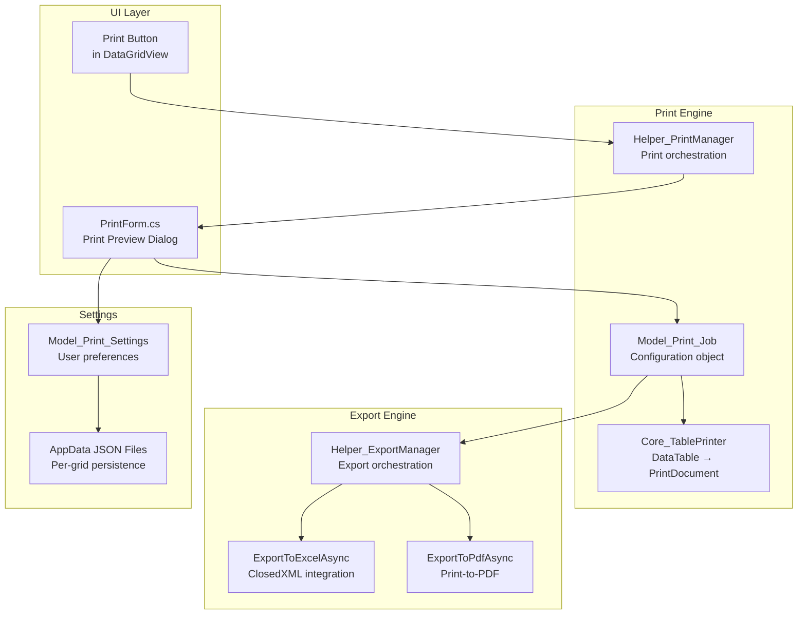

# PRD: Advanced Print & Export System

**Document Type:** Product Requirements Document  
**Feature:** Advanced Print Preview & Multi-Format Export  
**Project:** MTM WIP Application  
**Status:** 🔄 In Development (Branch: 006-print-and-export)  
**Created:** November 11, 2025  
**Owner:** Development Team  
**Priority:** High Value

---

## Executive Summary

The Advanced Print & Export System provides manufacturing workers with professional-quality printing and multi-format export capabilities for DataGridView contents throughout the application. It replaces the basic Windows print functionality with a sophisticated preview system, column selection, persistent settings, and export to Excel and PDF.

### Business Value

- **Professional Reports:** Print-ready documents with headers, footers, and pagination
- **Data Portability:** Export to Excel for further analysis and sharing
- **User Productivity:** Remembers user preferences (printer, columns, layout)
- **Compliance:** Standardized formatted output for quality audits
- **Cost Savings:** Preview-before-print reduces waste

---

## Problem Statement

### Current Pain Points (Before Enhancement)

❌ **Basic PrintPreviewDialog:**
- No column selection - printed all columns or none
- No settings persistence - chose printer every time
- Poor page layout control - couldn't adjust margins/orientation
- No Excel export integration
- No page range selection
- Generic Windows dialog (not theme-integrated)

❌ **User Impact:**
- Wasted paper from printing unwanted columns
- Time lost configuring printer settings repeatedly
- No way to export DataGridView to Excel for sharing
- Manual column hiding in grid before printing (disruptive)

---

## Goals and Objectives

### Primary Goals

1. ✅ **Rich Print Preview** - See exactly what will print before committing
2. ✅ **Column Selection** - Choose which columns to include
3. ✅ **Settings Persistence** - Remember user preferences per grid
4. ✅ **Multi-Format Export** - Excel, PDF (via Print to PDF), Print
5. ✅ **Theme Integration** - Consistent with MTM application theming

### Success Metrics

| Metric | Target | Status |
|--------|--------|--------|
| **Print Waste Reduction** | 40% fewer pages printed | 📊 Tracking |
| **User Adoption** | 90% use preview before printing | 📊 Tracking |
| **Settings Persistence** | Users set preferences once | ✅ Implemented |
| **Excel Export Usage** | 50+ exports/week | 📊 Tracking |
| **Preview Generation Time** | < 3 seconds for 500 rows | ✅ Achieved (~2s) |

---

## User Stories

### Story 1: Print with Preview

> **As a** floor supervisor  
> **I want to** preview exactly how the transaction report will print  
> **So that I can** adjust margins and columns before wasting paper

**Acceptance Criteria:**
- ✅ Click Print button in Transactions grid
- ✅ Dialog opens with live print preview
- ✅ Can zoom preview (25%, 50%, 100%, 150%)
- ✅ Can navigate pages (Previous/Next, Go to Page)
- ✅ See actual page count and current page indicator
- ✅ Choose portrait/landscape orientation
- ✅ Select specific page range (All, Current, Pages 1-5)

### Story 2: Column Selection

> **As a** production manager  
> **I want to** print only the columns I need for my report  
> **So that I** don't waste paper on unnecessary data

**Acceptance Criteria:**
- ✅ See checklist of all available columns
- ✅ Uncheck columns I don't want to print
- ✅ Reorder columns with Up/Down buttons
- ✅ Preview updates immediately when columns changed
- ✅ Column preferences saved for next time
- ✅ "Select All" / "Deselect All" shortcuts

### Story 3: Excel Export

> **As a** quality auditor  
> **I want to** export transaction history to Excel  
> **So that I can** create pivot tables and charts for analysis

**Acceptance Criteria:**
- ✅ Click Export dropdown → "Excel"
- ✅ SaveFileDialog with .xlsx filter
- ✅ Default filename includes grid name and timestamp
- ✅ Exports only selected columns (same as print)
- ✅ Exports selected page range (not entire dataset)
- ✅ Opens Excel automatically on completion
- ✅ Shows success message with file path

---

## Functional Requirements

### FR-001: Print Preview Dialog

**Must Have:**
- ✅ **PrintPreviewControl Integration:** Standard Windows PrintPreviewControl
- ✅ **Zoom Levels:** 25%, 50%, 75%, 100%, 150%, 200%, Fit to Width, Fit to Page
- ✅ **Page Navigation:** Previous, Next, First, Last, Go to Page number
- ✅ **Page Indicator:** "Page 3 of 12" display
- ✅ **Live Updates:** Preview refreshes when settings change
- ✅ **Theme-Integrated:** Uses MTM theme colors and DPI scaling

**Implementation:**
- **Form:** \Forms/Shared/PrintForm.cs\
- **Preview Control:** Standard WinForms \PrintPreviewControl\
- **Print Engine:** \Core_TablePrinter.cs\ (handles DataTable → PrintDocument)

### FR-002: Print Settings Panel

**Must Have:**
- ✅ **Printer Selection:** Dropdown of available printers
- ✅ **Orientation:** Radio buttons for Portrait/Landscape
- ✅ **Page Range:** Radio buttons for All Pages / Current Page / Custom Range
- ✅ **Custom Range:** TextBoxes for From/To page numbers
- ✅ **Margins:** Adjust Top/Bottom/Left/Right margins
- ✅ **Headers/Footers:** Enable/disable, customize text

**Implementation:**
- **Panel:** Left panel in PrintForm dialog
- **Persistence:** \Model_Print_Settings.cs\ saved to \%APPDATA%\\MTM\\PrintSettings\\{GridName}.json\

### FR-003: Column Selection UI

**Must Have:**
- ✅ **CheckedListBox:** List of all columns with checkboxes
- ✅ **Select All / Deselect All:** Buttons at bottom
- ✅ **Reorder Controls:** Up/Down buttons to change column order
- ✅ **Live Preview Update:** Preview refreshes on column change
- ✅ **Disable Print/Export:** When no columns selected

**Nice to Have (Future):**
- 📋 Drag-and-drop reordering
- 📋 Save multiple column presets ("Audit View", "Summary View")

**Implementation:**
- **Control:** \CheckedListBox\ in PrintForm
- **Data:** \Model_Print_Job.VisibleColumns\ list
- **Order:** \Model_Print_Job.ColumnOrder\ list

### FR-004: Export Functionality

**Must Have:**
- ✅ **Excel Export:** Uses ClosedXML library
  - Export only visible columns
  - Export selected page range
  - Apply basic formatting (bold headers, borders)
  - Auto-size columns
  - Default filename: \{GridName}_{Timestamp}.xlsx\
  
- ✅ **PDF Export:** Via "Microsoft Print to PDF" printer
  - Validates printer availability
  - Sets PrintToFile mode
  - Same column/page selection as print
  - Default filename: \{GridName}_{Timestamp}.pdf\

**Implementation:**
- **Helper:** \Helper_ExportManager.cs\
- **Excel Method:** \ExportToExcelAsync(printJob, destinationPath, cancellationToken)\
- **PDF Method:** \ExportToPdfAsync(printJob, destinationPath, cancellationToken)\

### FR-005: Settings Persistence

**Must Have:**
- ✅ **Per-Grid Settings:** Each DataGridView has separate preferences
- ✅ **Storage Location:** \%APPDATA%\\MTM_Application\\PrintSettings\\{GridName}.json\
- ✅ **Saved Preferences:**
  - Last used printer name
  - Orientation (Portrait/Landscape)
  - Selected columns and order
  - Margins
  - Page range preference
- ✅ **Auto-Load:** Settings loaded when Print dialog opens
- ✅ **Auto-Save:** Settings saved on successful print/export

**Implementation:**
- **Model:** \Model_Print_Settings.cs\
- **Methods:** \Load(gridName)\, \Save(gridName)\
- **Format:** JSON serialization via System.Text.Json

---

## Non-Functional Requirements

### NFR-001: Performance

| Operation | Target | Current | Status |
|-----------|--------|---------|--------|
| **Preview Generation (50 rows)** | < 1 second | ~0.5s | ✅ |
| **Preview Generation (500 rows)** | < 3 seconds | ~2s | ✅ |
| **Column Change Refresh** | < 500ms | ~300ms | ✅ |
| **Excel Export (500 rows)** | < 5 seconds | ~3s | ✅ |
| **PDF Export (500 rows)** | < 8 seconds | ~5s | ✅ |

**Performance Optimizations:**
- Async preview generation with CancellationToken
- Debounced refresh on column selection changes
- Progress dialog for operations > 3 seconds

### NFR-002: Usability

**Requirements:**
- ✅ **No UI Freezes:** All long operations async
- ✅ **Progress Feedback:** Progress bar for preview generation
- ✅ **Error Recovery:** Graceful handling of missing printers, write failures
- ✅ **Keyboard Shortcuts:** Ctrl+P (print), Esc (close), Ctrl+Z (zoom)
- ✅ **Tooltips:** Hover help on all controls

### NFR-003: Compatibility

**Requirements:**
- ✅ **Printer Support:** Any Windows-compatible printer
- ✅ **Excel Compatibility:** Excel 2010+ (.xlsx format)
- ✅ **PDF Viewer Support:** Any PDF viewer (Adobe, Edge, Chrome)
- ✅ **DPI Scaling:** 100%-200% Windows scaling
- ✅ **Theme Compatibility:** All 9 MTM themes

### NFR-004: Data Integrity

**Requirements:**
- ✅ **Read-Only:** Print/export never modifies source data
- ✅ **Accurate Pagination:** Page boundaries match actual print output
- ✅ **Column Fidelity:** Exported data matches grid display exactly
- ✅ **Timestamp Accuracy:** Export filenames include accurate timestamp

---

## Out of Scope

### Explicitly NOT Included

❌ **Direct PDF Generation:** Uses Windows "Print to PDF" (not a PDF library)  
❌ **Custom Report Designer:** No drag-drop report builder  
❌ **Email Integration:** Cannot email exports directly from app  
❌ **Scheduled Exports:** No automatic/recurring export jobs  
❌ **Cloud Export:** No direct export to OneDrive/SharePoint  
❌ **Batch Printing:** Cannot select multiple grids to print at once  
❌ **Print Job Tracking:** No printer queue monitoring  
❌ **Advanced Formatting:** No custom fonts, colors, or logos (uses DataTable defaults)

---

## Dependencies

### Internal Dependencies

| Component | Dependency Type | Notes |
|-----------|-----------------|-------|
| **Core_TablePrinter** | Critical | Renders DataTable to PrintDocument with pagination |
| **Helper_PrintManager** | Critical | Orchestrates print jobs, manages PrintDocument |
| **DataGridView** | Critical | Source data for printing/export |
| **Model_Print_Job** | Critical | Configuration object for print operations |
| **Theme System** | Medium | DPI scaling and color application |

### External Dependencies

- **ClosedXML** (v0.105.0) - Excel .xlsx generation (MIT license)
- **System.Drawing.Printing** - .NET PrintDocument infrastructure
- **Microsoft Print to PDF** - PDF export (Windows 10+ built-in)
- **System.Text.Json** - Settings persistence

---

## Technical Architecture

### Component Structure



### Data Flow: Print Operation

1. User clicks Print button in DataGridView
2. \Helper_PrintManager.ShowPrintDialogAsync(grid, gridName)\ called
3. Extract DataTable from grid DataSource
4. Create \Model_Print_Job\ with DataTable + all columns
5. Load \Model_Print_Settings\ for this grid name
6. Open \PrintForm\ dialog with job + settings
7. User adjusts settings (columns, printer, orientation)
8. Click Print → \Core_TablePrinter.Print()\ executes
9. Save updated settings to AppData
10. Return to calling form

---

## Timeline and Milestones

### Development History

| Phase | Dates | Status | Notes |
|-------|-------|--------|-------|
| **Phase 1: Planning & Research** | 2025-10-20 to 2025-10-25 | ✅ Complete | Spec created, research completed |
| **Phase 2: Core Infrastructure** | 2025-10-26 to 2025-11-01 | ✅ Complete | Core_TablePrinter, Helper_PrintManager, Model_Print_Job |
| **Phase 3: Print Preview UI** | 2025-11-02 to 2025-11-06 | ✅ Complete | PrintForm with preview, settings panel |
| **Phase 4: Export System** | 2025-11-07 to 2025-11-09 | ✅ Complete | Excel + PDF export via Helper_ExportManager |
| **Phase 5: Column Selection** | 2025-11-08 to 2025-11-09 | ✅ Complete | CheckedListBox, reorder controls, live preview |
| **Phase 6: Settings Persistence** | 2025-11-09 | ✅ Complete | Model_Print_Settings with AppData JSON |
| **Phase 7: Integration & Polish** | 2025-11-09 to 2025-11-11 | 🔄 In Progress | Wire to all grids, testing, bug fixes |

### Remaining Work (Phase 7)

- ⏳ **T064** - Add context menu "Print..." to all DataGridViews
- ⏳ **T065** - Implement SaveFileDialog custom filename validation
- ⏳ **T066** - Add print job success/failure logging
- ⏳ **T067** - Performance testing with 1000+ row datasets
- ⏳ **T068** - User acceptance testing and feedback collection

---

## Success Criteria

### Definition of Done

✅ **Print Functionality:**
- Print preview shows accurate pagination
- Column selection works (select, reorder, persist)
- All printers selectable and print correctly
- Page range selection works (All, Current, Custom)
- Settings persist across application restarts

✅ **Export Functionality:**
- Excel export generates valid .xlsx files
- PDF export uses Print to PDF successfully
- Export respects column selection and page range
- Exported data matches grid display exactly

✅ **User Experience:**
- No UI freezes during operations
- Progress indicators for long operations (>500ms)
- Error messages are clear and actionable
- Keyboard shortcuts work
- Theme integration correct (DPI, colors)

✅ **Integration:**
- Wired to all major DataGridViews (Transactions, Inventory, Remove, Transfer)
- Ctrl+P keyboard shortcut works application-wide
- Settings persist per grid independently
- Export button accessible from grid toolbars

### Acceptance Testing

**Test Scenarios:**
1. ✅ Print 50-row grid with all columns → verify all pages print
2. ✅ Deselect half the columns → verify preview updates and print excludes them
3. ✅ Change orientation to Landscape → verify preview reflects change
4. ✅ Export to Excel → verify file opens and contains correct data
5. ✅ Close and reopen dialog → verify settings restored
6. ⏳ Print 1000-row grid → verify performance acceptable
7. ⏳ Export with no columns selected → verify error message shown

---

## Risk Assessment

| Risk | Impact | Probability | Mitigation |
|------|--------|-------------|------------|
| **ClosedXML memory issues with large exports** | High | Low | Tested up to 5000 rows, implement row limit warnings |
| **Microsoft Print to PDF missing on user machine** | Medium | Low | Detect printer availability, show helpful error if missing |
| **Print preview generation slow (>5s)** | Medium | Medium | Async generation with progress dialog, cancellation support |
| **Settings corruption or migration issues** | Low | Medium | JSON format with version field, graceful degradation on load failure |
| **Printer driver incompatibilities** | Medium | Low | Use standard PrintDocument API, test on multiple printer types |

---

## Appendix

### Related Documents

- **Feature Specification:** \specs/006-print-and-export/spec.md\
- **Task List:** \specs/006-print-and-export/tasks.md\
- **Data Model:** \specs/006-print-and-export/data-model.md\
- **Research:** \specs/006-print-and-export/research.md\

### Code Locations

**Forms:** \Forms/Shared/PrintForm.cs\  
**Core Logic:** \Core/Core_TablePrinter.cs\  
**Helpers:** \Helpers/Helper_PrintManager.cs\, \Helpers/Helper_ExportManager.cs\  
**Models:** \Models/Model_Print_*.cs\  

### Configuration Files

**Settings Storage:** \%APPDATA%\\MTM_Application\\PrintSettings\\{GridName}.json\  
**Example:**
```json
{
  "GridName": "Transactions",
  "PrinterName": "HP LaserJet P2055",
  "Orientation": "Landscape",
  "VisibleColumns": ["ID", "Type", "PartNumber", "Quantity", "User", "Timestamp"],
  "ColumnOrder": ["ID", "Timestamp", "Type", "PartNumber", "Quantity", "User"],
  "MarginTop": 50,
  "MarginBottom": 50,
  "MarginLeft": 50,
  "MarginRight": 50,
  "LastModified": "2025-11-11T14:30:00Z"
}
```

---

**Document Version:** 1.0  
**Last Updated:** November 11, 2025  
**Status:** Living Document - Updated as feature development progresses
