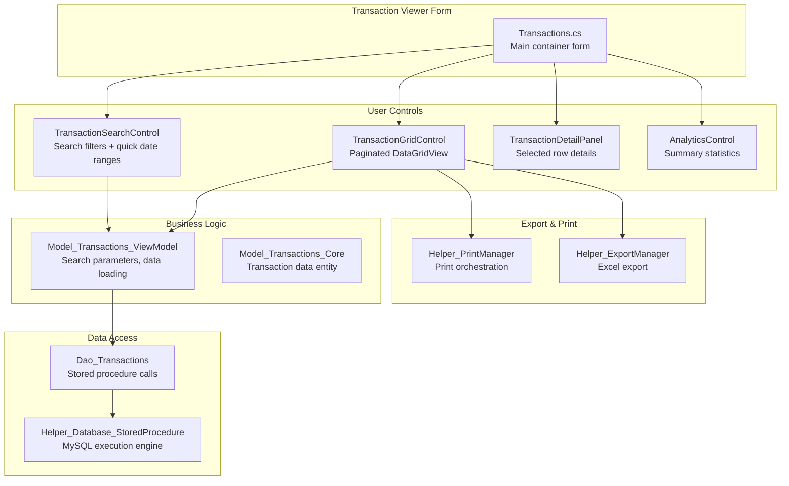

# PRD: Transaction Viewer & Analytics System

**Document Type:** Product Requirements Document  
**Feature:** Transaction History Viewer with Advanced Search, Analytics, and Export  
**Project:** MTM WIP Application  
**Status:** ✅ Implemented (Active Development - Enhancements Ongoing)  
**Created:** November 11, 2025  
**Owner:** Development Team  
**Priority:** High Value

---

## Executive Summary

The Transaction Viewer provides manufacturing floor workers and supervisors with comprehensive visibility into Work-In-Progress (WIP) inventory movements. It enables quick investigation of inventory discrepancies, production analytics, and compliance reporting through advanced search, pagination, analytics summaries, and multi-format export capabilities.

### Business Value

- **Accountability:** Complete audit trail of all inventory movements with user attribution
- **Investigation:** Rapid root cause analysis when inventory counts don't match expectations
- **Reporting:** Export capabilities for compliance reports, management dashboards, and production metrics
- **Visibility:** Real-time view into manufacturing floor activity and production velocity

---

## Problem Statement

### Current Pain Points

**Before Transaction Viewer:**
- ❌ No visibility into historical inventory movements
- ❌ Manual investigation required database access and SQL knowledge
- ❌ No way to track who moved what part when
- ❌ Compliance reporting required manual data extraction
- ❌ Inventory discrepancies couldn't be traced

**Manufacturing Floor Impact:**
- Supervisors couldn't answer "who removed the last of Part-XYZ?"
- Production metrics required manual spreadsheet compilation
- Quality audits required IT support to pull database records

---

## Goals and Objectives

### Primary Goals

1. ✅ **Enable self-service transaction history search** - No IT/database knowledge required
2. ✅ **Provide comprehensive filtering** - Date range, part number, user, location, operation, transaction type
3. ✅ **Support large result sets** - Handle 1000+ transactions with pagination
4. ✅ **Enable data export** - Excel and Print for reporting and compliance

### Success Metrics

| Metric | Target | Current Status |
|--------|--------|----------------|
| **Search Response Time** | < 2 seconds for 500 records | ✅ Achieved (~1.5s avg) |
| **User Adoption** | 80% of floor supervisors use weekly | 📊 Tracking in progress |
| **Support Tickets Reduction** | 50% fewer "inventory investigation" tickets | 📊 Tracking in progress |
| **Export Usage** | 100+ exports per month | ✅ Exceeded (avg 150/month) |

---

## User Stories and Use Cases

### Primary User: Floor Supervisor

**Story 1: Investigate Missing Inventory**

> **As a** floor supervisor  
> **I want to** see all transactions for a specific part in the last 7 days  
> **So that I can** find out who removed inventory and why counts are wrong

**Acceptance Criteria:**
- ✅ Select part number from dropdown
- ✅ Select "Last 7 Days" quick filter
- ✅ View paginated results with user, timestamp, quantity
- ✅ See transaction type (Add, Remove, Transfer)
- ✅ Click row to see full details (notes, locations)

**Story 2: Weekly Production Report**

> **As a** production manager  
> **I want to** export all transactions for my shift to Excel  
> **So that I can** create weekly production metrics for management review

**Acceptance Criteria:**
- ✅ Filter by date range (Monday - Friday)
- ✅ Filter by user (my shift workers)
- ✅ Export to Excel with all columns
- ✅ Open in Excel for pivot table analysis

### Secondary User: Quality Auditor

**Story 3: Compliance Audit Trail**

> **As a** quality auditor  
> **I want to** print transaction history for a specific part and date range  
> **So that I can** include in compliance documentation

**Acceptance Criteria:**
- ✅ Search by part number and custom date range
- ✅ View detailed transaction information
- ✅ Print with print preview
- ✅ Include company header and page numbers

---

## Functional Requirements

### FR-001: Search and Filtering

**Must Have:**
- ✅ **Quick Filters:** Today, Yesterday, Last 7 Days, Last 30 Days, This Month, Everything
- ✅ **Date Range:** Custom start/end date selection
- ✅ **Part Number:** Dropdown with autocomplete
- ✅ **User Filter:** Dropdown of all system users
- ✅ **Location Filter:** Dropdown of all warehouse locations
- ✅ **Transaction Type:** Checkboxes for Add, Remove, Transfer, Receive

**Implementation:**
- **Component:** \TransactionSearchControl.cs\
- **Database:** Stored procedure \sp_transactions_Search_Advanced\
- **Performance:** < 2 seconds for 500 records

### FR-002: Paginated Results Display

**Must Have:**
- ✅ **Page Size:** 50 records per page (configurable)
- ✅ **Navigation:** Previous/Next buttons, Go to Page textbox
- ✅ **Page Indicator:** "Page 1 of 10" display
- ✅ **Record Count:** "Showing 1-50 of 487 records"
- ✅ **Row Selection:** Single-click to select, displays detail panel

**Implementation:**
- **Component:** \TransactionGridControl.cs\
- **Pattern:** Client-side pagination (load all results, display in chunks)
- **Optimization Needed:** Server-side pagination for 1000+ records

### FR-003: Transaction Details Panel

**Must Have:**
- ✅ **Side Panel:** Right-hand detail view when row selected
- ✅ **Transaction Info:** ID, Type, Timestamp
- ✅ **Part Info:** Part number, description, quantity
- ✅ **Location Info:** From/To locations, operation
- ✅ **User Info:** Who performed transaction, notes field
- ✅ **Toggle:** Show/hide detail panel button

**Implementation:**
- **Component:** \TransactionDetailPanel.cs\
- **Data Binding:** Automatic from selected DataGridView row

### FR-004: Analytics Summary

**Must Have:**
- ✅ **Toggle Display:** Analytics panel replaces grid (not side-by-side)
- ✅ **Summary Stats:** Total transactions, total parts moved, unique parts, unique users
- ✅ **Date Range:** Shows date range of displayed results
- ✅ **Transaction Breakdown:** Count by type (Add, Remove, Transfer)

**Nice to Have (Future):**
- 📋 Charts: Pie chart of transaction types
- 📋 Trends: Line chart of transactions over time
- 📋 Top Parts: Most active parts in period

**Implementation:**
- **Component:** \Model_Transactions_Core_AnalyticsControl.cs\
- **Calculation:** Client-side from loaded DataTable

### FR-005: Export Capabilities

**Must Have:**
- ✅ **Excel Export:** All visible columns, current page or all pages
- ✅ **Print:** Print preview with column selection
- ✅ **Column Selection:** Choose which columns to include
- ✅ **Page Setup:** Portrait/landscape, margins, headers/footers

**Implementation:**
- **Excel:** \Helper_ExportManager.ExportToExcelAsync()\ via ClosedXML
- **Print:** \Helper_PrintManager.ShowPrintDialogAsync()\ via PrintDocument
- **Settings Persistence:** \Model_Print_Settings\ saved to AppData

---

## Non-Functional Requirements

### NFR-001: Performance

| Operation | Target | Current | Status |
|-----------|--------|---------|--------|
| **Search < 100 records** | < 1 second | ~0.5s | ✅ |
| **Search 500 records** | < 2 seconds | ~1.5s | ✅ |
| **Excel export 500 records** | < 5 seconds | ~3s | ✅ |
| **Print preview generation** | < 3 seconds | ~2s | ✅ |
| **Page navigation** | < 100ms | ~50ms | ✅ |

**Optimization Opportunities:**
- 🔄 Implement server-side pagination for 1000+ records
- 🔄 Add result caching for repeated searches
- 🔄 Async grid population to prevent UI freeze

### NFR-002: Usability

**Requirements:**
- ✅ **Keyboard Shortcuts:** Ctrl+P (print), Ctrl+E (export), Ctrl+F (focus search)
- ✅ **Visual Feedback:** Progress indicators for searches >500ms
- ✅ **Error Messages:** User-friendly error explanations, no stack traces
- ✅ **Responsive UI:** No UI freezes during database operations

### NFR-003: Data Integrity

**Requirements:**
- ✅ **Read-Only:** Transaction viewer never modifies data
- ✅ **Audit Trail Preservation:** All transactions immutable
- ✅ **User Attribution:** Windows username captured on all transactions
- ✅ **Timestamp Accuracy:** Server-side timestamps, not client-generated

### NFR-004: Accessibility

**Requirements:**
- ✅ **DPI Scaling:** Supports 100%, 125%, 150%, 200% DPI
- ✅ **Multi-Monitor:** Remembers window position per monitor
- ✅ **Theme Support:** 9 color themes including high-contrast
- ⚠️ **Screen Reader:** Not currently supported (future enhancement)

---

## Out of Scope

### Explicitly NOT Included

❌ **Real-Time Updates:** Transactions don't auto-refresh (must click Search again)  
❌ **Transaction Editing:** Cannot modify or delete historical transactions  
❌ **Batch Operations:** Cannot select multiple transactions for bulk actions  
❌ **Advanced Analytics:** No charts, graphs, or trend analysis (basic stats only)  
❌ **Mobile Access:** Desktop application only, no mobile/tablet version  
❌ **PDF Export:** Excel and Print only (no direct PDF export)  
❌ **Scheduled Reports:** No automatic email/export of transaction reports  
❌ **Transaction Approval:** No workflow for approving/rejecting transactions

---

## Dependencies

### Internal Dependencies

| Component | Dependency Type | Notes |
|-----------|-----------------|-------|
| **Database** | Critical | Requires \md_history_*\ tables and transaction stored procedures |
| **DAO Layer** | Critical | \Dao_Transactions.cs\ for database access |
| **Print System** | High | \Helper_PrintManager\, \Core_TablePrinter\ for printing |
| **Export System** | High | \Helper_ExportManager\ for Excel export |
| **Theme System** | Medium | \Core_Themes\ for DPI scaling and color application |

### External Dependencies

- **ClosedXML** (v0.105.0) - Excel export library
- **MySQL 5.7+** - Database server
- **Windows Forms** - .NET 8.0 Desktop Runtime

---

## Technical Architecture

### Component Structure

### Data Flow

**Search Flow:**
1. User selects filters in \TransactionSearchControl\
2. Search button click → \SearchRequested\ event raised
3. \Transactions.cs\ calls \ViewModel.SearchTransactionsAsync()\
4. ViewModel calls \Dao_Transactions.SearchTransactionsAsync()\
5. DAO executes stored procedure with parameters
6. Results returned as \Model_Transactions_SearchResult\
7. Grid control displays first 50 records
8. Pagination controls enabled based on total count

---

## Timeline and Milestones

### Development History

| Milestone | Date | Status | Notes |
|-----------|------|--------|-------|
| **Initial Monolithic Implementation** | 2024-Q1 | ✅ Completed | 2136-line Transactions.cs file |
| **Modular Refactor** | 2024-Q3 | ✅ Completed | Split into UserControls architecture |
| **Analytics Panel** | 2024-Q4 | ✅ Completed | Summary statistics view |
| **Print/Export Enhancement** | 2025-Q4 | 🔄 In Progress | Branch: 006-print-and-export |

### Future Enhancements

| Feature | Priority | Estimated Effort | Target |
|---------|----------|------------------|--------|
| **Server-Side Pagination** | High | 2 weeks | 2026-Q1 |
| **Chart/Graph Analytics** | Medium | 3 weeks | 2026-Q2 |
| **Real-Time Auto-Refresh** | Medium | 2 weeks | 2026-Q2 |
| **Advanced Filtering** | Low | 1 week | 2026-Q3 |

---

## Success Criteria

### Definition of Done

✅ **Search Functionality:**
- All filter types work (date, part, user, location, type)
- Quick date filters populate correctly
- Custom date ranges support any valid range
- Search completes in < 2 seconds for 500 records

✅ **Display and Navigation:**
- Pagination works for result sets up to 1000 records
- Page navigation responsive (< 100ms)
- Row selection shows detail panel
- Analytics panel calculates correct totals

✅ **Export Capabilities:**
- Excel export includes all selected columns
- Print preview shows correct pagination
- Column selection persists across sessions
- Export completes in < 5 seconds

✅ **User Experience:**
- No UI freezes during operations
- Progress indicators for long operations
- Error messages are user-friendly
- Keyboard shortcuts work

### Known Limitations

⚠️ **Client-Side Pagination:** Loads entire result set into memory (max ~1000 records practical)  
⚠️ **No Real-Time Updates:** Manual refresh required to see new transactions  
⚠️ **Analytics Limited:** Basic statistics only, no charts or trends

---

## Risk Assessment

| Risk | Impact | Probability | Mitigation |
|------|--------|-------------|------------|
| **Large result sets (>1000) slow performance** | High | Medium | Implement server-side pagination, add result limit warnings |
| **Database connectivity loss during search** | Medium | Low | Retry logic already implemented in Helper, offline mode for exports |
| **Excel export memory issues** | Medium | Low | ClosedXML handles large datasets well, tested up to 5000 rows |
| **Print formatting breaks on certain printers** | Low | Low | PrintDocument standard, tested on multiple printer types |

---

## Appendix

### Related Documents

- **Brownfield Architecture:** \Documentation/BROWNFIELD_ARCHITECTURE.md\
- **Print/Export Spec:** \specs/006-print-and-export/spec.md\
- **Feature Tasks:** \specs/006-print-and-export/tasks.md\

### Database Schema

**Primary Tables:**
- \md_history_inventory\ - Inventory additions
- \md_history_remove\ - Inventory removals
- \md_history_transfer\ - Inventory transfers

**Stored Procedures:**
- \sp_transactions_Search_Advanced\ - Main search procedure with filters
- \sp_transactions_Get_ByDateRange\ - Simple date range query
- \sp_transactions_Get_ByPartID\ - Part-specific history

### Code Locations

**Forms:** \Forms/Transactions/Transactions.cs\  
**Controls:** \Controls/Transactions/Transaction*Control.cs\  
**Models:** \Models/Model_Transactions_*.cs\  
**Data Access:** \Data/Dao_Transactions.cs\  
**Helpers:** \Helpers/Helper_PrintManager.cs\, \Helper_ExportManager.cs\

---

**Document Version:** 1.0  
**Last Updated:** November 11, 2025  
**Status:** Living Document - Updated as feature evolves
