# Part ID Management Control - UI Structure and Flow

> **Component**: `Control_PartIDManagement`  
> **Location**: `Controls/SettingsForm/Control_PartIDManagement.cs`  
> **Purpose**: Unified interface for adding, editing, and removing part numbers in the MTM WIP Application

## Visual Hierarchy and Navigation Flow

```mermaid
flowchart TD
    Start([User Opens Part ID Management]) --> Home[Home Screen]
    
    Home --> |Contains| HomeLayout[TableLayout_Home<br/>3 Columns]
    
    HomeLayout --> Tile1[HomeTile_Add<br/>Green Accent<br/>🆕 Add Part]
    HomeLayout --> Tile2[HomeTile_Edit<br/>Blue Accent<br/>✏️ Edit Part]
    HomeLayout --> Tile3[HomeTile_Remove<br/>Red Accent<br/>🗑️ Remove Part]
    
    Tile1 --> |Click Anywhere| ShowAdd[Show Add Card<br/>Hide Home]
    Tile2 --> |Click Anywhere| ShowEdit[Show Edit Card<br/>Hide Home]
    Tile3 --> |Click Anywhere| ShowRemove[Show Remove Card<br/>Hide Home]
    
    ShowAdd --> AddCard[AddCard Panel<br/>Visible]
    ShowEdit --> EditCard[EditCard Panel<br/>Visible]
    ShowRemove --> RemoveCard[RemoveCard Panel<br/>Visible]
    
    AddCard --> BackBtn1[Back Button<br/>Appears]
    EditCard --> BackBtn2[Back Button<br/>Appears]
    RemoveCard --> BackBtn3[Back Button<br/>Appears]
    
    BackBtn1 --> |Click| ReturnHome1[Return to Home<br/>Clear All Fields]
    BackBtn2 --> |Click| ReturnHome2[Return to Home<br/>Clear All Fields]
    BackBtn3 --> |Click| ReturnHome3[Return to Home<br/>Clear All Fields]
    
    ReturnHome1 --> Home
    ReturnHome2 --> Home
    ReturnHome3 --> Home
    
    style Home fill:#e1f5e1
    style Tile1 fill:#d4edda
    style Tile2 fill:#d1ecf1
    style Tile3 fill:#f8d7da
    style AddCard fill:#d4edda
    style EditCard fill:#d1ecf1
    style RemoveCard fill:#f8d7da
```

## Control Hierarchy Structure

## Add Card Internal Structure

## Edit Card Internal Structure

## Remove Card Internal Structure

```mermaid
flowchart TB
    RemoveCard[Panel_RemoveCard<br/>Red Accent Bar]
    
    RemoveCard --> RemoveLayout[TableLayout_Remove<br/>2 Columns<br/>Icon + Content]
    
    RemoveLayout --> RemoveIcon[Label_RemoveIcon<br/>🗑️ 28pt Emoji]
    RemoveLayout --> RemoveTitle[Label_RemoveTitle<br/>'Remove Part' 16pt Bold]
    RemoveLayout --> RemoveContent[TableLayout_RemoveContent<br/>Spans Both Columns<br/>4 Rows Stack]
    
    RemoveContent --> RRow1[Suggestion_RemoveSelectPart<br/>F4 Suggestions Enabled<br/>Cached Part Numbers]
    RemoveContent --> RRow2[TableLayout_RemoveDetails<br/>5 Rows × 2 Columns<br/>Initially Hidden]
    RemoveContent --> RRow3[Label_RemoveWarning<br/>'Removal is permanent'<br/>Red Text<br/>Initially Hidden]
    RemoveContent --> RRow4[FlowPanel_RemoveActions<br/>Right-Aligned Buttons]
    
    RRow1 --> |SuggestionSelected Event| LoadRemove[LoadRemovePartAsync<br/>Fetch from Database]
    
    LoadRemove --> |Success| PopulateRemove[Populate Details Table:<br/>Part Number<br/>Customer<br/>Description<br/>Item Type<br/>Issued By]
    LoadRemove --> |Not Found| WarnNotFound2[Show Warning<br/>Clear Section]
    LoadRemove --> |DB Error| HandleError2[Handle Database Error<br/>Clear Section]
    
    PopulateRemove --> ShowDetails[Show Details Table<br/>Show Warning Label<br/>Enable Confirm Button]
    
    RRow2 --> DetailRow1[Item Number Label + Value]
    RRow2 --> DetailRow2[Customer Label + Value]
    RRow2 --> DetailRow3[Description Label + Value]
    RRow2 --> DetailRow4[Item Type Label + Value]
    RRow2 --> DetailRow5[Issued By Label + Value]
    
    RRow4 --> BtnCancel[Button_RemoveCancel<br/>Secondary Style<br/>Always Enabled]
    RRow4 --> BtnConfirm[Button_RemoveConfirm<br/>Danger Style<br/>Red Background<br/>Initially Disabled]
    
    BtnCancel --> |Click| ClearRemove[Clear All Fields<br/>Hide Details<br/>Disable Buttons<br/>Focus Select Part]
    
    BtnConfirm --> |Click| ValidateRemove{Validate<br/>Selection}
    
    ValidateRemove --> |No Part Selected| WarnNoSelection[Show Warning<br/>'Select a part first']
    ValidateRemove --> |Missing Part#| WarnMissing[Show Warning<br/>'Missing part number']
    ValidateRemove --> |Valid| Confirmation{User Confirms<br/>Deletion?}
    
    Confirmation --> |No| CancelRemove[Return to Remove Card<br/>No Changes]
    Confirmation --> |Yes| DeleteDB[(Delete from Database<br/>DeletePartAsync)]
    
    DeleteDB --> |Success| Success3[Show Success Message]
    DeleteDB --> |Fail| Error3[Handle Database Error]
    
    Success3 --> PostRemove[Refresh Part Caches<br/>Clear Section<br/>Notify Parent]
    
    style RemoveCard fill:#f8d7da
    style LoadRemove fill:#cce5ff
    style PopulateRemove fill:#d4edda
    style ShowDetails fill:#d4edda
    style ValidateRemove fill:#fff3cd
    style Confirmation fill:#ffeaa7
    style DeleteDB fill:#cce5ff
    style Success3 fill:#d4edda
    style Error3 fill:#f8d7da
    style BtnConfirm fill:#f8d7da
```

## Navigation State Management

## Panel Visibility Matrix

| View State | Panel_Home | TableLayout_Cards | AddCard | EditCard | RemoveCard | BackButton |
|------------|------------|-------------------|---------|----------|------------|------------|
| **Initial Load** | ✅ Visible | ❌ Hidden | ❌ Hidden | ❌ Hidden | ❌ Hidden | ❌ Hidden |
| **Add Mode** | ❌ Hidden | ✅ Visible | ✅ Visible | ❌ Hidden | ❌ Hidden | ✅ Visible |
| **Edit Mode** | ❌ Hidden | ✅ Visible | ❌ Hidden | ✅ Visible | ❌ Hidden | ✅ Visible |
| **Remove Mode** | ❌ Hidden | ✅ Visible | ❌ Hidden | ❌ Hidden | ✅ Visible | ✅ Visible |

## Event Wiring Flow

## Key Behavioral Patterns

### 1. **Home Tile Interaction**
- Each tile (Add, Edit, Remove) and ALL its child controls are clickable
- Clicking anywhere on a tile triggers `ShowCard(index)`
- Cursor changes to hand pointer on hover
- Recursively wires up all nested controls for click events

### 2. **Card Visibility Toggle**
- Only ONE card visible at a time (mutually exclusive)
- `ShowCard(index)` hides home, shows cards container, reveals back button
- Automatically focuses appropriate input field when card appears

### 3. **Section Enabling/Disabling**
- **Add Card**: Always enabled (except when no privileges)
- **Edit Card**: Starts disabled, enables when part loaded
- **Remove Card**: Starts disabled, enables when part loaded

### 4. **Data Loading Pattern**
- User selects from suggestion dropdown → fires `SuggestionSelected` event
- Event handler calls `LoadEditPartAsync` or `LoadRemovePartAsync`
- Async database fetch via `Dao_Part.GetPartByNumberAsync`
- On success: populate fields, enable editing, store original values
- On failure: show error, clear section, keep disabled

### 5. **Validation Flow**
- Client-side validation before database operations
- Check for empty required fields → show warning, focus field
- Check for duplicates → query database, show warning if exists
- All validation uses `Service_ErrorHandler` (no direct MessageBox)

### 6. **Cache Refresh Pattern**
- After any successful add/edit/remove operation
- Calls `RefreshPartCachesAsync()` which updates:
  - `Helper_UI_ComboBoxes.SetupPartDataTable()`
  - `Helper_UI_SuggestionBoxes.LoadPartIdsAsync()`
- Notifies parent via `PartListChanged` event

### 7. **Privilege Enforcement**
- `ApplyPrivileges(canAdd, canEdit, canRemove)` method
- Hides/disables tiles and cards based on user permissions
- If no privileges: shows message, hides all functionality

### 8. **Color Code Special Handling**
- Tracks original `RequiresColorCode` state in Edit mode
- If changed, triggers `Model_Application_Variables.ReloadColorCodePartsAsync()`
- Critical for parts requiring color code + work order validation

---

**Document Created**: November 19, 2025  
**Related Files**:
- `Controls/SettingsForm/Control_PartIDManagement.cs`
- `Controls/SettingsForm/Control_PartIDManagement.Designer.cs`
