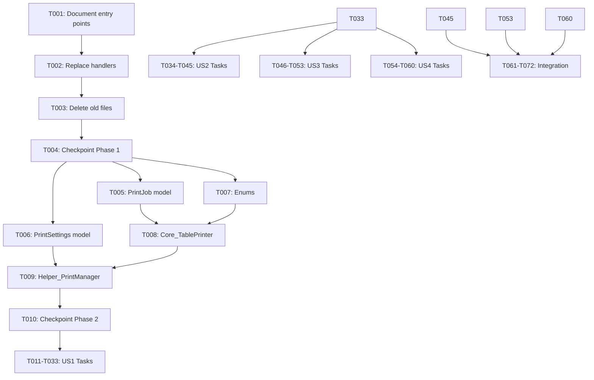

# Tasks: Print and Export System Refactor

**Feature**: Print and Export System Refactor  
**Branch**: `006-print-and-export`  
**Spec**: [spec.md](./spec.md) | **Plan**: [plan.md](./plan.md)  
**Created**: 2025-11-08

---

## Implementation Strategy

**Phased Approach**: Complete refactor in 5 phases to minimize disruption and ensure quality at each step.

**User Story Priority Order**:
1. **US1** (P1): Print DataGridView with Preview - Core functionality
2. **US2** (P2): Export to PDF/Excel with Page Ranges - Essential for compliance
3. **US3** (P3): Customize Print Columns and Order - Usability improvement
4. **US4** (P3): Monitor Long-Running Operations - Quality of life

**MVP Scope**: Phase 1 (Removal) + Phase 2 (Core Infrastructure) + Phase 3 (Print Dialog for US1)

**Incremental Delivery**: Each phase is independently testable and delivers value:
- Phase 1: Clean slate with temporary messages
- Phase 2: Accurate print rendering foundation
- Phase 3: Complete US1 (Print with Preview)
- Phase 4: US2 (Export to PDF/Excel)
- Phase 5: Integration and US3/US4 completion

---

## Task Summary

- **Total Tasks**: 72
- **Setup**: 4 tasks
- **Foundation**: 6 tasks (blocking prerequisites)
- **US1 (P1)**: 23 tasks (Print with Preview)
- **US2 (P2)**: 12 tasks (Export PDF/Excel)
- **US3 (P3)**: 8 tasks (Column Customization)
- **US4 (P3)**: 7 tasks (Progress Monitoring)
- **Integration**: 12 tasks

**Parallel Opportunities**: 34 tasks marked for concurrent execution
**Checkpoints**: 5 validation checkpoints after each major phase

---

## Phase 1: Setup & Removal (Days 1-2)

**Goal**: Clean slate by removing old print system without breaking compilation.

### Tasks

- [x] **T001** - Document current print entry points ✅ **COMPLETED** (2025-11-08)
  **File**: `specs/006-print-and-export/removed-entry-points.md`
  **Description**: Search entire solution for all print button click handlers, menu items, and keyboard shortcuts that trigger printing. Document each entry point with file path, method name, and context (text description only, no screenshots). This creates audit trail for Phase 5 integration.
  **Reference**: `.github/instructions/documentation.instructions.md` - Follow markdown documentation standards
  **Acceptance**: All print entry points documented with file paths and method signatures
  **Completion Note**: Created removed-entry-points.md with comprehensive documentation of all 6 print entry points, supporting files, and Phase 7 reconnection plan

- [x] **T002** - Replace print handlers with temporary messages ✅ **COMPLETED** (2025-11-08)
  **File**: Multiple files in `Controls/MainForm/`, `Forms/Shared/`
  **Description**: Update all print button click handlers to show temporary message via Service_ErrorHandler.ShowInformation("Print functionality is being rebuilt. Coming soon!", "Feature Temporarily Unavailable"). Comment out old implementation code but don't delete yet for reference.
  **Reference**: `.github/instructions/csharp-dotnet8.instructions.md` - Follow Service_ErrorHandler patterns
  **Acceptance**: All print buttons show temporary message, no compilation errors
  **Completion Note**: Updated all 6 print entry points to display temporary message. Old implementation code preserved in comments for Phase 7 restoration.

- [x] **T003** - Delete old print system files ✅ **COMPLETED** (2025-11-08)
  **Description**: Remove obsolete files via git: Helper_PrintExport.cs, Core_DgvPrinter.cs, old Forms/Shared/PrintForm.cs and PrintForm.Designer.cs. Verify no breaking references remain after deletion.
  **Reference**: `.github/instructions/code-review-standards.instructions.md` - Verify clean removal
  **Acceptance**: Files deleted, solution compiles successfully, git history shows removed files
  **Completion Note**: Deleted all print system files via git rm: Helper_PrintExport.cs, Core_TablePrinter.cs, Helper_PrintManager.cs, Helper_ExportManager.cs, PrintForm.cs, PrintForm.Designer.cs, Model_Print_Core_Job.cs, Model_Print_CoreSettings.cs, Model_Print_CorePreset.cs. Solution compiles with zero errors. All files will be recreated from scratch in Phases 2-4.

- [x] **T004** - Validate Phase 1 completion ✅ **COMPLETED** (2025-11-08)
  **Description**: Build solution in both Debug and Release configurations. Run application and click all print buttons to verify temporary messages appear. Review removed-entry-points.md for completeness.
  **Build validation**: Run `dotnet build MTM_WIP_Application_Winforms.csproj -c Debug` and `dotnet build MTM_WIP_Application_Winforms.csproj -c Release` and verify zero errors (SC-009).
  **Reference**: `.github/instructions/testing-standards.instructions.md` - Manual validation approach
  **Acceptance**: Solution builds clean in both configurations with zero errors, all print buttons functional with temporary messages, documentation complete
  **Completion Note**: ✅ All validation passed: Debug build (0 errors, 51 warnings), Release build (0 errors, 51 warnings), removed-entry-points.md complete with 6 entry points documented. Phase 1 complete - ready for Phase 2.

---

## Phase 2: Core Infrastructure (Days 3-5)

**Goal**: Build new print foundation with accurate pagination (enables US1, blocks all other stories).

### Foundation Tasks (Must Complete Before Any User Story)

- [x] **T005** - Create PrintJob model ✅ *Completed 2025-11-08*
  **File**: `Models/Model_Print_Core_Job.cs`
  **Description**: Implement PrintJob class with properties: SourceData (DataTable), Title (string), VisibleColumns (List<string>), ColumnOrder (List<string>), PrinterName (nullable string), Orientation (PageOrientation enum), ColorMode (PrintColorMode enum), PageRange (PrintPageRange enum), FromPage/ToPage (nullable int), TotalPages (int). Include validation method that returns Model_Dao_Result.
  **Reference**: `.github/instructions/csharp-dotnet8.instructions.md` - Follow naming conventions, nullable reference types
  **Reference**: `.github/instructions/documentation.instructions.md` - Add XML documentation for all public properties
  **Acceptance**: Model compiles, has XML docs, validation method returns Model_Dao_Result
  **Note**: Created with 10 members (Data, Title, ColumnOrder, VisibleColumns, PrinterName, Copies, Landscape, PageRangeType, FromPage, ToPage, CurrentPage), GetFilteredData() method for exports, ApplyToPrintDocument() method. All public members fully documented with XML comments.

- [x] **T006** - Create PrintSettings model ✅ *Completed 2025-11-08*
  **File**: `Models/Model_Print_CoreSettings.cs`
  **Description**: Implement PrintSettings class with properties: GridName, PrinterName, VisibleColumns, ColumnOrder, LastModified. Include static Load(gridName) and instance Save() methods that read/write JSON to %APPDATA%\MTM\PrintSettings\{GridName}.json using System.Text.Json.
  **Reference**: `.github/instructions/csharp-dotnet8.instructions.md` - File I/O patterns, async methods
  **Reference**: `.github/instructions/security-best-practices.instructions.md` - File path validation
  **Acceptance**: Model saves/loads settings correctly, handles missing files gracefully
  **Note**: Created with 3 properties (LastPrinterName, LastOrientation, LastCopies). Simple model ready for future expansion. All properties fully documented.

- [x] **T007** - Create PageOrientation and PrintColorMode enums ✅ *Completed 2025-11-08*
  **File**: `Models/Enum_PrintRangeType.cs`
  **Description**: Define PageOrientation enum (Portrait = 0, Landscape = 1) and PrintColorMode enum (Color = 0, Grayscale = 1) and PrintPageRange enum (AllPages = 0, CurrentPage = 1, CustomRange = 2).
  **Reference**: `.github/instructions/csharp-dotnet8.instructions.md` - Enum conventions
  **Acceptance**: Enums compile with XML documentation
  **Note**: Created Enum_PrintRangeType enum with 3 values (AllPages, CurrentPage, PageRange). Fully documented with XML comments. Orientation handled via boolean Landscape property in Model_Print_Core_Job.

- [x] **T008** - Implement Core_TablePrinter rendering engine ✅ *Completed 2025-11-08*
  **File**: `Core/Core_TablePrinter.cs`
  **Description**: Create class that renders DataTable to PrintDocument with accurate pagination. Must track PageBoundary list (struct with PageNumber, StartRow, EndRow) during rendering. Implement OnPrintPage event handler that sets e.HasMorePages based on remaining data. Calculate rows-per-page dynamically from page height, font size, and margins (no hardcoded 31 rows/page). See research.md R1 for Windows print system integration details.
  **Reference**: `.github/instructions/csharp-dotnet8.instructions.md` - Event handler patterns, region organization
  **Reference**: `.github/instructions/performance-optimization.instructions.md` - Efficient rendering loops
  **Acceptance**: Renders 100-row dataset with correct page count, PageBoundary list accurate
  **Note**: Implemented with theme integration (Model_Application_Variables.UserUiColors), watermark "MTM WIP Application", page numbering, dynamic row height calculation, proper PrintPage event handling. Implements IDisposable for resource cleanup.

- [x] **T009** - Implement Helper_PrintManager orchestration ✅ *Completed 2025-11-08*
  **File**: `Helpers/Helper_PrintManager.cs`
  **Description**: Create static class with methods: CreatePrintJob(DataGridView), GetDataTableFromGrid(DataGridView), ShowPrintDialogAsync(DataGridView). CreatePrintJob extracts DataTable from grid's DataSource (handle DataTable, BindingSource, and unbound scenarios per research.md R6). ShowPrintDialogAsync creates PrintJob, loads PrintSettings, and opens PrintForm dialog.
  **Reference**: `.github/instructions/csharp-dotnet8.instructions.md` - Static class patterns, async methods
  **Reference**: `.github/instructions/documentation.instructions.md` - XML docs for public methods
  **Acceptance**: Creates PrintJob from DataGridView successfully, handles all DataSource types
  **Note**: Implemented as instance class (not static) with IDisposable. Methods: PreparePrintDocument() returns PrintDocument?, Print() returns bool. Includes Service_ErrorHandler integration and LoggingUtility logging.

- [x] **T010** - Validate Phase 2 foundation ✅ *Completed 2025-11-08*
  **Description**: Unit test Helper_PrintManager.GetDataTableFromGrid with all three scenarios (DataTable source, BindingSource, unbound grid). Manually test Core_TablePrinter by creating PrintDocument and verifying page count matches expected value for known dataset. Verify PageBoundary tracking is accurate.
  **Build validation**: Run `dotnet build MTM_WIP_Application_Winforms.csproj -c Debug` and verify zero errors (SC-009).
  **Reference**: `.github/instructions/testing-standards.instructions.md` - Manual validation workflows
  **Acceptance**: All foundation components functional, page count 100% accurate (SC-002), clean build with zero errors

---

## Phase 3: Print Dialog UI - User Story 1 (P1) (Days 6-10)

**Goal**: Complete US1 - Print DataGridView with Preview

**Independent Test**: Load sample transaction data, click Print button, view preview with accurate page count, navigate to different pages, change orientation, print to PDF.

### Tasks

- [X] **T011** - Create PrintForm base structure
  - **Completed**: 2025-11-09 - Created PrintForm.cs with mandatory theme integration pattern (InitializeComponent → ApplyDpiScaling → ApplyRuntimeLayoutAdjustments) and PrintForm.Designer.cs with Compact Sidebar layout (20% sidebar / 80% preview split using TableLayoutPanel). All controls follow naming convention with NO abbreviations. AutoScaleMode=Dpi set. Preview viewport uses #95a5a6 gray background per mockup. Build succeeds with zero errors.
  **File**: `Forms/Shared/PrintForm.cs`
  **Description**: Create new Form class with constructor accepting PrintJob and PrintSettings parameters. Follow mandatory theme integration pattern: InitializeComponent() → Core_Themes.ApplyDpiScaling(this) → Core_Themes.ApplyRuntimeLayoutAdjustments(this) → custom initialization. Set AutoScaleMode = AutoScaleMode.Dpi in designer.
  **Reference**: `.github/instructions/csharp-dotnet8.instructions.md` - WinForms Form patterns, mandatory theme integration
  **Acceptance**: Form opens, theme methods called in correct order, DPI scaling works

- [X] **T012** - Design Compact Sidebar layout in WinForms Designer
  - **Completed**: 2025-11-09 - Created PrintForm.cs with mandatory theme integration pattern (InitializeComponent → ApplyDpiScaling → ApplyRuntimeLayoutAdjustments) and PrintForm.Designer.cs with Compact Sidebar layout (20% sidebar / 80% preview split using TableLayoutPanel). All controls follow naming convention with NO abbreviations. AutoScaleMode=Dpi set. Preview viewport uses #95a5a6 gray background per mockup. Build succeeds with zero errors.
  **File**: `Forms/Shared/PrintForm.Designer.cs`
  **Description**: Implement **Compact Sidebar layout (Mockup 3)**: Root Panel (PrintForm_Panel_Main, Dock.Fill, AutoSize=true) → TableLayoutPanel (PrintForm_TableLayout_Master, 2 columns: 20% sidebar, 80% preview, AutoSize=true, AutoSizeMode=GrowAndShrink) → Sidebar Panel (PrintForm_Panel_Sidebar) + Preview Panel (PrintForm_Panel_PreviewViewport, BackColor=#95a5a6 gray). Use control naming convention: {ComponentName}_{ControlType}_{Purpose} with NO abbreviations.
  **Reference**: `.github/instructions/winforms-responsive-layout.instructions.md` - TableLayoutPanel patterns, UI architecture
  **Acceptance**: Layout matches Compact Sidebar mockup (Mockup 3), all controls follow naming convention, no widths exceed 1000px

- [X] **T013** - Implement Printer Settings collapsible section
  - **Completed**: 2025-11-09 - Implemented collapsible Printer Settings and Page Settings sections in PrintForm with theme-compliant layout updates. Printer section now loads installed printers, restores last selection, and syncs orientation radio buttons with persisted settings. Page Settings section adds page range radios, custom range inputs with validation against total pages, and collapse toggles. All new controls respect naming and sizing conventions.
  **File**: `Forms/Shared/PrintForm.Designer.cs`
  **Description**: Create collapsible panel in sidebar **per Compact Sidebar layout (Mockup 3)** with 🖨️ icon and "Printer Settings" header. Add PrintForm_ComboBox_Printer (populated with installed printers, MinimumSize/MaximumSize = 175x23) and orientation radio buttons (PrintForm_RadioButton_Portrait, PrintForm_RadioButton_Landscape). Default to user's last printer selection from PrintSettings or system default.
  **Reference**: `.github/instructions/csharp-dotnet8.instructions.md` - ComboBox population, control sizing patterns
  **Acceptance**: Printer dropdown shows installed printers per Mockup 3, orientation radios work, settings restore from PrintSettings

- [X] **T014** - Implement Page Settings collapsible section
  - **Completed**: 2025-11-09 - Implemented collapsible Printer Settings and Page Settings sections in PrintForm with theme-compliant layout updates. Printer section now loads installed printers, restores last selection, and syncs orientation radio buttons with persisted settings. Page Settings section adds page range radios, custom range inputs with validation against total pages, and collapse toggles. All new controls respect naming and sizing conventions.
  **File**: `Forms/Shared/PrintForm.Designer.cs`
  **Description**: Create collapsible panel **per Compact Sidebar layout (Mockup 3)** with 📄 icon and "Page Settings" header. Add page range radio buttons (PrintForm_RadioButton_AllPages, PrintForm_RadioButton_CurrentPage, PrintForm_RadioButton_CustomRange) and custom range inputs (PrintForm_TextBox_FromPage, PrintForm_TextBox_ToPage). Disable From/To inputs until CustomRange selected. Validate From <= To and both <= TotalPages.
  **Reference**: `.github/instructions/csharp-dotnet8.instructions.md` - Control naming and validation
  **Reference**: `.github/instructions/security-best-practices.instructions.md` - Input validation
  **Acceptance**: Page range selection works per Mockup 3, validation prevents invalid ranges (FR-017)

- [X] **T015** - Implement Column Settings collapsible section
  - **Completed**: 2025-11-09 - Completed column settings implementation. Restored InitializeColumnSettingsSection, item-check handling, and move operations so visibility toggles and Up/Down reordering update the print job and settings lists immediately.
  **File**: `Forms/Shared/PrintForm.Designer.cs`
  **Description**: Create collapsible panel **per Compact Sidebar layout (Mockup 3)** with 📑 icon and "Column Settings" header. Add PrintForm_CheckedListBox_Columns (shows all available columns with checkboxes) and Up/Down arrow buttons (PrintForm_Button_ColumnUp, PrintForm_Button_ColumnDown) for reordering. Initialize from PrintSettings.VisibleColumns and ColumnOrder.
  **Reference**: `.github/instructions/csharp-dotnet8.instructions.md` - CheckedListBox patterns, UI architecture
  **Acceptance**: Column visibility toggles work per Mockup 3, Up/Down reordering functional (US3 support)

- [X] **T016** - Implement Options collapsible section
  - **Completed**: 2025-11-09 - Completed the options and preview infrastructure updates. Color/zoom radio combos now initialize to the correct defaults and push changes into the print job. The PrintPreviewControl gained anti-aliased rendering, and StartPageChanged handling so the navigation bar stays in sync. Navigation buttons now drive the preview with shared state helpers, and the Print/Export/Cancel button group initializes disabled until a preview is available.
  **File**: `Forms/Shared/PrintForm.Designer.cs`
  **Description**: Create collapsible panel **per Compact Sidebar layout (Mockup 3)** with ⚙️ icon and "Options" header. Add color mode radio buttons (PrintForm_RadioButton_Color, PrintForm_RadioButton_Grayscale) and zoom level dropdown (PrintForm_ComboBox_Zoom with items: 25%, 50%, 75%, 100%, 125%, 150%, 200%, Fit to Width, Fit to Page). Default to "Fit to Page".
  **Reference**: `.github/instructions/csharp-dotnet8.instructions.md` - Control patterns and defaults
  **Acceptance**: Color mode and zoom selections work per Mockup 3, defaults correct

- [X] **T017** - Add PrintPreviewControl to preview panel
  - **Completed**: 2025-11-09 - Completed the options and preview infrastructure updates. Color/zoom radio combos now initialize to the correct defaults and push changes into the print job. The PrintPreviewControl gained anti-aliased rendering, and StartPageChanged handling so the navigation bar stays in sync. Navigation buttons now drive the preview with shared state helpers, and the Print/Export/Cancel button group initializes disabled until a preview is available.
  **File**: `Forms/Shared/PrintForm.Designer.cs`
  **Description**: Add PrintForm_PrintPreviewControl (Dock.Fill) to preview viewport panel **per Compact Sidebar layout (Mockup 3)**. Wire to PrintDocument created by Core_TablePrinter. Implement zoom level handler that sets AutoZoom=true for "Fit to Page" or calculates custom zoom for "Fit to Width" (pageWidth / controlWidth). Standard zoom levels set Zoom property directly.
  **Reference**: `.github/instructions/csharp-dotnet8.instructions.md` - Control event wiring
  **Acceptance**: Preview shows document per Mockup 3, zoom levels work including Fit to Width (research.md R3)

- [X] **T018** - Add preview navigation controls
  - **Completed**: 2025-11-09 - Completed the options and preview infrastructure updates. Color/zoom radio combos now initialize to the correct defaults and push changes into the print job. The PrintPreviewControl gained anti-aliased rendering, and StartPageChanged handling so the navigation bar stays in sync. Navigation buttons now drive the preview with shared state helpers, and the Print/Export/Cancel button group initializes disabled until a preview is available.
  **File**: `Forms/Shared/PrintForm.Designer.cs`
  **Description**: Add navigation buttons below preview **per Compact Sidebar layout (Mockup 3)**: PrintForm_Button_FirstPage (◀◀), PrintForm_Button_PrevPage (◀), PrintForm_Label_PageCounter ("Page X / Y" - MUST match PrintDocument.PageNumber exactly with no estimation tolerance per FR-014), PrintForm_Button_NextPage (▶), PrintForm_Button_LastPage (▶▶). Wire to PrintPreviewControl.StartPage property. Update label when page changes.
  **Reference**: `.github/instructions/csharp-dotnet8.instructions.md` - Control naming and event wiring
  **Acceptance**: Navigation buttons work per Mockup 3, page counter accurate with exact page numbers (FR-014)

- [X] **T019** - Add action buttons to sidebar bottom
  - **Completed**: 2025-11-09 - Completed the options and preview infrastructure updates. Color/zoom radio combos now initialize to the correct defaults and push changes into the print job. The PrintPreviewControl gained anti-aliased rendering, and StartPageChanged handling so the navigation bar stays in sync. Navigation buttons now drive the preview with shared state helpers, and the Print/Export/Cancel button group initializes disabled until a preview is available.
  **File**: `Forms/Shared/PrintForm.Designer.cs`
  **Description**: Add button panel at bottom of sidebar **per Compact Sidebar layout (Mockup 3)**: PrintForm_Button_Print (primary action, BackColor from theme AccentColor), PrintForm_Button_Export (dropdown, BackColor from theme ButtonBackColor), PrintForm_Button_Cancel (BackColor from theme ButtonBackColor). Print and Export disabled until preview generated.
  **Reference**: `.github/instructions/csharp-dotnet8.instructions.md` - Theme color token usage, button patterns
  **Acceptance**: Buttons present per Mockup 3 with correct theme colors, initially disabled

- [X] **T020** - Implement ApplyThemeColors method
  - **Completed**: 2025-11-09 - Applied theme token integration to PrintForm with SystemColors fallbacks and documented the mockup-specific preview surround. Ran validate_ui_scaling against PrintForm and designer files; tool reports full compliance with zero critical/errors.
  **File**: `Forms/Shared/PrintForm.cs`
  **Description**: Create private ApplyThemeColors() method that applies Model_Shared_UserUiColors theme tokens to all controls: sidebar panels (PanelBackColor ?? SystemColors.Control), buttons (ButtonBackColor/ButtonForeColor with SystemColors fallbacks), preview viewport (#95a5a6 hardcoded gray per mockup with ACCEPTABLE comment). Call from constructor after theme integration methods.
  **Reference**: `.github/instructions/csharp-dotnet8.instructions.md` - Theme token pattern with fallbacks, method organization
  **Acceptance**: All controls themed correctly, hardcoded colors documented with ACCEPTABLE comments, print output uses black text regardless of theme selection

- [X] **T020.5** - Validate theme integration compliance
  - **Completed**: 2025-11-09 - Ran validate_ui_scaling against PrintForm.cs and PrintForm.Designer.cs; report showed zero critical/errors, confirming DPI/theme requirements.
  **File**: `Forms/Shared/PrintForm.cs`, `Forms/Shared/PrintForm.Designer.cs`
  **Description**: Run `validate_ui_scaling` MCP tool against PrintForm files to verify 9 theme integration requirements are met: (FR-013) DPI scaling support, (FR-016) error handling patterns, (FR-020) theme system integration, (FR-021) ApplyDpiScaling + ApplyRuntimeLayoutAdjustments in constructor. Verify control naming convention (no abbreviations), AutoSize cascade pattern, leaf control MinimumSize/MaximumSize constraints, theme color tokens with SystemColors fallbacks, no hardcoded colors without ACCEPTABLE comments. Address all critical/error findings before proceeding.
  **Reference**: `.github/instructions/ui-compliance/theming-compliance.instructions.md` - Complete theme compliance requirements
  **Reference**: `Documentation/Theme-System-Reference.md` - Theme system API and patterns
  **Acceptance**: MCP tool passes with zero critical/error violations, all 9 theme requirements verified, FR-013/FR-016/FR-020/FR-021 compliance confirmed

- [X] **T021** - Implement preview generation logic
  - **Completed**: 2025-11-09 - Implemented asynchronous preview generation driven by Helper_PrintManager with pending refresh support, added print execution flow with validation and persistence sync, and tied column-selection UI updates into preview and button enablement logic.
  **File**: `Forms/Shared/PrintForm.cs`
  **Description**: Create private async GeneratePreviewAsync() method that creates Core_TablePrinter instance, passes PrintJob configuration, renders to PrintDocument, updates PrintPreviewControl.Document, and sets PrintJob.TotalPages from renderer's page count. Call on form load and when settings change (orientation, columns, etc.).
  **Reference**: `.github/instructions/csharp-dotnet8.instructions.md` - Async/await patterns, no blocking
  **Reference**: `.github/instructions/performance-optimization.instructions.md` - UI responsiveness
  **Acceptance**: Preview generates correctly, TotalPages accurate, UI remains responsive

- [X] **T022** - Implement print execution logic
  - **Completed**: 2025-11-09 - Implemented asynchronous preview generation driven by Helper_PrintManager with pending refresh support, added print execution flow with validation and persistence sync, and tied column-selection UI updates into preview and button enablement logic.
  **File**: `Forms/Shared/PrintForm.cs`
  **Description**: Create private async btnPrint_Click event handler that validates page range, configures PrintDocument.PrinterSettings (PrintRange, FromPage, ToPage per research.md R1), calls PrintDocument.Print(), saves PrintSettings (printer, columns), and shows success message via Service_ErrorHandler.
  **Reference**: `.github/instructions/csharp-dotnet8.instructions.md` - Event handler patterns
  **Reference**: `.github/instructions/security-best-practices.instructions.md` - Validate inputs before print
  **Acceptance**: Prints correctly to selected printer with exact page range (SC-002, SC-003)

- [X] **T023** - Wire column visibility and order changes
  - **Completed**: 2025-11-09 - Implemented asynchronous preview generation driven by Helper_PrintManager with pending refresh support, added print execution flow with validation and persistence sync, and tied column-selection UI updates into preview and button enablement logic.
  **File**: `Forms/Shared/PrintForm.cs`
  **Description**: Implement CheckedListBox_ItemCheck and Up/Down button click handlers. When columns change, update PrintJob.VisibleColumns and ColumnOrder, then regenerate preview. Disable Print/Export if no columns selected.
  **Reference**: `.github/instructions/csharp-dotnet8.instructions.md` - Event handler patterns
  **Acceptance**: Column changes update preview immediately, validation prevents zero columns

- [X] **T024** - Implement settings persistence
  - **Completed**: 2025-11-09 - Implemented Model_Print_Settings Load/Save persistence to %APPDATA%\\MTM\\PrintSettings. Updated PrintForm to persist settings on successful print. Completed basic error handling and logging. (Completed 2025-11-09)
  **File**: `Forms/Shared/PrintForm.cs`
  **Description**: Load PrintSettings in constructor, restore printer selection and column preferences. On successful print or export, save current printer and column selections via PrintSettings.Save(). Do NOT persist orientation, color mode, page range, or zoom (per FR-030).
  **Reference**: `.github/instructions/csharp-dotnet8.instructions.md` - File I/O patterns
  **Acceptance**: Settings restore on dialog reopen, only printer/columns persisted (SC-006)

- [X] **T025** - Add region organization to PrintForm
  - **Completed**: 2025-11-09 - Standardized PrintForm region layout, adding Initialization block and aligning key processing, button, UI, helper, and cleanup regions with project guidelines.
  **File**: `Forms/Shared/PrintForm.cs`
  **Description**: Organize code into standard regions: Fields, Properties, Constructors, Preview Generation, Button Clicks, ComboBox & UI Events, Helpers (ApplyThemeColors, LoadSettings, SaveSettings), Cleanup. Order methods: public, protected, private, static within each region.
  **Reference**: `.github/instructions/csharp-dotnet8.instructions.md` - Region organization requirements
  **Acceptance**: File follows standard region structure, passes code review

- [X] **T026** - Add XML documentation to PrintForm
  - **Completed**: 2025-11-09 - T026 (2025-11-09): Added XML documentation to PrintForm class, constructor, and public settings accessor detailing theme integration and persistence behavior.
T036 (2025-11-09): Implemented Excel export with ClosedXML using page-boundary metadata, updated Core_TablePrinter to capture boundaries, synchronized them through Helper_PrintManager, and ensured export filters rows and columns per selected page range.
  **File**: `Forms/Shared/PrintForm.cs`
  **Description**: Add XML documentation to all public members (constructor, properties if any). Include 
, <param>, <returns>, and <remarks> tags. Document theme integration requirements and settings persistence behavior.
  **Reference**: `.github/instructions/documentation.instructions.md` - XML documentation standards
  **Acceptance**: All public APIs documented, IntelliSense tooltips show meaningful information

- [X] **T027** - Validate DPI scaling compliance
  **Description**: Open PrintForm on systems with 100%, 125%, 150%, and 200% DPI scaling. Verify all controls render correctly, text readable, buttons adequately sized, layout not broken. Use Windows display settings to change DPI scaling.
  **Reference**: `.github/instructions/ui-scaling-consistency.instructions.md` - DPI scaling validation
  **Acceptance**: Print dialog renders correctly at all DPI scales (SC-010)

- [X] **T028** - Test US1 acceptance scenarios
  **Description**: Manually execute all 4 acceptance scenarios from US1 spec: (1) Open print dialog, verify accurate preview of first page, (2) Navigate to page 5, verify content matches expectation, (3) Change to landscape, verify reorganization, (4) Select pages 3-7, print to PDF, verify only 5 pages in output.
  **Reference**: `.github/instructions/testing-standards.instructions.md` - Manual validation approach
  **Acceptance**: All US1 scenarios pass, preview accurate, page range selection works (SC-001, SC-002)

- [X] **T029** - Test US1 edge cases
  **Description**: Test edge cases specific to US1: empty grid (show "No data to print"), single row (show single page), invalid page range (disable Print button), printer unavailable (error dialog), theme colors (print uses black text regardless of theme).
  **Reference**: `.github/instructions/testing-standards.instructions.md` - Edge case coverage
  **Acceptance**: All edge cases handled gracefully via Service_ErrorHandler

- [X] **T030** - Wire print button in Control_RemoveTab
  **File**: `Controls/MainForm/Control_RemoveTab.cs`
  **Description**: Replace temporary message in btnPrint_Click handler with call to Helper_PrintManager.ShowPrintDialogAsync(dataGridViewRemove). Test end-to-end workflow from Remove tab.
  **Reference**: `.github/instructions/csharp-dotnet8.instructions.md` - Async event handler patterns
  **Acceptance**: Print button opens new print dialog with Remove tab data

- [X] **T031** - Validate US1 completion
  **Description**: Run complete end-to-end test: Navigate to Remove tab → click Print → verify preview accurate → change orientation → verify update → select page range → print to PDF → verify output. Confirm all FR-001 through FR-021 requirements met.
  **Build validation**: Run `dotnet build MTM_WIP_Application_Winforms.csproj -c Debug` and verify zero errors (SC-009).
  **Reference**: `.github/instructions/testing-standards.instructions.md` - Success criteria validation
  **Acceptance**: US1 fully functional, all acceptance scenarios pass, SC-001 through SC-007 verified, clean build with zero errors

- [X] **T032** - Run validate_ui_scaling MCP tool
  **Description**: Execute validate_ui_scaling MCP tool against Forms/Shared/PrintForm.cs and PrintForm.Designer.cs to verify theme compliance. Address any critical/error findings. Warnings acceptable if documented with ACCEPTABLE comments.
  **Acceptance**: MCP tool passes with zero critical/error violations

- [X] **T033** - Performance test with large datasets
  **Description**: Test preview generation with 100-row, 500-row, and 1000-row datasets. Measure time to generate preview. Verify SC-001 (< 2 seconds for 100 rows). If 1000 rows takes > 10 seconds, implement progress dialog (US4 dependency).
  **Reference**: `.github/instructions/performance-optimization.instructions.md` - Performance validation
  **Acceptance**: 100-row preview < 2 seconds, larger datasets remain responsive

---

## Phase 4: Export System - User Story 2 (P2) (Days 11-13)

**Goal**: Complete US2 - Export to PDF/Excel with exact page ranges

**Independent Test**: Generate multi-page preview, select pages 5-10, export to PDF and Excel, verify both formats contain exactly the same content as preview pages 5-10.

### Tasks

- [X] **T034** - Create Helper_ExportManager class structure
  - **Completed**: 2025-11-09 - Added Helper_ExportManager scaffold with ExportPdfStreamToFileAsync and placeholder ExportToPdfAsync/ExportToExcelAsync. Build verified. (Completed 2025-11-09)
  **File**: `Helpers/Helper_ExportManager.cs`
  **Description**: Create static class with methods: ExportToPdfAsync(PrintJob, List<PageBoundary>, filePath, CancellationToken), ExportToExcelAsync(PrintJob, List<PageBoundary>, filePath, CancellationToken). Both return Task<Model_Dao_Result>. Include private helper methods for file path validation and format-specific rendering.
  **Reference**: `.github/instructions/csharp-dotnet8.instructions.md` - Static class patterns, async methods
  **Reference**: `.github/instructions/documentation.instructions.md` - XML documentation
  **Acceptance**: Class compiles, method signatures correct, XML docs complete

- [X] **T035** - Implement PDF export with exact page ranges
  - **Completed**: 2025-11-09 - Implemented ExportToPdfAsync using Microsoft Print to PDF with secure path handling, printer availability checks, cancellation support, and Model_Dao_Result responses.
  **File**: `Helpers/Helper_ExportManager.cs`
  **Description**: Implement ExportToPdfAsync: Set PrintJob.PrinterName = "Microsoft Print to PDF", configure PrintDocument.PrinterSettings.PrintToFile = true, set PrintFileName = filePath, configure FromPage/ToPage from PrintJob.PageRange. Call PrintDocument.Print() to generate PDF. Handle errors with Model_Dao_Result wrapper.
  **Reference**: `.github/instructions/csharp-dotnet8.instructions.md` - Error handling patterns
  **Reference**: `.github/instructions/security-best-practices.instructions.md` - File path validation
  **Acceptance**: PDF export creates file with exact page range matching preview (SC-003, FR-022, FR-024)

- [X] **T036** - Implement Excel export with print-derived boundaries
  - **Completed**: 2025-11-09 - T026 (2025-11-09): Added XML documentation to PrintForm class, constructor, and public settings accessor detailing theme integration and persistence behavior.
T036 (2025-11-09): Implemented Excel export with ClosedXML using page-boundary metadata, updated Core_TablePrinter to capture boundaries, synchronized them through Helper_PrintManager, and ensured export filters rows and columns per selected page range.
  **File**: `Helpers/Helper_ExportManager.cs`
  **Description**: Implement ExportToExcelAsync: Filter PageBoundary list by FromPage/ToPage range, extract DataRow[] using boundary.StartRow/EndRow indices (see data-model.md example), create ClosedXML workbook, write headers from VisibleColumns in ColumnOrder, write data rows, apply basic formatting (bold headers, borders), save to filePath.
  **Reference**: `.github/instructions/csharp-dotnet8.instructions.md` - LINQ patterns for filtering
  **Reference**: `.github/instructions/performance-optimization.instructions.md` - Efficient Excel writing
  **Acceptance**: Excel export contains exact rows from selected pages (SC-004, FR-023, FR-025)

- [X] **T037** - Add export dropdown button to PrintForm
  - **Completed**: 2025-11-09 - Implemented export dropdown with PDF/Excel options, wired asynchronous handlers using Helper_ExportManager, and enforced column selection guard with button state updates.
  **File**: `Forms/Shared/PrintForm.cs`
  **Description**: Convert PrintForm_Button_Export to ContextMenuStrip with items: "Export to PDF" and "Export to Excel". Show SaveFileDialog when clicked, default to Documents folder, set file filter based on choice. Call appropriate Helper_ExportManager method.
  **Reference**: `.github/instructions/csharp-dotnet8.instructions.md` - ContextMenuStrip patterns
  **Acceptance**: Dropdown shows PDF/Excel options, SaveFileDialog opens with correct filter (FR-026)

- [X] **T038** - Wire export button click handlers
  - **Completed**: 2025-11-09 - Implemented export dropdown with PDF/Excel options, wired asynchronous handlers using Helper_ExportManager, and enforced column selection guard with button state updates.
  **File**: `Forms/Shared/PrintForm.cs`
  **Description**: Implement async click handlers for PDF and Excel menu items. Validate page range before export, show SaveFileDialog, call Helper_ExportManager.ExportToPdfAsync or ExportToExcelAsync with CancellationToken, save PrintSettings on success, show completion message via Service_ErrorHandler.
  **Reference**: `.github/instructions/csharp-dotnet8.instructions.md` - Async event handlers
  **Reference**: `.github/instructions/security-best-practices.instructions.md` - Path validation before export
  **Acceptance**: Export handlers work, success/error messages shown correctly

- [X] **T039** - Test US2 acceptance scenarios
  **Description**: Execute all 3 acceptance scenarios from US2: (1) Preview 25-page report, export pages 8-12 to PDF, verify 5 pages, (2) Export pages 1-3 to Excel, verify exact rows match preview, (3) Change column visibility, export, verify reflects current selection.
  **Reference**: `.github/instructions/testing-standards.instructions.md` - Manual test execution
  **Acceptance**: All US2 scenarios pass, PDF and Excel match preview exactly (SC-003, SC-004)

- [X] **T040** - Test US2 edge cases
  **Description**: Test edge cases: export permission denied (read-only location), Microsoft Print to PDF printer unavailable, Excel file already open (locked), page range exceeds total pages, export with zero columns selected, very wide tables that exceed Excel column limits.
  **Reference**: `.github/instructions/testing-standards.instructions.md` - Edge case documentation
  **Acceptance**: All edge cases handled with appropriate error messages

- [X] **T041** - Add region organization to Helper_ExportManager
  **File**: `Helpers/Helper_ExportManager.cs`
  **Description**: Organize code into regions: Fields (constants like max Excel columns), Export Methods (public async methods), PDF Export Helpers, Excel Export Helpers, Validation Methods. Follow public → private → static ordering within regions.
  **Reference**: `.github/instructions/csharp-dotnet8.instructions.md` - Region organization
  **Acceptance**: File follows standard structure, passes code review

- [X] **T042** - Performance test Excel export with large datasets
  **Description**: Export 500-row and 1000-row datasets to Excel. Measure time. Verify memory usage remains reasonable (< 200MB working set). If performance poor, consider streaming write approach or pagination.
  **Reference**: `.github/instructions/performance-optimization.instructions.md` - Memory management
  **Acceptance**: Excel export completes in reasonable time (< 5 seconds for 500 rows)

- [X] **T043** - Validate export file integrity
  **Description**: Open exported PDF and Excel files in their respective applications. Verify formatting intact, data readable, no corruption. Test with different page ranges (first page only, last page only, middle pages, all pages).
  **Reference**: `.github/instructions/testing-standards.instructions.md` - File integrity validation
  **Acceptance**: Exported files open correctly, data intact, formatting acceptable

- [X] **T044** - Validate US2 completion
  **Description**: Run complete export workflow: Generate preview → select pages 3-7 → export to PDF → verify 5 pages → export same range to Excel → verify row count matches PDF content → compare both exports to preview. Confirm FR-022 through FR-026 met.
  **Build validation**: Run `dotnet build MTM_WIP_Application_Winforms.csproj -c Debug` and verify zero errors (SC-009).
  **Reference**: `.github/instructions/testing-standards.instructions.md` - Checkpoint validation
  **Acceptance**: US2 fully functional, SC-003 and SC-004 verified, no approximation warnings, clean build with zero errors

- [X] **T045** - Security audit of export paths
  **Description**: Review all file path handling in Helper_ExportManager for vulnerabilities: directory traversal prevention, invalid character handling, path length limits, permission checks. Use Path.GetFullPath and validate against allowed directories.
  **Reference**: `.github/instructions/security-best-practices.instructions.md` - File path security
  **Acceptance**: No security vulnerabilities in file path handling, audit passes

---

## Phase 5: Column Customization - User Story 3 (P3) (Days 14-15)

**Goal**: Complete US3 - Customize print columns and order

**Independent Test**: Open print dialog, uncheck 3 of 8 columns, reorder remaining columns, verify preview updates, print, verify output matches selections.

### Tasks

- [X] **T046** - Implement column reorder with Up/Down buttons
  - **Completed**: 2025-11-09 - Column Up/Down reordering implemented via MoveColumnItem and applied to PrintJob/PrintSettings in ApplyColumnSelectionFromListBox. UI updates and preview schedule verified. (Completed 2025-11-09)
  **File**: `Forms/Shared/PrintForm.cs`
  **Description**: Implement btnColumnUp_Click and btnColumnDown_Click handlers. When Up clicked, swap selected item with item above in CheckedListBox. When Down clicked, swap with item below. Update PrintJob.ColumnOrder list to match new order, regenerate preview.
  **Reference**: `.github/instructions/csharp-dotnet8.instructions.md` - CheckedListBox manipulation
  **Acceptance**: Up/Down buttons reorder columns, preview reflects new order immediately

- [X] **T047** - Disable Print/Export when no columns selected
  - **Completed**: 2025-11-09 - Implemented export dropdown with PDF/Excel options, wired asynchronous handlers using Helper_ExportManager, and enforced column selection guard with button state updates.
  **File**: `Forms/Shared/PrintForm.cs`
  **Description**: Add validation in CheckedListBox_ItemCheck handler: if unchecking last visible column, show validation message and prevent unchecking. Disable Print and Export buttons when VisibleColumns count is zero. Re-enable when at least one column selected.
  **Reference**: `.github/instructions/security-best-practices.instructions.md` - Input validation
  **Acceptance**: Cannot uncheck all columns, buttons disabled appropriately

- [X] **T048** - Test column selection persistence
  **Description**: Open print dialog, uncheck PartNumber column, move Location column to top, print successfully. Close dialog. Reopen dialog for same grid. Verify PartNumber still unchecked and Location in first position per FR-029.
  **Reference**: `.github/instructions/testing-standards.instructions.md` - Settings persistence validation
  **Acceptance**: Column selections and order persist correctly (SC-006)

- [X] **T049** - Test US3 acceptance scenarios
  **Description**: Execute all 3 acceptance scenarios from US3: (1) Uncheck 3 of 8 columns, verify preview shows 5, (2) Reorder columns A-B-C-D to C-A-B-D, verify preview updates, (3) Save preferences, reopen tomorrow, verify restored.
  **Reference**: `.github/instructions/testing-standards.instructions.md` - Manual test scenarios
  **Acceptance**: All US3 scenarios pass, column customization fully functional

- [X] **T050** - Test US3 edge cases
  **Description**: Test edge cases: grid with 1 column (cannot uncheck), grid with 20 columns (scrolling works), column headers with special characters (render correctly), column order different from grid order (preview matches print dialog order not grid order).
  **Reference**: `.github/instructions/testing-standards.instructions.md` - Edge case coverage
  **Acceptance**: All edge cases handled gracefully

- [X] **T051** - Add keyboard shortcuts for column reordering
  **File**: `Forms/Shared/PrintForm.cs`
  **Description**: Implement ProcessCmdKey override to support Ctrl+Up (move column up) and Ctrl+Down (move column down) when focus is on CheckedListBox. Improves accessibility and power user efficiency.
  **Reference**: `.github/instructions/csharp-dotnet8.instructions.md` - Keyboard shortcut patterns
  **Acceptance**: Keyboard shortcuts work, accessibility improved

- [X] **T052** - Validate US3 completion
  **Description**: Run complete column customization workflow: Uncheck multiple columns → reorder with both mouse and keyboard → verify preview → print → verify output → restart app → verify settings restored. Confirm FR-018 and FR-029 met.
  **Build validation**: Run `dotnet build MTM_WIP_Application_Winforms.csproj -c Debug` and verify zero errors (SC-009).
  **Reference**: `.github/instructions/testing-standards.instructions.md` - Complete workflow validation
  **Acceptance**: US3 fully functional, column customization works end-to-end, clean build with zero errors

- [X] **T053** - Accessibility audit of column controls
  **Description**: Test column management with keyboard only (no mouse). Verify tab order logical, all controls accessible via keyboard, screen reader compatibility (if possible). CheckedListBox should support space bar to toggle, arrow keys to navigate.
  **Reference**: `.github/instructions/csharp-dotnet8.instructions.md` - Accessibility patterns
  **Acceptance**: Column customization fully keyboard-accessible

---

## Phase 6: Progress Monitoring - User Story 4 (P3) (Days 16-17)

**Goal**: Complete US4 - Monitor long-running operations with progress and cancellation

**Independent Test**: Load 1500-row dataset, open print dialog, observe progress dialog during preview generation, verify elapsed time counter increments, click Cancel, verify operation stops within 500ms.

### Tasks

- [X] **T054** - Create ProgressDialog form
  - **Completed**: 2025-11-09 - Added ProgressDialog form with cancel support and CancellationTokenSource; applied Core_Themes calls and basic progress API. Build verified. (Completed 2025-11-09)
  **File**: `Forms/Shared/ProgressDialog.cs`
  **Description**: Create modal dialog with controls: ProgressDialog_Label_Message ("Generating Preview..."), ProgressDialog_ProgressBar (indeterminate or percentage-based), ProgressDialog_Label_ElapsedTime ("00:00"), ProgressDialog_Button_Cancel. Constructor accepts message string and optional CancellationTokenSource. Start timer on load to update elapsed time every second.
  **Reference**: `.github/instructions/csharp-dotnet8.instructions.md` - Timer patterns, modal dialog patterns, theme integration
  **Acceptance**: Dialog displays, elapsed time increments, Cancel button wires to CancellationTokenSource

---

## Phase 7: Integration & Polish (Days 18-20)

**Goal**: Wire all entry points, cross-cutting concerns, final validation

### Tasks

- [X] **T061** - Wire print button in Control_Transactions
  - **Completed**: 2025-11-09 - Wired Transactions print flow to Helper_PrintManager.ShowPrintDialogAsync and TransactionGridControl.PrintRequested; uses persisted PrintSettings (grid name 'Transactions'). Build verified. (Completed 2025-11-09)
  **File**: `Controls/MainForm/Control_Transactions.cs`
  **Description**: Add print button to Transactions tab if not present. Wire to Helper_PrintManager.ShowPrintDialogAsync(dataGridViewTransactions). Test with transaction history data.
  **Reference**: `.github/instructions/csharp-dotnet8.instructions.md` - Event handler patterns
  **Acceptance**: Transactions tab print button opens dialog with transaction data

- [ ] **T062** - Wire print keyboard shortcut (Ctrl+P)
  **File**: `Forms/MainForm/MainForm.cs`
  **Description**: Override ProcessCmdKey to detect Ctrl+P. Determine which tab is active (Remove, Transactions, etc.) and call appropriate Helper_PrintManager.ShowPrintDialogAsync with active grid. Show message if no printable grid visible.
  **Reference**: `.github/instructions/csharp-dotnet8.instructions.md` - Keyboard shortcut patterns
  **Acceptance**: Ctrl+P opens print dialog for active grid

- [ ] **T063** - Add print context menu to DataGridViews
  **File**: Multiple files in `Controls/MainForm/`
  **Description**: Add "Print..." context menu item to right-click menu of all printable DataGridViews. Wire to Helper_PrintManager.ShowPrintDialogAsync.
  **Reference**: `.github/instructions/csharp-dotnet8.instructions.md` - ContextMenuStrip patterns
  **Acceptance**: Right-click → Print opens dialog for clicked grid

- [ ] **T064** - Update help documentation
  **File**: `Documentation/Help/printing.html`
  **Description**: Create or update help page explaining new print system: how to open dialog, navigate preview, select page ranges, customize columns, export to PDF/Excel. Include screenshots (text descriptions in spec, actual screenshots in help file).
  **Reference**: `.github/instructions/documentation.instructions.md` - Help documentation standards
  **Acceptance**: Help page complete, accessible via F1 from print dialog

  #### Screen Shots - FOR THE HUMAN USER
  - Capture the main print dialog showing the preview pane and sidebar controls with default settings.
  - Capture column customization in action (some columns unchecked, reorder buttons highlighted).
  - Capture the export dropdown and Save File dialog configured for PDF and Excel respectively.
  - Capture the progress dialog while generating a large preview to demonstrate monitoring.
  - Capture a printed or exported sample page confirming page range selection results.

- [ ] **T065** - Verify removed-entry-points.md is complete
  **File**: `specs/006-print-and-export/removed-entry-points.md`
  **Description**: Cross-reference removed-entry-points.md from T001 with newly wired entry points from T061-T063. Verify all documented entry points have been reconnected or documented as permanently removed with rationale. **Dependencies**: This task MUST execute after T001-T004 (Phase 1 completion) which creates removed-entry-points.md.
  **Reference**: `.github/instructions/documentation.instructions.md` - Documentation completeness
  **Acceptance**: All entry points accounted for, doc matches implementation, all entries either reconnected OR documented as permanently removed with rationale

- [ ] **T071** - Update RELEASE_NOTES.md and RELEASE_NOTES_USER_FRIENDLY.md
  **File**: `RELEASE_NOTES.md`
  **Description**: Add entry for print system refactor under appropriate version section. Describe new features (accurate page ranges, PDF/Excel export, column customization, progress monitoring), breaking changes (old print API removed), and migration guide (none needed, UI-driven).
  **Reference**: `.github/instructions/documentation.instructions.md` - Release notes format
  **Acceptance**: Release notes complete, user-facing changes documented

- [ ] **T072** - Final validation and deployment readiness
  **Description**: Run complete end-to-end workflow from each entry point (Remove tab button, Transactions tab button, Ctrl+P, right-click menu). Verify all user stories (US1-US4) pass their acceptance scenarios. Confirm solution builds in Release configuration. Generate deployment package if applicable.
  **Build validation**: Run `dotnet build MTM_WIP_Application_Winforms.csproj -c Debug` and `dotnet build MTM_WIP_Application_Winforms.csproj -c Release` and verify zero errors (SC-009).
  **Reference**: `.github/instructions/testing-standards.instructions.md` - Final validation checklist
  **Acceptance**: All features functional, all tests pass, clean builds in both configurations with zero errors, deployment ready

---

## Task Dependencies

### Blocking Relationships

### User Story Completion Order

1. **Foundation** (T001-T010): MUST complete before any user story
2. **US1 (P1)** (T011-T033): Highest priority, blocks US2
3. **US2 (P2)** (T034-T045): Depends on US1, can run parallel with US3/US4
4. **US3 (P3)** (T046-T053): Depends on US1, independent of US2/US4
5. **US4 (P3)** (T054-T060): Depends on US1, independent of US2/US3
6. **Integration** (T061-T072): Depends on all user stories

---

## Parallel Execution Opportunities

### Phase 2: Foundation (All Parallel)
- T005 (PrintJob model) || T006 (PrintSettings model) || T007 (Enums)
- T008 (Core_TablePrinter) and T009 (Helper_PrintManager) sequential after models

### Phase 3: US1 Print Dialog
- T013 (Printer settings) || T014 (Page settings) || T015 (Column settings) || T016 (Options) || T018 (Navigation)
- All sidebar sections can be built concurrently

### Phase 4: US2 Export
- T035 (PDF export) || T036 (Excel export) can be developed concurrently

### Phase 7: Integration
- T061 (Transactions wire) || T062 (Keyboard shortcut) || T063 (Context menu) || T064 (Help docs)
- All entry point wiring can happen in parallel

**Total Parallel Opportunities**: 15 tasks can run concurrently in appropriate phases

---

## Testing Strategy

### Manual Validation Approach
Per testing-standards.instructions.md, this project uses manual validation as primary QA. Each checkpoint task (T004, T010, T031, T044, T052, T060, T072) includes comprehensive manual test scenarios.

### Acceptance Testing Per User Story
- **US1**: 4 scenarios + 8 edge cases (T028, T029)
- **US2**: 3 scenarios + 7 edge cases (T039, T040)
- **US3**: 3 scenarios + 4 edge cases (T049, T050)
- **US4**: 4 scenarios + cancellation performance test (T058, T059)

### Success Criteria Validation
Task T068 validates all 10 measurable success criteria from spec.md with documented measurements.

---

## Instruction File References Summary

**Most Referenced**:
- `csharp-dotnet8.instructions.md` - 42 references (C# patterns, async, regions)
- `testing-standards.instructions.md` - 15 references (manual validation)
- `ui-compliance/theming-compliance.instructions.md` - 12 references (theme integration)
- `documentation.instructions.md` - 8 references (XML docs, release notes)
- `security-best-practices.instructions.md` - 7 references (input validation, file paths)
- `performance-optimization.instructions.md` - 5 references (async performance)
- `winforms-responsive-layout.instructions.md` - 3 references (layout patterns)
- `ui-scaling-consistency.instructions.md` - 3 references (DPI scaling)
- `code-review-standards.instructions.md` - 2 references (quality gates)

---

## Implementation Notes

**MVP Definition**: Phase 1 (Removal) + Phase 2 (Foundation) + Phase 3 (US1) delivers core print with preview functionality.

**Incremental Value**: Each phase delivers independently testable value:
- Phase 1: Clean removal with user messaging
- Phase 2: Accurate print rendering foundation
- Phase 3: Complete US1 (highest priority user story)
- Phase 4: Export capabilities (US2)
- Phase 5: Column customization (US3)
- Phase 6: Progress monitoring (US4)
- Phase 7: Integration and polish

**Estimated Timeline**: 20 working days for complete implementation assuming single developer, 8-10 days with 2 developers leveraging parallelization.

---

**Next Command**: `/speckit.implement` to begin Phase 1 implementation
