# Feature Specification: Universal Suggestion System for TextBox Inputs

**Feature ID**: 002-suggestion-textbox  
**Status**: Planning  
**Priority**: High  
**Target Release**: 6.2.0  
**Date**: November 12, 2025

---

## Executive Summary

Implement a universal suggestion/autocomplete system for text input fields that provides intelligent filtering and selection of master data values. This system will work with any database table or data source (parts, operations, locations, customers, users, etc.) and provide consistent user experience across all forms.

### Business Value

- **Reduced data entry errors** - Users select from validated master data instead of typing
- **Faster data entry** - Autocomplete suggestions eliminate typing long values
- **Improved data quality** - Consistent formatting and validation
- **Universal reusability** - One component works for all master data types
- **Better user experience** - Keyboard navigation, wildcard search, and visual feedback

---

## Problem Statement

### Current Limitations

1. **Manual typing required** - Users must type exact values for part numbers, operations, locations, etc.
2. **Error-prone** - Typos and invalid values cause validation errors
3. **Slow data entry** - No autocomplete means full typing for long values
4. **Inconsistent UX** - Some fields have dropdowns, others have plain text boxes
5. **No fuzzy matching** - Users must know exact spelling
6. **No wildcard support** - Cannot search with patterns like "R-%-01"

### User Pain Points

**Shop Floor Users:**
- "I have to remember exact part numbers"
- "Typing long operation codes is slow and error-prone"
- "I make mistakes and have to re-enter data"

**Office Staff:**
- "Searching for customer names takes too long"
- "I don't always remember the exact format"
- "The dropdown lists are overwhelming with 1000+ items"

**Administrators:**
- "Users frequently enter invalid data that requires cleanup"
- "Training new users on exact data formats takes time"

---

## Requirements

### Functional Requirements

#### FR-1: Universal Data Source Support
- **MUST** support any master data table from database
- **MUST** work with: Parts, Operations, Locations, Customers, Item Types, Users, etc.
- **MUST** allow custom data providers via function/delegate pattern
- **MUST** support both database queries and in-memory lists

#### FR-2: Intelligent Filtering
- **MUST** filter suggestions based on user input (case-insensitive)
- **MUST** support substring matching (e.g., "ABC" matches "XABCDEF")
- **MUST** support wildcard patterns using `%` symbol (e.g., "R-%-01" matches "R-ABC-01")
- **MUST** sort results by relevance (shortest match first, then alphabetically)
- **SHOULD** limit results to configurable maximum (default 100)
- **SHOULD** show "no matches found" when filter returns empty

#### FR-3: User Interaction
- **MUST** trigger suggestion display when user exits field (LostFocus pattern)
- **MUST NOT** trigger on every keystroke (performance and UX)
- **MUST** show overlay popup positioned near input field
- **MUST** support keyboard navigation:
  - Arrow keys (Up/Down) - Navigate list
  - Enter - Select highlighted item
  - Escape - Cancel without selection
  - Home/End - First/Last item
- **MUST** support mouse interaction:
  - Single click - Highlight item
  - Double click - Select item
  - Click outside - Cancel (light dismiss)
- **MUST** move focus to next field after selection
- **SHOULD** keep focus on field if cancelled

#### FR-4: Visual Feedback
- **MUST** display count of filtered suggestions (e.g., "23 matches found")
- **MUST** highlight currently selected item in list
- **MUST** show scrollbar when suggestions exceed visible area
- **MUST** apply current application theme (light/dark)
- **SHOULD** show loading indicator for slow data sources

#### FR-5: Validation Integration
- **MUST** clear field if user enters invalid value with no matches (MTM pattern)
- **MUST NOT** show overlay for exact matches
- **MUST NOT** show overlay for empty input
- **SHOULD** preserve valid partial input if user cancels

#### FR-6: Performance
- **MUST** filter 1000+ items without UI lag
- **MUST** display overlay within 100ms of trigger
- **SHOULD** cache master data to avoid repeated database queries
- **SHOULD** support async data loading for large datasets

### Non-Functional Requirements

#### NFR-1: Compatibility
- **MUST** work with .NET 8.0 Windows Forms
- **MUST** integrate with existing ThemedForm system
- **MUST** support all DPI scaling levels (100%, 125%, 150%, 200%)
- **MUST** work correctly on multi-monitor setups

#### NFR-2: Maintainability
- **MUST** follow MTM coding standards (XML docs, #regions, error handling)
- **MUST** use Service_ErrorHandler for all exceptions
- **MUST** log events via LoggingUtility
- **MUST** implement IDisposable pattern for proper resource cleanup

#### NFR-3: Accessibility
- **SHOULD** support screen readers (ARIA-like patterns)
- **SHOULD** support high contrast themes
- **MUST** maintain proper tab order

#### NFR-4: Security
- **MUST** validate all user input before database queries
- **MUST** use parameterized queries (no SQL injection)
- **SHOULD** respect user permissions for data access

---

## User Stories

### US-1: Part Number Entry with Autocomplete
**As a** shop floor user  
**I want** part number suggestions as I type  
**So that** I can quickly select the correct part without typing the full number

**Acceptance Criteria:**
- [ ] Typing "R-" shows all part numbers starting with "R-"
- [ ] Using "R-%-01" shows all R-series parts ending in -01
- [ ] Selecting a suggestion fills the field and moves to next input
- [ ] Invalid entries are cleared automatically

### US-2: Operation Selection Across All Tabs
**As a** inventory manager  
**I want** consistent operation selection on all tabs  
**So that** data entry is uniform and efficient

**Acceptance Criteria:**
- [ ] Same suggestion behavior on Inventory, Transfer, Remove tabs
- [ ] Operation list filtered by partial matches
- [ ] Keyboard navigation works identically everywhere
- [ ] Exact matches don't show overlay

### US-3: Location Entry with Wildcards
**As a** warehouse operator  
**I want** to search locations using patterns  
**So that** I can find locations without knowing exact codes

**Acceptance Criteria:**
- [ ] Typing "SHOP%" shows all shop locations
- [ ] Typing "%-A" shows locations ending with A
- [ ] Pattern "SHOP-%-A" matches "SHOP-123-A", "SHOP-456-A"
- [ ] No matches clears the field

### US-4: Customer Name Entry (Admin)
**As an** administrator  
**I want** customer name suggestions when adding parts  
**So that** customer data is consistent

**Acceptance Criteria:**
- [ ] Customer suggestions from master customer table
- [ ] Case-insensitive matching
- [ ] Sorted alphabetically
- [ ] Works in Settings → Part Management

### US-5: User Selection (Admin)
**As an** administrator  
**I want** user name suggestions in user management  
**So that** I can quickly find and select users

**Acceptance Criteria:**
- [ ] All active users shown as suggestions
- [ ] Filter by username or full name
- [ ] Selection fills related fields automatically

---

## Architecture Overview

### High-Level Design

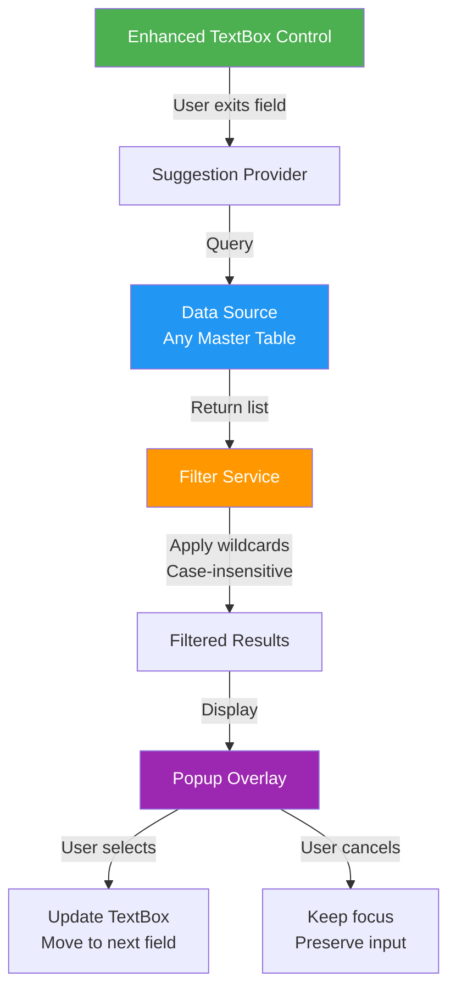

### Suggestion Workflow State Machine

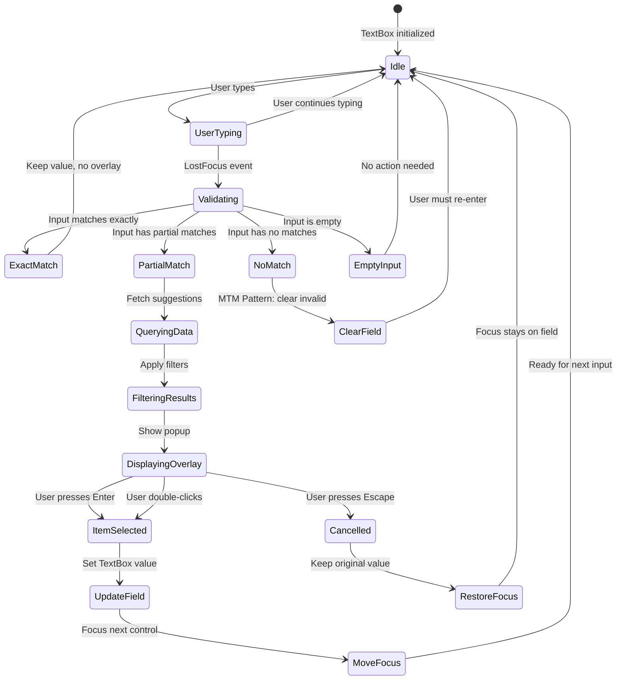

### Component Responsibilities

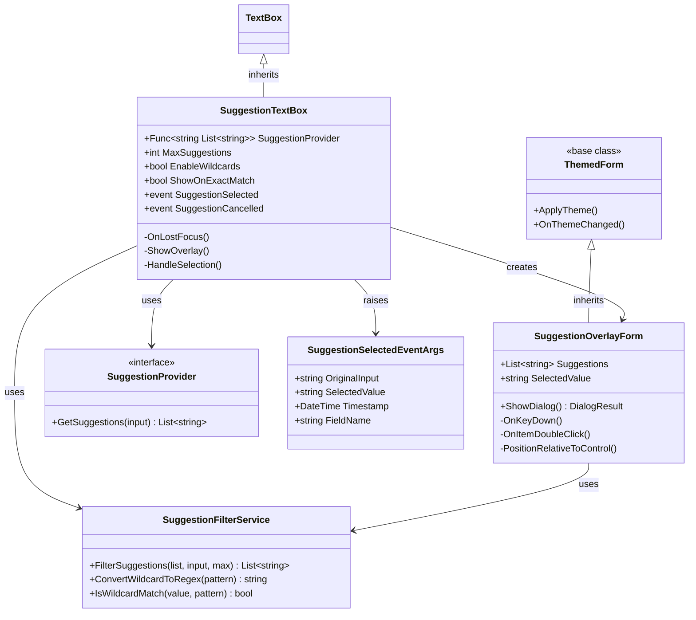

#### 1. Enhanced TextBox Control
- Monitor user interaction (focus events)
- Call suggestion provider when needed
- Display overlay at correct position
- Handle selection/cancellation events
- Manage focus flow

#### 2. Suggestion Provider (Interface/Delegate)
- Abstract data source access
- Return list of suggestion strings
- Support both sync and async operations
- Allow caching for performance

#### 3. Filter Service
- Apply case-insensitive substring matching
- Convert wildcard patterns to regex
- Sort results by relevance
- Limit to maximum count

#### 4. Popup Overlay
- Display filtered suggestions
- Handle keyboard navigation
- Handle mouse interaction
- Apply theme styling
- Position relative to TextBox

#### 5. Selection Manager
- Validate selected value
- Update TextBox text
- Trigger focus navigation
- Raise events for form logic

---

## Data Model

### Master Data Sources

Any database table can provide suggestions by implementing a simple query pattern. The following master data tables are available in the `mtm_wip_application_winforms` database:

#### Database Entity Relationships

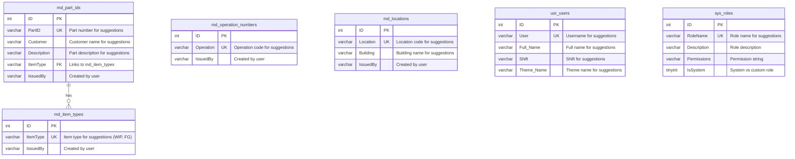

#### Core Master Data Tables

**md_part_ids** - Part master data
- PartID (VARCHAR(300)) → Primary suggestion field for part numbers
- Customer (VARCHAR(300)) → Suggestion field for customer names
- Description (VARCHAR(300)) → Suggestion field for descriptions
- ItemType (VARCHAR(100)) → Links to md_item_types, suggestion field
- IssuedBy (VARCHAR(100)) → Audit field (created by)

**md_operation_numbers** - Operation master data
- Operation (VARCHAR(100)) → Primary suggestion field for operations
- IssuedBy (VARCHAR(100)) → Audit field (created by)

**md_locations** - Location master data
- Location (VARCHAR(100)) → Primary suggestion field for locations
- Building (VARCHAR(100)) → Suggestion field for building names
- IssuedBy (VARCHAR(100)) → Audit field (created by)

**md_item_types** - Item type master data
- ItemType (VARCHAR(100)) → Primary suggestion field for item types (WIP, FG, RM, etc.)
- IssuedBy (VARCHAR(100)) → Audit field (created by)

#### System and User Tables

**usr_users** - User master data
- User (VARCHAR(100)) → Primary suggestion field for usernames
- Full Name (VARCHAR(200)) → Suggestion field for full names
- Shift (VARCHAR(50)) → Suggestion field for shift assignments
- Theme_Name (VARCHAR(50)) → Suggestion field for theme selection

**sys_roles** - Role master data
- RoleName (VARCHAR(50)) → Primary suggestion field for role assignments
- Description (VARCHAR(255)) → Role descriptions (informational)
- Permissions (VARCHAR(1000)) → Permission strings (not for suggestions)
- IsSystem (TINYINT) → System vs custom roles (filter criteria)

### Extensibility

The suggestion system is designed to work with **any table that contains string columns**. New master data tables can be added without modifying the suggestion component by simply providing a data provider function.

### Configuration Model

```
SuggestionConfig {
    DataSource: Function returning List<string>
    MaxResults: Integer (default 100)
    EnableWildcards: Boolean (default true)
    ShowOnExactMatch: Boolean (default false)
    CacheDuration: TimeSpan (optional)
}
```

### Event Data

```
SuggestionSelectedEvent {
    OriginalInput: string
    SelectedValue: string
    Timestamp: DateTime
    FieldName: string
}
```

---

## Technical Constraints

### Technology Stack
- Platform: .NET 8.0 Windows Forms
- Database: MySQL 5.7.24 (no 8.0+ features)
- UI Framework: WinForms with custom theme system
- Patterns: Observer, Strategy, Factory

### Database Constraints
- ❌ NO JSON functions (MySQL 5.7 limitation)
- ❌ NO Common Table Expressions (CTEs)
- ❌ NO Window functions
- ✅ Simple SELECT queries only
- ✅ Parameterized queries mandatory

### Performance Constraints
- Overlay display: < 100ms
- Filtering 1000 items: < 50ms
- Memory per control: < 10MB
- No UI blocking during data load

### Integration Constraints
- MUST inherit from ThemedForm (theme system)
- MUST use Service_ErrorHandler (no MessageBox.Show)
- MUST use LoggingUtility (structured logging)
- MUST follow DAO → Service → Form layering

---

## Use Cases

### UC-1: Part Number Entry on Inventory Tab

**Actor:** Shop floor user  
**Preconditions:** User is on Inventory tab with part field focused  

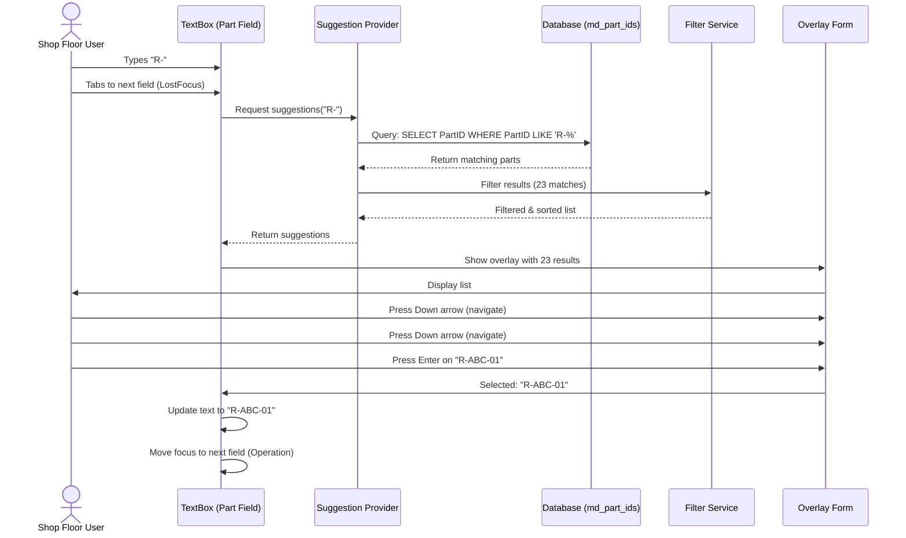

**Main Flow:**
1. User types "R-" in part number field
2. User tabs to next field (triggers LostFocus)
3. System queries part master table for partial matches
4. System displays overlay with filtered list (e.g., 23 matches)
5. User presses Down arrow to navigate list
6. User presses Enter to select "R-ABC-01"
7. System fills field with selected value
8. System moves focus to next field (Operation)

**Alternative Flows:**
- 3a. No matches found → System clears field and shows message
- 6a. User presses Escape → System keeps original input and focus
- 2a. User types exact match → System doesn't show overlay

**Postconditions:** Part field contains valid part number from master data

---

### UC-2: Wildcard Search for Locations

**Actor:** Warehouse operator  
**Preconditions:** User is on Transfer tab  

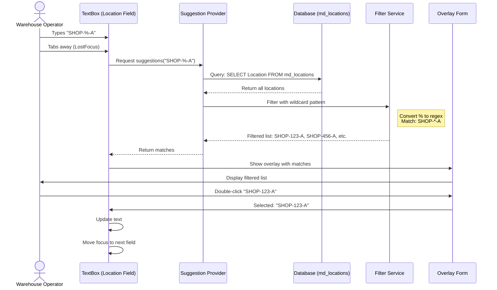

**Main Flow:**
1. User types "SHOP-%-A" in location field
2. User tabs away (triggers LostFocus)
3. System converts wildcard to regex pattern
4. System filters locations matching pattern
5. System displays overlay with matches: "SHOP-123-A", "SHOP-456-A", etc.
6. User double-clicks "SHOP-123-A"
7. System fills field and moves focus

**Alternative Flows:**
- 4a. Pattern invalid → System uses substring matching as fallback
- 5a. Too many matches → System shows first 100 with "more results" indicator

**Postconditions:** Location field contains valid location code

---

### UC-3: Customer Selection in Part Management

**Actor:** Administrator  
**Preconditions:** User is adding new part in Settings  

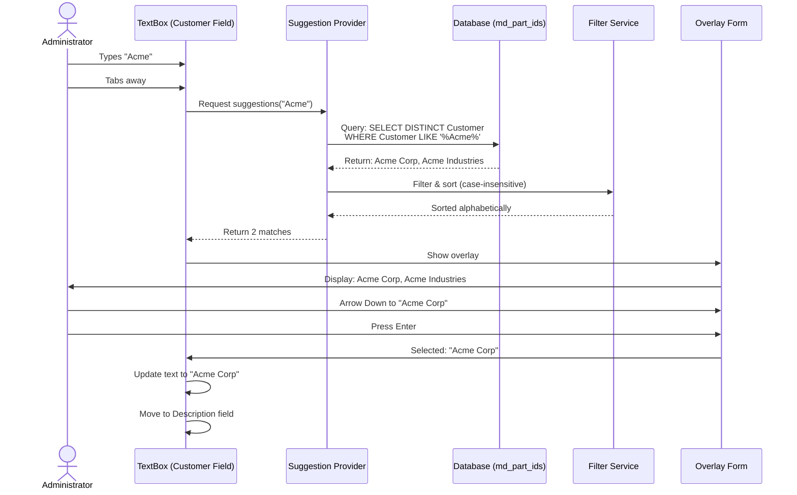

**Main Flow:**
1. User types "Acme" in customer field
2. User tabs away
3. System queries customer master table (DISTINCT from md_part_ids.Customer)
4. System displays overlay with matches: "Acme Corp", "Acme Industries"
5. User uses arrow keys to select "Acme Corp"
6. User presses Enter
7. System fills field with "Acme Corp"
8. System moves to Description field

**Postconditions:** Customer field contains valid customer name

---

## Success Metrics

### Expected Impact Distribution

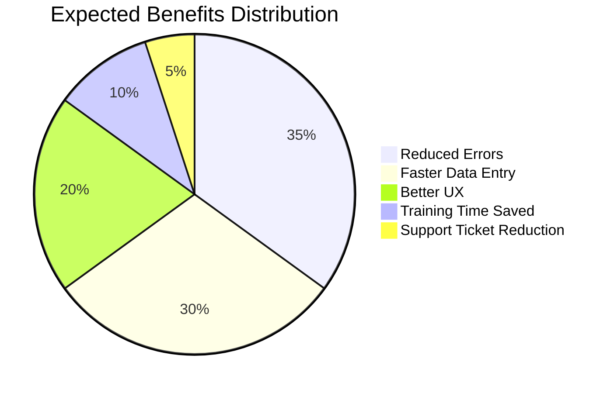

### Quantitative Metrics
- **Data entry speed**: 30% reduction in time to fill forms
- **Error rate**: 50% reduction in invalid data entries
- **User satisfaction**: >80% prefer suggestions over manual typing
- **Performance**: Overlay displays in <100ms for 95% of queries
- **Adoption**: 90% of eligible fields using suggestion system within 3 months

### Qualitative Metrics
- Users report easier data entry
- Fewer support tickets about invalid data
- New users onboard faster
- Consistent UX across all forms

### Performance Targets

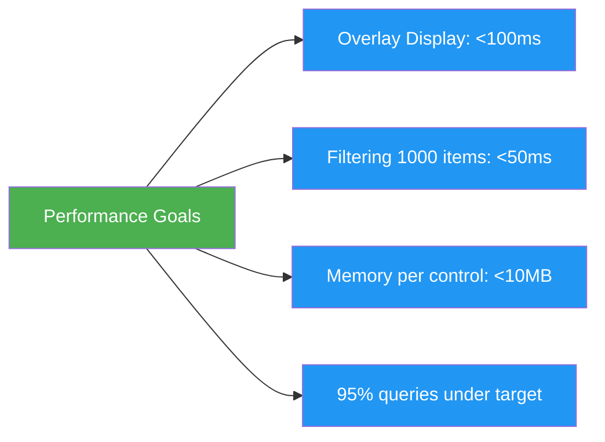

---

## Integration Points

### Forms Requiring Suggestion Support

| Form/Control | File Path | Field | Data Source | Priority |
|--------------|-----------|-------|-------------|----------|
| Control_InventoryTab | Controls/MainForm/Control_InventoryTab.cs | Part Number | md_part_ids.PartID | Critical |
| Control_InventoryTab | Controls/MainForm/Control_InventoryTab.cs | Operation | md_operation_numbers.Operation | Critical |
| Control_InventoryTab | Controls/MainForm/Control_InventoryTab.cs | Customer | md_part_ids.Customer | High |
| Control_InventoryTab | Controls/MainForm/Control_InventoryTab.cs | Description | md_part_ids.Description | Medium |
| Control_AdvancedInventory | Controls/MainForm/Control_AdvancedInventory.cs | Part Number | md_part_ids.PartID | Critical |
| Control_AdvancedInventory | Controls/MainForm/Control_AdvancedInventory.cs | Operation | md_operation_numbers.Operation | Critical |
| Control_TransferTab | Controls/MainForm/Control_TransferTab.cs | Part Number | md_part_ids.PartID | Critical |
| Control_TransferTab | Controls/MainForm/Control_TransferTab.cs | From Location | md_locations.Location | Critical |
| Control_TransferTab | Controls/MainForm/Control_TransferTab.cs | To Location | md_locations.Location | Critical |
| Control_TransferTab | Controls/MainForm/Control_TransferTab.cs | Operation | md_operation_numbers.Operation | Critical |
| Control_TransferTab | Controls/MainForm/Control_TransferTab.cs | Building | md_locations.Building | Medium |
| Control_RemoveTab | Controls/MainForm/Control_RemoveTab.cs | Part Number | md_part_ids.PartID | Critical |
| Control_RemoveTab | Controls/MainForm/Control_RemoveTab.cs | Operation | md_operation_numbers.Operation | Critical |
| Control_AdvancedRemove | Controls/MainForm/Control_AdvancedRemove.cs | Part Number | md_part_ids.PartID | Critical |
| Control_AdvancedRemove | Controls/MainForm/Control_AdvancedRemove.cs | Operation | md_operation_numbers.Operation | Critical |
| SettingsForm | Forms/Settings/SettingsForm.cs | Customer (Part Management) | md_part_ids.Customer | High |
| SettingsForm | Forms/Settings/SettingsForm.cs | Item Type (Part Management) | md_item_types.ItemType | High |
| SettingsForm | Forms/Settings/SettingsForm.cs | Username (User Management) | usr_users.User | Medium |
| SettingsForm | Forms/Settings/SettingsForm.cs | Full Name (User Management) | usr_users.`Full Name` | Medium |
| SettingsForm | Forms/Settings/SettingsForm.cs | Role Name (Role Management) | sys_roles.RoleName | Medium |
| SettingsForm | Forms/Settings/SettingsForm.cs | Shift (User Management) | usr_users.Shift | Low |
| SettingsForm | Forms/Settings/SettingsForm.cs | Theme Name (Theme Settings) | usr_users.Theme_Name | Low |
| Form_QuickButtonEdit | Forms/Shared/Form_QuickButtonEdit.cs | Part ID | md_part_ids.PartID | High |
| Form_QuickButtonEdit | Forms/Shared/Form_QuickButtonEdit.cs | Operation | md_operation_numbers.Operation | High |

**Note**: The MainForm (Forms/MainForm/MainForm.cs) contains tabs that host these UserControl components. The actual data entry occurs in the UserControls listed above.

**Note**: The MainForm (Forms/MainForm/MainForm.cs) contains tabs that host these UserControl components. The actual data entry occurs in the UserControls listed above.

### Service Dependencies

- **Data Access**: Any DAO that provides master data (Dao_Part, Dao_Operation, Dao_Location, Dao_ItemType, Dao_User, Dao_System for roles, etc.)
- **Error Handling**: Service_ErrorHandler for all exceptions
- **Logging**: LoggingUtility for event tracking
- **Theming**: Core_Themes for visual consistency

**Design Principle**: The suggestion system is **data-agnostic**. Any master data table that returns a list of strings can be used as a suggestion source. This includes:
- **Core master tables**: md_part_ids, md_operation_numbers, md_locations, md_item_types
- **User and system tables**: usr_users, sys_roles
- **Custom business-specific tables**: Any new master data table added to the database
- **In-memory lists**: Computed or derived values
- **API responses**: External data sources

### Database Dependencies

- **Read-only access** to master data tables
- **No schema changes** required
- **Existing stored procedures** can be reused (e.g., `md_part_GetAll`, `md_operation_GetAll`, `md_location_GetAll`)
- **Any table with VARCHAR columns** can provide suggestions

**Master Data Tables Available**:
- `md_part_ids` (PartID, Customer, Description, ItemType)
- `md_operation_numbers` (Operation)
- `md_locations` (Location, Building)
- `md_item_types` (ItemType)
- `usr_users` (User, Full Name, Shift, Theme_Name)
- `sys_roles` (RoleName, Description)

---

## Risk Assessment

### Technical Risks Visualization

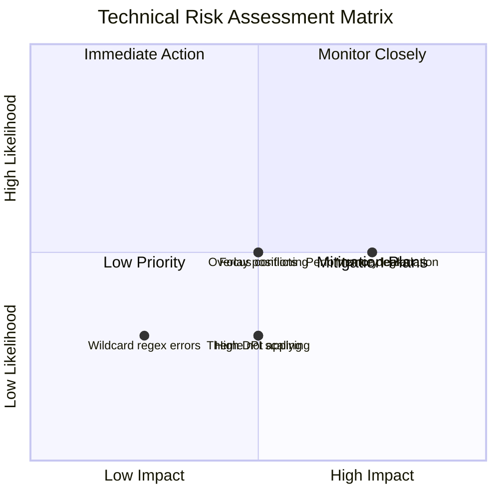

### Technical Risks

| Risk | Likelihood | Impact | Mitigation |
|------|------------|--------|------------|
| Performance degradation with 10,000+ items | Medium | High | Implement caching, async loading, limit results |
| Overlay positioning issues on multi-monitor | Medium | Medium | Test explicitly, use Screen.FromControl() |
| High DPI scaling problems | Low | Medium | Test at 125%, 150%, 200% |
| Theme not applying to overlay | Low | Medium | Inherit from ThemedForm, test theme switching |
| Memory leaks from undisposed overlays | Medium | High | Implement IDisposable, use `using` statements |
| Focus management conflicts | Medium | Medium | Explicit focus handling, test TabIndex flow |
| Wildcard regex exceptions | Low | Low | Try-catch, fallback to substring matching |

### Business Risks

| Risk | Likelihood | Impact | Mitigation |
|------|------------|--------|------------|
| Users resist change from current workflow | Low | Medium | Phased rollout, training, feedback loops |
| Increased database load from queries | Medium | Low | Implement caching strategy |
| Development time exceeds estimate | Medium | Medium | Phased implementation, MVP first |

---

## Implementation Phases

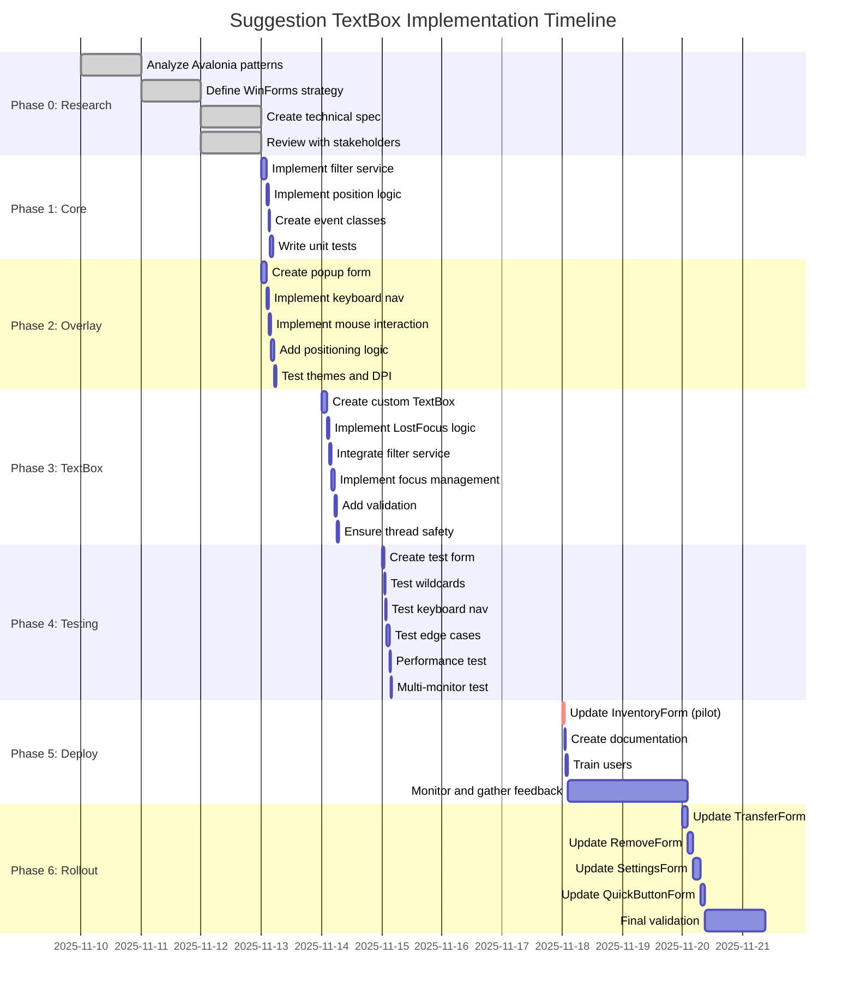

### Phase 0: Research & Design (Complete)
- ✅ Analyze Avalonia implementation patterns
- ✅ Define WinForms adaptation strategy
- ✅ Create technical specification
- ✅ Review with stakeholders

### Phase 1: Core Components (2-3 hours)
- [ ] Implement filter service with wildcard support
- [ ] Implement position calculation logic
- [ ] Create event argument classes
- [ ] Write unit tests for filtering

**Deliverable**: Core filtering logic with test coverage

### Phase 2: Overlay UI (3-4 hours)
- [ ] Create popup form with theme integration
- [ ] Implement keyboard navigation
- [ ] Implement mouse interaction
- [ ] Add positioning logic (above/below)
- [ ] Test with multiple themes and DPI settings

**Deliverable**: Functional themed overlay with navigation

### Phase 3: Enhanced TextBox Control (4-5 hours)
- [ ] Create custom TextBox component
- [ ] Implement LostFocus trigger logic
- [ ] Integrate with filter service
- [ ] Implement focus management
- [ ] Add validation integration
- [ ] Ensure thread safety

**Deliverable**: Production-ready TextBox control

### Phase 4: Integration & Testing (2-3 hours)
- [ ] Create test form with multiple data sources
- [ ] Test wildcard patterns
- [ ] Test keyboard navigation
- [ ] Test edge cases (empty, exact match, no matches)
- [ ] Performance test with 1000+ items
- [ ] Multi-monitor and DPI testing

**Deliverable**: Validated, tested component

### Phase 5: Deployment (1-2 hours)
- [ ] Update InventoryForm (pilot)
- [ ] Create usage documentation
- [ ] Train initial users
- [ ] Monitor for issues
- [ ] Gather feedback

**Deliverable**: Deployed to production with documentation

### Phase 6: Rollout (ongoing)
- [ ] Update TransferForm
- [ ] Update RemoveForm
- [ ] Update AddPartForm
- [ ] Update QuickButtonForm
- [ ] Update UserManagementForm

**Deliverable**: Universal adoption across all forms

---

## Testing Strategy

### Manual Testing
- Real-world data entry scenarios
- Multi-monitor positioning
- High DPI scaling
- Theme switching
- Performance with large datasets
- Keyboard-only workflow
- Mouse-only workflow

### Acceptance Testing
- Shop floor users test part entry
- Office staff test customer entry
- Administrators test user selection
- Collect feedback and iterate

---

## Open Questions

1. ✅ **Caching Strategy**: Should suggestions be cached? For how long?
   - **Decision**: No caching at component level
   - **Rationale**: Master data is managed at application startup; caching happens in DAO layer or application memory, not in suggestion component

2. ✅ **Modal vs Modeless**: Should overlay block parent form or allow interaction?
   - **Decision**: Modal (blocks parent form)
   - **Rationale**: Simpler focus management, prevents data corruption

3. ✅ **Tab key behavior**: Should Tab accept first suggestion or cancel?
   - **Decision**: Tab cancels (normal behavior), Enter accepts
   - **Rationale**: Prevents accidental selection, consistent with expectations

4. ✅ **Async vs Sync**: Should data provider support async operations?
   - **Decision**: Async for all data provider operations
   - **Rationale**: Prevents UI blocking for large datasets, future-proof design, consistent with existing DAO patterns

5. ✅ **Cache invalidation**: How to detect when master data changes?
   - **Decision**: Cache loaded on application startup
   - **Rationale**: Master data tables (md_*) are populated at app startup and rarely change during runtime; refresh occurs on app restart

---

## Dependencies

### Prerequisites
- ✅ .NET 8.0 Windows Forms project
- ✅ ThemedForm system (from theme refactor PR #68)
- ✅ Service_ErrorHandler
- ✅ LoggingUtility
- ✅ Existing DAO layer

### Blocking Issues
- None currently identified

### Future Enhancements
- Multi-column suggestions (show part number + description)
- Recent selections history
- Favorite/pinned suggestions
- Voice input integration
- Touch-friendly mode for tablets

---

## Acceptance Criteria

### Must Have (MVP)
- [ ] Suggestion overlay displays for partial matches
- [ ] Wildcard patterns work correctly (`%` symbol)
- [ ] Keyboard navigation functions (arrows, Enter, Escape)
- [ ] Theme system integration works
- [ ] Focus moves to next field after selection
- [ ] Performance acceptable with 1000 items
- [ ] Works at all DPI scaling levels
- [ ] Integrates with at least 3 forms (Inventory, Transfer, Remove)

### Should Have
- [ ] Mouse interaction (click, double-click)
- [ ] Caching for performance
- [ ] Loading indicator for slow queries
- [ ] "No matches found" message

### Nice to Have
- [ ] Recent selections shown first
- [ ] Fuzzy matching beyond wildcards
- [ ] Customizable keyboard shortcuts
- [ ] Animation on overlay show/hide

---

## Timeline

| Phase | Duration | Start | End |
|-------|----------|-------|-----|
| Phase 0: Research | Complete | Nov 10 | Nov 12 |
| Phase 1: Core Components | 2-3 hours | Nov 13 | Nov 13 |
| Phase 2: Overlay UI | 3-4 hours | Nov 13 | Nov 14 |
| Phase 3: Enhanced TextBox | 4-5 hours | Nov 14 | Nov 15 |
| Phase 4: Integration & Testing | 2-3 hours | Nov 15 | Nov 15 |
| Phase 5: Deployment | 1-2 hours | Nov 18 | Nov 18 |
| Phase 6: Rollout | 2 weeks | Nov 18 | Dec 2 |

**Total Development Time**: 12-17 hours  
**Total Calendar Time**: 3 weeks (including testing and rollout)

---

## Appendix

### Reference Materials
- Avalonia MTM_WIP_Application SuggestionOverlay implementation
- WinForms best practices documentation
- MTM coding standards (.github/copilot-instructions.md)
- Theme system architecture (.github/instructions/theme-system.instructions.md)

### Glossary
- **Wildcard**: Pattern matching using `%` symbol (e.g., "R-%" matches all starting with "R-")
- **LostFocus**: WinForms event triggered when user leaves a control
- **Master Data**: Reference data tables (parts, operations, locations, etc.)
- **DAO**: Data Access Object - layer for database operations
- **DPI Scaling**: Display scaling for high-resolution screens

---

**Document Version**: 1.1  
**Last Updated**: November 12, 2025  
**Author**: System Architecture Team  
**Reviewers**: Development Team, Product Owner, QA Lead
